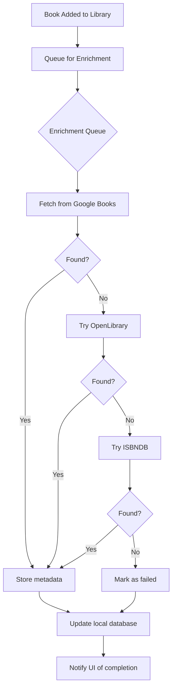

# Book Enrichment & Search - Product Requirements Document

**Status:** Shipped
**Owner:** Product Team
**Target Release:** v3.0.0+
**Last Updated:** December 2025

---

## Executive Summary

The Book Enrichment system automatically fetches complete metadata (covers, descriptions, ISBNs, page counts, genres) for books in the user's library. Combined with the Book Search feature, users can find and add books with rich metadata instantly. The system uses a multi-provider orchestration architecture (Google Books, OpenLibrary, ISBNDB) to maximize data quality and coverage.

---

## Problem Statement

### User Pain Point

Books added via barcode scan, AI shelf scan, or CSV import often have incomplete metadata:
- Missing cover images (shows placeholder)
- No description or synopsis
- Missing page count (can't track reading progress)
- Inconsistent genre tags
- Wrong edition details

**Impact:**
- Library looks incomplete and unprofessional
- Reading progress tracking broken without page counts
- Genre filtering doesn't work with inconsistent tags
- Users manually search for missing data (defeats purpose)

### Current Experience

Without enrichment, users must:
1. Notice missing metadata on a book
2. Open book detail screen
3. Manually search the web for correct info
4. Copy/paste into app fields
5. Repeat for every incomplete book

For users with 500 books, this is 10+ hours of manual work.

---

## Target Users

### Primary Persona

| Attribute | Description |
|-----------|-------------|
| **User Type** | Users who bulk-import libraries via scan or CSV |
| **Usage Frequency** | Automatic (background), occasional manual refresh |
| **Tech Savvy** | Low (shouldn't need to understand enrichment) |
| **Primary Goal** | Complete, accurate book metadata without manual work |

**Example User Story:**

> "As a **user who just imported 200 books from Goodreads**, I want **covers and descriptions automatically added** so that **my library looks complete without manual work**."

---

## Success Metrics

| Metric | Target | Measurement |
|--------|--------|-------------|
| **Cover Success** | 90%+ books get cover images | Backend logs |
| **Enrichment Latency** | 100 books in <5 minutes | Queue metrics |
| **Search Accuracy** | 95%+ find correct book on first search | User testing |
| **Provider Uptime** | 99%+ with fallback | Monitoring |
| **User Satisfaction** | <5% report missing metadata | Support tickets |

---

## User Stories & Acceptance Criteria

### Must-Have (P0)

#### US-1: Automatic Background Enrichment

**As a** user who just added books
**I want to** have metadata automatically fetched in the background
**So that** books are enriched without manual action

**Acceptance Criteria:**
- [x] Books added → queued for enrichment automatically
- [x] Background processing doesn't block UI
- [x] Progress notification: "Enriching 45 books..."
- [x] Partial success: Some books enriched, others fail gracefully
- [x] Edge case: App closed → enrichment pauses, resumes on reopen

#### US-2: Title Search with Rich Results

**As a** user searching for a book
**I want to** see cover images and author names in search results
**So that** I can quickly identify the correct book

**Acceptance Criteria:**
- [x] Search by title returns results in <2 seconds
- [x] Results show: cover thumbnail, title, author(s), year
- [x] Fuzzy matching handles typos ("Grate Gatsby" → "Great Gatsby")
- [x] Multiple editions shown with format badges (Paperback, Hardcover, Ebook)
- [x] Edge case: No results → "No books found" + manual entry option

#### US-3: ISBN Lookup

**As a** user with a book's ISBN
**I want to** search by ISBN for exact match
**So that** I get the precise edition

**Acceptance Criteria:**
- [x] ISBN-10 and ISBN-13 both supported
- [x] Exact edition returned (not similar books)
- [x] If ISBN not found, fallback to title search
- [x] Edge case: Invalid ISBN format → validation error message

---

### Should-Have (P1)

#### US-4: Provider Fallback Chain

**As a** user searching for obscure books
**I want** the app to check multiple sources automatically
**So that** rare books are still found

**Acceptance Criteria:**
- [x] Primary: Google Books → Fallback: OpenLibrary → ISBNDB
- [x] Best cover selected from all providers
- [x] Merged metadata from multiple sources
- [x] Provider attribution visible in debug mode

#### US-5: Manual Enrichment Refresh

**As a** user with outdated book info
**I want to** manually trigger re-enrichment
**So that** I can get updated metadata

**Acceptance Criteria:**
- [x] "Refresh metadata" option in book detail
- [x] Re-queries all providers for fresh data
- [x] Shows diff preview before overwriting
- [x] Edge case: No new data → "Already up to date"

---

### Nice-to-Have (P2)

- [ ] Preferred provider setting (user chooses Google vs OpenLibrary)
- [ ] Bulk re-enrichment for entire library
- [ ] Enrichment history (see what changed)
- [ ] AI-assisted genre tagging for books with no genres

---

## Functional Requirements

### High-Level Flow



### Feature Specifications

#### Title Search

**Description:** Search for books by title with fuzzy matching

**Requirements:**
- **Endpoint:** `GET /v1/search/title?q={query}`
- **Response Time:** <2 seconds (95th percentile)
- **Results:** Up to 20 books, sorted by relevance
- **Fields Returned:** title, authors, cover, year, ISBN, format
- **Caching:** 6-hour TTL in CDN

#### ISBN Search

**Description:** Exact lookup by ISBN-10 or ISBN-13

**Requirements:**
- **Endpoint:** `GET /v1/search/isbn?isbn={isbn}`
- **Validation:** Check digit validation before API call
- **Response Time:** <2 seconds
- **Caching:** 7-day TTL in CDN

#### Background Enrichment Queue

**Description:** Batch processing of books needing metadata

**Requirements:**
- **Concurrency:** 10 parallel enrichment requests
- **Rate Limiting:** Respect provider limits (Google: 100/min)
- **Retry Logic:** 3 attempts with exponential backoff
- **Priority:** Recently added books first

#### Provider Orchestration

**Description:** Multi-provider data fetching and merging

**Requirements:**
- **Order:** Google Books → OpenLibrary → ISBNDB
- **Cover Selection:** Prefer highest resolution
- **Genre Normalization:** Unified genre taxonomy (see Genre-Normalization-PRD.md)
- **Provenance Tracking:** Store which provider contributed each field

---

## Non-Functional Requirements

### Performance

| Requirement | Target | Rationale |
|-------------|--------|-----------|
| **Search Latency** | <2s | User expectation |
| **Enrichment Rate** | 100 books in 5 min | Batch efficiency |
| **Queue Size** | 1000+ books | Large imports |
| **Memory** | <50MB for queue | Background task |

### Reliability

- **Provider Fallback:** If Google fails, try OpenLibrary
- **Offline Queue:** Queue persists, processes when online
- **Partial Success:** Enrich what's possible, log failures
- **Data Integrity:** Don't overwrite user-edited fields

### Caching

- Title search: 6-hour CDN cache
- ISBN search: 7-day CDN cache
- Cover images: 30-day local cache

---

## Data Models

### Enrichment Queue Item

```typescript
interface EnrichmentQueueItem {
  id: string;
  bookId: string;
  isbn?: string;
  title: string;
  author?: string;
  status: 'pending' | 'processing' | 'completed' | 'failed';
  attempts: number;
  lastAttempt?: Date;
  error?: string;
  createdAt: Date;
}
```

### Enrichment Result

```typescript
interface EnrichmentResult {
  coverImageUrl?: string;
  description?: string;
  pageCount?: number;
  publisher?: string;
  publishedDate?: string;
  genres: string[];  // Normalized
  primaryProvider: 'google-books' | 'openlibrary' | 'isbndb';
  contributors: string[]; // All providers that contributed
}
```

### Search Response

```typescript
interface SearchResponse {
  success: boolean;
  data: {
    works: WorkDTO[];
    editions: EditionDTO[];
    authors: AuthorDTO[];
  };
  meta: {
    provider: string;
    cached: boolean;
    processingTime: number;
  };
}
```

---

## API Contracts

### Title Search

| Endpoint | Method | Purpose |
|----------|--------|---------|
| `/v1/search/title` | GET | Search by book title |

**Request:**
```
GET /v1/search/title?q=the+great+gatsby&limit=20
```

**Response:**
```json
{
  "success": true,
  "data": {
    "works": [{
      "title": "The Great Gatsby",
      "subjectTags": ["Fiction", "Classics"],
      "primaryProvider": "google-books"
    }],
    "editions": [{
      "isbn": "9780141036144",
      "coverImageURL": "https://...",
      "format": "paperback"
    }],
    "authors": [{
      "name": "F. Scott Fitzgerald"
    }]
  },
  "meta": {
    "cached": false,
    "processingTime": 450
  }
}
```

### ISBN Search

| Endpoint | Method | Purpose |
|----------|--------|---------|
| `/v1/search/isbn` | GET | Lookup by ISBN |

**Request:**
```
GET /v1/search/isbn?isbn=9780141036144
```

### Error Codes

| Code | HTTP | Meaning |
|------|------|---------|
| `INVALID_QUERY` | 400 | Empty or too short query |
| `INVALID_ISBN` | 400 | Malformed ISBN |
| `NOT_FOUND` | 404 | No matching book |
| `RATE_LIMIT` | 429 | Too many requests |
| `PROVIDER_ERROR` | 504 | Upstream API failure |

---

## Testing Strategy

### Unit Tests

- [ ] ISBN validation (valid/invalid formats)
- [ ] Genre normalization (Thrillers → Thriller)
- [ ] Queue priority ordering
- [ ] Retry logic with backoff

### Integration Tests

- [ ] Search → Select → Add → Enrich flow
- [ ] Provider fallback chain
- [ ] Rate limit handling
- [ ] Offline queue persistence

### Manual QA Checklist

- [ ] Search for popular book (instant results)
- [ ] Search for obscure book (fallback to secondary provider)
- [ ] ISBN lookup for paperback vs hardcover
- [ ] Bulk import → enrichment queue processing
- [ ] Network offline → queue paused → online → resumes

---

## Platform Implementation Notes

### iOS Implementation

**Status:** Completed

**Key Files:**
- `Services/BookSearchAPIService.swift` - Search client
- `Enrichment/EnrichmentQueue.swift` - Queue management
- `Enrichment/EnrichmentService.swift` - Provider orchestration
- `Services/DTOMapper.swift` - DTO → Model conversion

**Platform-Specific Details:**
- Uses `@Observable` for queue state management
- Background task registration for enrichment
- SwiftData batch updates for performance
- Actor-isolated services for thread safety

**V3 Migration Notes:**
- Currently uses V2 API (`BookSearchAPIService`)
- V3 abstraction layer in `V3BooksService.swift`
- Feature flag controls V2/V3 switching

---

### Flutter Implementation

**Status:** Not Started

**Recommended Approach:**
- Use `dio` for API requests with retry interceptor
- Use `hive` or `isar` for offline queue persistence
- Background isolate for enrichment processing
- Consider `workmanager` for true background tasks

**Key Dependencies:**
```yaml
dependencies:
  dio: ^5.0.0
  hive_flutter: ^1.1.0
  workmanager: ^0.5.0
```

**Implementation Notes:**
- Handle Android Doze mode for background processing
- iOS background modes may limit execution time
- Consider batch API endpoint to reduce round-trips

---

## Decision Log

### [October 2025] Decision: Backend Normalization

**Context:** Should genre normalization happen on client or server?
**Decision:** All normalization on backend, clients receive clean data
**Rationale:**
- Single source of truth
- Consistent across all platforms
- Easier debugging
**Alternatives Considered:** Client-side normalization
**Outcome:** Zero platform-specific normalization code

### [October 2025] Decision: Provider Orchestration Order

**Context:** Which book data provider should be primary?
**Decision:** Google Books primary, OpenLibrary secondary, ISBNDB tertiary
**Rationale:**
- Google Books: Best covers, most comprehensive
- OpenLibrary: Good descriptions, free unlimited
- ISBNDB: ISBN-specific, high accuracy
**Trade-off:** Google has rate limits (100/min free tier)
**Outcome:** 90%+ enrichment success rate

---

## Related Documentation

- **Canonical Contracts:** `docs/prd/Canonical-Data-Contracts-PRD.md`
- **Genre Normalization:** `docs/prd/Genre-Normalization-PRD.md`
- **API Contract:** See AGENTS.md Backend API section
- **Technical Spec:** `docs/features/ENRICHMENT_PIPELINE.md`

---

## Changelog

| Date | Change | Author |
|------|--------|--------|
| Oct 2025 | Initial enrichment pipeline | Engineering |
| Oct 2025 | Added genre normalization | Engineering |
| Nov 2025 | V3 API migration started | Engineering |
| Dec 2025 | Consolidated to platform-agnostic PRD | Documentation |
