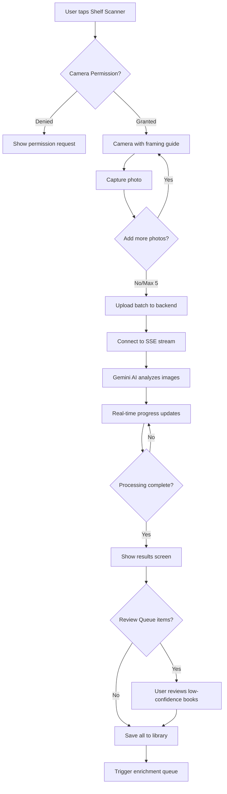

# Bookshelf AI Scanner - Product Requirements Document

**Status:** Shipped
**Owner:** Product Team
**Target Release:** v3.0.0+
**Last Updated:** December 2025

---

## Executive Summary

The Bookshelf AI Scanner allows users to photograph their bookshelves and have AI (Gemini 2.0 Flash) automatically identify and add books to their library. This feature transforms bulk library building from hours of manual entry to minutes of photo capture, making it the fastest onboarding path for users with existing physical collections.

---

## Problem Statement

### User Pain Point

Users with large physical book collections (100-1000+ books) face a significant barrier to digitizing their libraries:
- Scanning barcodes one-by-one is tedious for 500 books
- Manual title search takes 30+ seconds per book
- Users abandon onboarding before experiencing the app's value

**Real impact:**
- 40%+ onboarding abandonment for users with 100+ books
- Average time to add 100 books manually: 2+ hours
- Users request "just scan my shelf" in every feedback channel

### Current Experience

Without AI scanning, users must:
1. Pick up each book individually
2. Scan barcode OR search by title
3. Confirm the correct edition
4. Repeat 100-1000+ times

**Competitor landscape:** No major book tracking app offers AI-powered shelf scanning.

---

## Target Users

### Primary Persona

| Attribute | Description |
|-----------|-------------|
| **User Type** | Collectors with existing physical libraries (100-1500+ books) |
| **Usage Frequency** | Intensive during onboarding, occasional for new shelf sections |
| **Tech Savvy** | Medium (familiar with photo-based features) |
| **Primary Goal** | Digitize entire library with minimal effort |

**Example User Story:**

> "As a **book lover with 8 bookshelves**, I want to **photograph each shelf and have books automatically identified** so that I can **build my digital library in 30 minutes instead of 8 hours**."

---

## Success Metrics

| Metric | Target | Measurement |
|--------|--------|-------------|
| **Detection Accuracy** | 80%+ books correctly identified | QA testing |
| **Processing Time** | 20 books processed in <60 seconds | Backend metrics |
| **Adoption Rate** | 40% of users with 50+ books try feature | Analytics |
| **Onboarding Completion** | 2x improvement for 100+ book users | Funnel |
| **User Satisfaction** | 4.5/5 stars | In-app rating |

---

## User Stories & Acceptance Criteria

### Must-Have (P0)

#### US-1: Single Photo Scan

**As a** user with a bookshelf
**I want to** take one photo and have all visible books identified
**So that** I can add 10-20 books with a single action

**Acceptance Criteria:**
- [x] Camera capture with shelf framing guidance
- [x] Image preprocessed (resize to 3072px, 90% quality, 400-600KB)
- [x] Real-time progress via SSE (Server-Sent Events)
- [x] Results show detected books with confidence scores
- [x] Books with <60% confidence go to Review Queue
- [x] Edge case: Blurry photo shows "Could not detect books, retake?"

#### US-2: Batch Photo Mode

**As a** user with multiple shelves
**I want to** capture up to 5 photos in one session
**So that** I can scan my entire bookcase without multiple trips to settings

**Acceptance Criteria:**
- [x] Photo capture → add more → submit batch
- [x] Progress shows per-photo status ("Photo 2 of 5: 15 books found")
- [x] Deduplication across photos (same book on shelf edge appears in 2 photos)
- [x] Cancel mid-batch preserves completed photos
- [x] Edge case: One photo fails → others still processed

#### US-3: Review Queue for Low Confidence

**As a** user reviewing AI results
**I want to** see books the AI wasn't sure about
**So that** I can correct mistakes before adding to my library

**Acceptance Criteria:**
- [x] Books with confidence <60% flagged for review
- [x] Review screen shows AI guess + alternatives
- [x] Manual search available for unidentified spines
- [x] "Skip" option for books I don't want to add
- [x] Bulk actions: "Accept all AI suggestions"

---

### Should-Have (P1)

#### US-4: Enrichment After Save

**As a** user who just scanned a shelf
**I want** books to be automatically enriched with covers and metadata
**So that** my library looks complete without manual work

**Acceptance Criteria:**
- [x] Books saved → added to enrichment queue
- [x] Background enrichment fetches covers, ISBNs, descriptions
- [x] Progress notification: "Enriching 45 books..."
- [x] Failed enrichment shows in Review Queue

---

### Nice-to-Have (P2)

- [ ] "Scan history" to re-process old photos with improved AI
- [ ] Manual spine annotation for rare/foreign books
- [ ] Shelf organization suggestions based on detected genres
- [ ] Share scan results with friends

---

## Functional Requirements

### High-Level Flow



### Feature Specifications

#### Image Preprocessing

**Description:** Client-side optimization before upload

**Requirements:**
- **Resize:** Max 3072px on longest edge
- **Quality:** 90% JPEG compression
- **Target Size:** 400-600KB per image
- **Metadata:** Strip EXIF except orientation
- **Timeout:** 5 minute max processing per image

#### AI Processing

**Description:** Gemini 2.0 Flash analyzes bookshelf images

**Requirements:**
- **Model:** Gemini 2.0 Flash (2M token context)
- **Output:** List of detected books with confidence scores
- **Confidence Threshold:** 60% for auto-accept, below for Review Queue
- **Fallback:** If Gemini fails, queue for manual review

#### Real-Time Progress

**Description:** SSE streaming for processing updates

**Requirements:**
- **Primary Transport:** Server-Sent Events (SSE)
- **Fallback:** WebSocket (legacy, deprecated)
- **Event Types:** `job_started`, `job_progress`, `job_complete`, `error`
- **Update Frequency:** Every 5-10% progress change
- **Reconnection:** Auto-reconnect with state sync

---

## Non-Functional Requirements

### Performance

| Requirement | Target | Rationale |
|-------------|--------|-----------|
| **Upload Time** | <10s for 5 photos | User patience |
| **AI Processing** | <60s for 20 books | Acceptable wait |
| **Memory Usage** | <200MB peak | Avoid crashes |

### Reliability

- **Detection Accuracy:** 80%+ in good lighting
- **Offline Support:** Photo capture works offline, upload queued
- **Error Recovery:** Failed photos can be retried individually

### Accessibility

- [x] VoiceOver describes detection progress
- [x] High contrast progress indicators
- [x] Haptic feedback on photo capture
- [x] Alternative: Manual ISBN entry always available

---

## Data Models

### Scan Job

```typescript
interface ScanJob {
  jobId: string;
  status: 'pending' | 'processing' | 'completed' | 'failed';
  photos: ScanPhoto[];
  detectedBooks: DetectedBook[];
  createdAt: Date;
  completedAt?: Date;
  expiresAt: Date; // 24-hour TTL
}

interface ScanPhoto {
  photoId: string;
  status: 'uploading' | 'processing' | 'completed' | 'failed';
  booksDetected: number;
}

interface DetectedBook {
  title: string;
  author?: string;
  isbn?: string;
  confidence: number; // 0.0 - 1.0
  coverUrl?: string;
  needsReview: boolean; // confidence < 0.6
  sourcePhotoId: string;
}
```

### Review Queue Item

```typescript
interface ReviewQueueItem {
  id: string;
  detectedBook: DetectedBook;
  aiSuggestions: BookSuggestion[]; // Alternative matches
  status: 'pending' | 'accepted' | 'rejected' | 'manual';
  userSelection?: string; // Selected book ID if corrected
}
```

---

## API Contracts

### Start Batch Scan

| Endpoint | Method | Purpose |
|----------|--------|---------|
| `/api/scan-bookshelf/batch` | POST | Upload photos for AI processing |

**Request:**
```
POST /api/scan-bookshelf/batch
Content-Type: multipart/form-data

files: [image1.jpg, image2.jpg, ...] (max 5)
```

**Response:**
```json
{
  "jobId": "uuid-12345",
  "token": "auth-token-for-sse"
}
```

### Stream Progress (SSE)

| Endpoint | Method | Purpose |
|----------|--------|---------|
| `/v3/jobs/scans/{jobId}/stream` | GET | Real-time progress |

**SSE Events:**
```
event: job_progress
data: {"progress": 0.45, "status": "Analyzing photo 2 of 5", "booksFound": 12}

event: job_complete
data: {"totalBooks": 45, "needsReview": 8, "resultsUrl": "/v1/scan/results/uuid-12345"}
```

### Fetch Results

| Endpoint | Method | Purpose |
|----------|--------|---------|
| `/v1/scan/results/{jobId}` | GET | Get full detection results |

**Note:** Results expire after 24 hours (`expiresAt` field).

---

## Testing Strategy

### Unit Tests

- [ ] Image preprocessing (resize, compression)
- [ ] Confidence threshold logic (>60% auto, <60% review)
- [ ] Deduplication (same ISBN across photos)
- [ ] SSE message parsing

### Integration Tests

- [ ] Full flow: Photo → Upload → AI → Results → Save
- [ ] Batch mode: 5 photos processed correctly
- [ ] Review Queue: Low-confidence items flagged
- [ ] Enrichment: Saved books trigger enrichment

### Manual QA Checklist

- [ ] Well-lit shelf with varied book sizes
- [ ] Dim lighting (evening indoor)
- [ ] Mixed orientation (vertical + horizontal books)
- [ ] Non-English book spines
- [ ] Paperbacks with small text
- [ ] Hardcovers with dust jackets
- [ ] Test with 50+ books in view
- [ ] Network interruption mid-processing

---

## Platform Implementation Notes

### iOS Implementation

**Status:** Completed

**Key Files:**
- `BookshelfScanning/BookshelfScannerView.swift` - Main UI
- `BookshelfScanning/Services/BookshelfAIService.swift` - AI service actor
- `API/SSEClient.swift` - SSE streaming client
- `ReviewQueue/ManualMatchView.swift` - Low-confidence correction UI

**Platform-Specific Details:**
- Uses standard `UIImagePickerController` for camera
- Image preprocessing with Core Graphics
- SSE via `URLSession` with `assumesHTTP3Capable = false` (HTTP/1.1)
- Actor-isolated service for thread safety

---

### Flutter Implementation

**Status:** Not Started

**Recommended Approach:**
- Use `image_picker` for camera capture
- Use `image` package for preprocessing
- Use `dio` or `http` for SSE streaming
- Consider `flutter_riverpod` for state management

**Key Dependencies:**
```yaml
dependencies:
  image_picker: ^1.0.0
  image: ^4.0.0
  dio: ^5.0.0
```

**Implementation Notes:**
- SSE needs custom implementation (no official Flutter SSE package)
- Consider `eventsource` package for SSE client
- Handle background/foreground transitions (pause SSE)

---

## Decision Log

### [November 2025] Decision: SSE over WebSocket for V3

**Context:** Needed reliable real-time progress for long-running AI jobs
**Decision:** Use Server-Sent Events (SSE) as primary, WebSocket as fallback
**Rationale:**
- Browser-native reconnection with `Last-Event-ID`
- Works through corporate proxies (HTTP/1.1)
- Simpler than WebSocket for one-way streaming
- Automatic retry on connection loss
**Trade-off:** No bidirectional cancel (use `DELETE /v3/jobs/{type}/{jobId}` instead)
**Outcome:** More reliable on mobile networks

### [October 2025] Decision: 60% Confidence Threshold

**Context:** Needed to balance auto-accept convenience vs accuracy
**Decision:** Books with <60% AI confidence go to Review Queue
**Rationale:**
- User testing showed 60% aligned with "probably right" perception
- Higher threshold = too many false positives in review
- Lower threshold = too many incorrect books auto-added
**Outcome:** Users report good balance of automation vs control

---

## Related Documentation

- **Workflow Diagram:** `docs/workflows/bookshelf-scanner-workflow.md`
- **Technical Spec:** `docs/features/BOOKSHELF_SCANNER.md`
- **Batch Processing:** `docs/features/BATCH_BOOKSHELF_SCANNING.md`
- **Review Queue:** `docs/prd/Review-Queue-PRD.md`

---

## Changelog

| Date | Change | Author |
|------|--------|--------|
| Oct 2025 | Initial iOS implementation | Engineering |
| Nov 2025 | Added batch mode (5 photos) | Engineering |
| Nov 2025 | Migrated to SSE from WebSocket | Engineering |
| Dec 2025 | Refactored to platform-agnostic PRD | Documentation |
