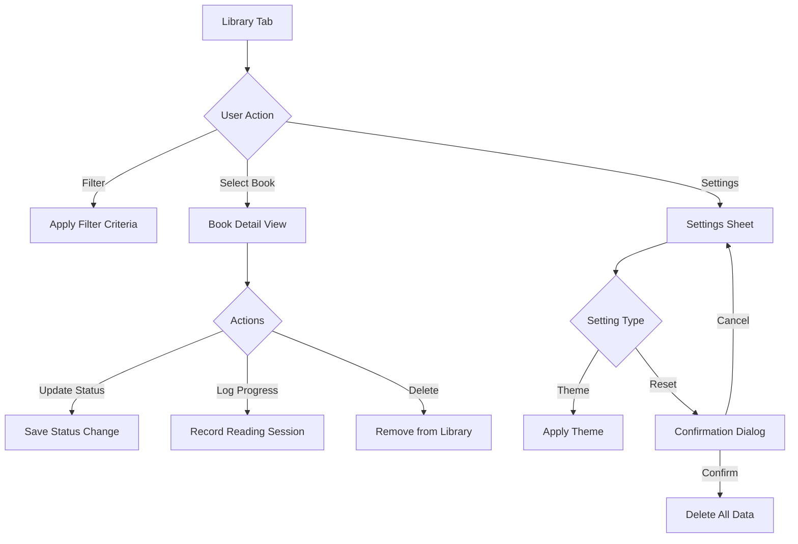

# Library Management - Product Requirements Document

**Status:** Shipped
**Owner:** Product Team
**Target Release:** v3.0.0+
**Last Updated:** December 2025

---

## Executive Summary

Library Management encompasses the core features for organizing, filtering, and maintaining a user's book collection. This includes reading status tracking, library reset, data cleanup, and settings management. The feature provides the foundation for a usable book tracking experience.

---

## Problem Statement

### User Pain Point

Users need intuitive ways to:
1. Track reading progress across their library
2. Filter and find books quickly
3. Clean up mistakes or start fresh
4. Customize their experience

Without these features, the app is just a list of books with no organization or personalization.

---

## Target Users

| Attribute | Description |
|-----------|-------------|
| **User Type** | All app users |
| **Usage Frequency** | Daily for tracking, occasional for settings |
| **Tech Savvy** | All levels |
| **Primary Goal** | Organize and track reading habits |

---

## User Stories & Acceptance Criteria

### Reading Status Management (P0)

#### US-1: Track Reading Status

**As a** user with books in my library
**I want to** mark books as "To Read", "Reading", or "Completed"
**So that** I can organize my reading queue

**Acceptance Criteria:**
- [x] Status options: To Read, Reading, Completed, Wishlist, Abandoned
- [x] Quick status change from book card (swipe or long-press)
- [x] Completion date auto-set when marking "Completed"
- [x] Progress percentage shown for "Reading" books
- [x] Filter library by status

#### US-2: Track Reading Progress

**As a** user reading a book
**I want to** log my current page
**So that** I can track progress and estimate completion

**Acceptance Criteria:**
- [x] Manual page entry
- [x] Progress bar visualization
- [x] Estimated completion date based on reading pace
- [x] Reading sessions logged with duration

---

### Library Filtering (P0)

#### US-3: Filter by Multiple Criteria

**As a** user with 500+ books
**I want to** filter by status, genre, author, and year
**So that** I can quickly find specific books

**Acceptance Criteria:**
- [x] Multi-select filter chips
- [x] Combine filters (e.g., "Unread" + "Science Fiction")
- [x] Clear all filters button
- [x] Filter count badge on filter button
- [x] Search within filtered results

---

### Library Reset (P1)

#### US-4: Full Library Reset

**As a** user who wants to start fresh
**I want to** delete all my library data
**So that** I can begin again without reinstalling

**Acceptance Criteria:**
- [x] Multi-step confirmation ("Are you sure?")
- [x] Preview of what will be deleted
- [x] Cancels any in-progress enrichment jobs
- [x] Clears all: Books, Authors, Reading History, Queue
- [x] Preserves: App settings, Theme preference, User account
- [x] Reset takes <5 seconds even for 1500 books

#### US-5: Selective Cleanup

**As a** user with some bad imports
**I want to** delete specific books or batches
**So that** I can fix mistakes without losing everything

**Acceptance Criteria:**
- [x] Bulk select mode in library view
- [x] "Delete Selected" action
- [x] Undo available for 10 seconds after delete
- [x] Cascade delete removes orphaned authors/editions

---

### Settings Management (P1)

#### US-6: Customize App Behavior

**As a** user with preferences
**I want to** configure notifications, themes, and defaults
**So that** the app works how I want

**Acceptance Criteria:**
- [x] Theme selection (5 built-in themes)
- [x] Notification preferences (reading reminders, etc.)
- [x] Default reading status for new books
- [x] Cloud sync toggle
- [x] Data export option
- [x] Debug/developer settings (hidden)

---

## Functional Requirements

### High-Level Flow



### Feature Specifications

#### Library Reset

**Description:** Complete wipe of user's library data

**Requirements:**
- **Scope:** Books, Editions, Authors, UserLibraryEntries, ReadingSessions
- **Preserves:** App settings, theme, user preferences
- **Pre-Actions:**
  - Cancel in-flight backend enrichment jobs
  - Stop local enrichment processing
- **Performance:** <5 seconds for 1500 books
- **Confirmation:** 2-step confirmation required

#### Reading Status

**Description:** Track book reading lifecycle

**Status Enum:**
```typescript
enum ReadingStatus {
  TO_READ = 'toRead',
  READING = 'reading',
  COMPLETED = 'completed',
  WISHLIST = 'wishlist',
  ABANDONED = 'abandoned'
}
```

---

## Data Models

### User Library Entry

```typescript
interface UserLibraryEntry {
  id: string;
  bookId: string;
  readingStatus: ReadingStatus;
  currentPage: number;
  totalPages?: number;
  startDate?: Date;
  completionDate?: Date;
  rating?: number;        // 1-5 stars
  notes?: string;
  tags: string[];
  createdAt: Date;
  updatedAt: Date;
}
```

### Reading Session

```typescript
interface ReadingSession {
  id: string;
  entryId: string;
  startPage: number;
  endPage: number;
  durationMinutes: number;
  date: Date;
}
```

### App Settings

```typescript
interface AppSettings {
  theme: string;           // Theme ID
  defaultStatus: ReadingStatus;
  notificationsEnabled: boolean;
  readingReminders: boolean;
  reminderTime?: string;   // "20:00"
  cloudSyncEnabled: boolean;
  lastSyncDate?: Date;
}
```

---

## Non-Functional Requirements

### Performance

| Requirement | Target | Rationale |
|-------------|--------|-----------|
| **Library Load** | <500ms for 1500 books | Instant feel |
| **Filter Apply** | <100ms | Real-time feedback |
| **Reset** | <5s | Quick cleanup |

### Data Safety

- Reset requires 2-step confirmation
- Undo available for single book deletes
- No silent data loss
- Export available before destructive actions

---

## Platform Implementation Notes

### iOS Implementation

**Status:** Completed

**Key Files:**
- `Views/Library/iOS26LiquidLibraryView.swift` - Main library view
- `Settings/SettingsView.swift` - Settings management
- `Models/UserLibraryEntry.swift` - Entry model
- `Models/ReadingSession.swift` - Session tracking

**Platform-Specific Details:**
- Uses SwiftData for persistence
- CloudKit for optional sync
- Haptic feedback on status changes
- Swipe actions for quick status update

**Reset Implementation:**
```swift
// Cancel backend jobs first
await EnrichmentQueue.shared.cancelAllJobs()
// Delete all SwiftData models
try modelContext.delete(model: Work.self)
try modelContext.delete(model: Edition.self)
try modelContext.delete(model: Author.self)
try modelContext.delete(model: UserLibraryEntry.self)
try modelContext.save()
```

---

### Flutter Implementation

**Status:** Not Started

**Recommended Approach:**
- Use `riverpod` or `bloc` for state management
- Use `drift` or `isar` for local database
- Use `firebase` or custom backend for sync

**Key Dependencies:**
```yaml
dependencies:
  flutter_riverpod: ^2.0.0
  drift: ^2.0.0
  firebase_core: ^2.0.0
```

---

## Related Documentation

- **Reading Statistics:** `docs/prd/Reading-Statistics-PRD.md`
- **Cloud Sync:** `docs/prd/Cloud-Sync-PRD.md`

---

## Changelog

| Date | Change | Author |
|------|--------|--------|
| Oct 2025 | Initial library management | Engineering |
| Dec 2025 | Consolidated Settings + Reset into single PRD | Documentation |
