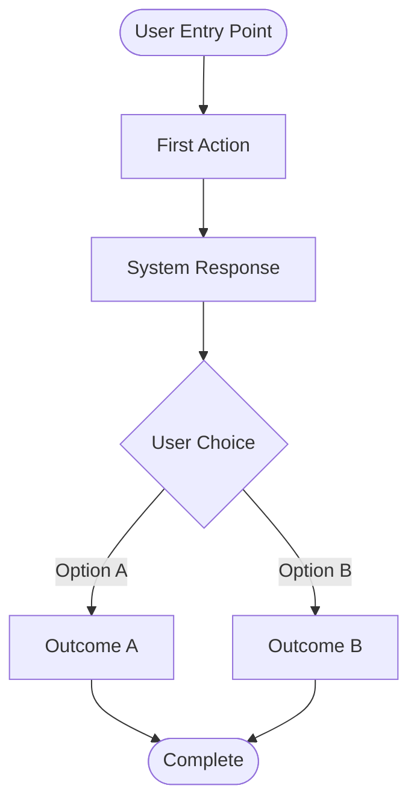

# [Feature Name] - Product Requirements Document

**Status:** [Draft | Review | Approved | Shipped]
**Owner:** [Product Manager / Team Lead]
**Target Release:** [Version / Date]
**Last Updated:** [Date]

---

## Executive Summary

**One-paragraph description of what this feature is, who it's for, and why it matters.**

[Write 2-3 sentences summarizing the feature's purpose, target user, and primary benefit.]

---

## Problem Statement

### User Pain Point

**What problem are we solving?**

[Describe the specific user frustration, workflow inefficiency, or unmet need this feature addresses.]

**Example:**
> "Users with large book collections (100+ books) spend hours manually entering each book. This creates friction during onboarding and prevents users from experiencing the app's value quickly."

### Current Experience

**How do users currently solve this problem (if at all)?**

[Describe existing workarounds, competitor solutions, or manual processes users employ today.]

---

## Target Users

### Primary Persona

| Attribute | Description |
|-----------|-------------|
| **User Type** | [e.g., Avid readers, collectors, students] |
| **Usage Frequency** | [e.g., Daily, weekly, monthly] |
| **Tech Savvy** | [Low / Medium / High] |
| **Primary Goal** | [What they want to achieve] |

**Example User Story:**

> "As a **book collector with 500+ books**, I want to **bulk import my existing library** so that I can **start tracking new reads without manual data entry**."

---

## Success Metrics

### Key Performance Indicators (KPIs)

| Metric | Target | Measurement Method |
|--------|--------|-------------------|
| **Adoption Rate** | [X%] of users try feature within 30 days | Analytics |
| **Completion Rate** | [X%] of users complete workflow | Conversion funnel |
| **Performance** | [Response time / processing speed] | Instrumentation |
| **Accuracy** | [X%] success rate (if applicable) | Quality metrics |
| **User Satisfaction** | [X/5 stars or NPS score] | Surveys / Reviews |

---

## User Stories & Acceptance Criteria

### Must-Have (P0) - Core Functionality

#### User Story 1: [Feature Name]

**As a** [user type]
**I want to** [action]
**So that** [benefit]

**Acceptance Criteria:**
- [ ] Given [context], when [action], then [expected outcome]
- [ ] Given [context], when [action], then [expected outcome]
- [ ] Edge case: Given [unusual context], system should [handle gracefully]

---

### Should-Have (P1) - Enhanced Experience

[Repeat user story format for medium-priority features]

---

### Nice-to-Have (P2) - Future Enhancements

[List future iteration features as bullet points]

---

## Functional Requirements

### High-Level Flow

**End-to-end user journey:**



**OR link to existing workflow:**
> See `docs/workflows/[feature]-workflow.md` for detailed flow diagrams.

---

### Feature Specifications

#### [Sub-Feature 1 Name]

**Description:** [What this sub-feature does]

**Requirements:**
- **Input:** [What data/input is required]
- **Processing:** [How the system processes it]
- **Output:** [What the user sees/receives]
- **Error Handling:** [How errors are surfaced and recovered]

---

## Non-Functional Requirements

### Performance

| Requirement | Target | Rationale |
|-------------|--------|-----------|
| **Response Time** | [X ms/s] | [Why this matters] |
| **Memory Usage** | [X MB] | [Device constraints] |
| **Battery Impact** | [Minimal / Moderate] | [User expectations] |

---

### Reliability

- **Error Rate:** [Target X% success rate]
- **Offline Support:** [Required / Not Required / Partial]
- **Data Integrity:** [How data consistency is ensured]

---

### Accessibility (WCAG AA Compliance)

- [ ] Screen reader labels on all interactive elements
- [ ] Color contrast ratio >= 4.5:1 for text
- [ ] Dynamic text sizing support
- [ ] Keyboard/controller navigation
- [ ] Reduced motion option (for animations)

---

### Security & Privacy

- **Data Storage:** [Where is user data stored?]
- **API Security:** [How are backend calls authenticated?]
- **Privacy Considerations:** [What data is collected/shared?]

---

## Design & User Experience

### UI Mockups / Wireframes

[Include screenshots, Figma links, or references to design assets]

---

### Design System Compliance

- [ ] Uses standard design system components
- [ ] Follows platform-specific guidelines (iOS HIG / Material Design / etc.)
- [ ] Theme-aware colors (light/dark mode)
- [ ] Standard spacing and corner radius
- [ ] Proper navigation patterns

---

### User Feedback & Affordances

| State | Visual Feedback | Example |
|-------|----------------|---------|
| **Loading** | Progress indicator | Spinner with "Processing..." |
| **Success** | Confirmation message | Checkmark + "100 books imported" |
| **Error** | Clear error message + recovery | "Import failed" + Retry button |
| **Empty State** | Helpful guidance | "Tap + to import your first CSV" |

---

## Data Models

### Core Entities

**Use platform-agnostic format (TypeScript/JSON style):**

```typescript
interface ExampleModel {
  id: string;           // UUID
  name: string;         // Required
  description?: string; // Optional
  createdAt: Date;
  status: 'pending' | 'active' | 'completed';
  items: ExampleItem[]; // One-to-many relationship
}
```

### Relationships

```
Entity1 1:many Entity2
Entity1 many:many Entity3
```

---

## API Contracts

### Endpoints

| Endpoint | Method | Purpose | Request | Response |
|----------|--------|---------|---------|----------|
| `/api/[endpoint]` | GET/POST | [What it does] | [Payload] | [Response] |

### Request/Response Examples

```json
// GET /api/example
{
  "success": true,
  "data": { ... },
  "meta": {
    "timestamp": "2025-01-01T00:00:00Z",
    "processingTime": 150
  }
}
```

### Error Codes

| Code | HTTP Status | Meaning |
|------|-------------|---------|
| `INVALID_INPUT` | 400 | Invalid request parameters |
| `NOT_FOUND` | 404 | Resource not found |
| `RATE_LIMIT` | 429 | Too many requests |

---

## Testing Strategy

### Unit Tests

- [ ] [Component/function] - [Expected behavior]
- [ ] [Edge case] - [Expected handling]

### Integration Tests

- [ ] [User flow] from [start] to [end]

### Manual QA Checklist

- [ ] Real device testing
- [ ] Edge cases (empty data, network failures)
- [ ] Accessibility (screen reader, large text)
- [ ] Performance under load

---

## Rollout Plan

### Phased Release

| Phase | Audience | Features Enabled | Success Criteria |
|-------|----------|------------------|------------------|
| **Alpha** | Internal team | Core functionality | Zero crashes |
| **Beta** | Test users | Full feature set | 90%+ success rate |
| **GA** | All users | Production-ready | <1% error rate |

### Rollback Plan

1. **Disable feature** - Hide UI entry points
2. **Backend rollback** - Revert API deployment
3. **Data migration** - [If schema changes, how to revert]

---

## Launch Checklist

**Pre-Launch:**
- [ ] All P0 acceptance criteria met
- [ ] Unit tests passing
- [ ] Manual QA completed
- [ ] Performance benchmarks validated
- [ ] Accessibility audit
- [ ] Analytics events instrumented
- [ ] Documentation updated

**Post-Launch:**
- [ ] Monitor analytics for adoption
- [ ] Track error rates
- [ ] Collect user feedback
- [ ] Measure success metrics

---

## Open Questions & Risks

### Unresolved Decisions

- [ ] [Question] - **Owner:** [Name] - **Due:** [Date]

### Known Risks

| Risk | Impact | Probability | Mitigation |
|------|--------|-------------|------------|
| [Description] | High/Med/Low | High/Med/Low | [Plan] |

---

## Platform Implementation Notes

### iOS Implementation

**Status:** [Not Started | In Progress | Completed]

**Key Files:**
- `path/to/MainView.swift` - [Purpose]
- `path/to/Service.swift` - [Purpose]

**Platform-Specific Considerations:**
- [iOS-specific APIs or patterns used]
- [Framework dependencies: VisionKit, CloudKit, etc.]
- [iOS version requirements]

---

### Flutter Implementation

**Status:** [Not Started | In Progress | Completed]

**Key Files:**
- `lib/features/[feature]/` - [Purpose]
- `lib/services/[service].dart` - [Purpose]

**Platform-Specific Considerations:**
- [Flutter packages required]
- [Platform channels needed]
- [Minimum SDK versions]

---

### Android Implementation

**Status:** [Not Started | In Progress | Completed]

**Key Files:**
- `app/src/main/java/.../` - [Purpose]

**Platform-Specific Considerations:**
- [Android-specific APIs]
- [Minimum API level]

---

## Related Documentation

- **Workflow Diagram:** `docs/workflows/[feature]-workflow.md`
- **Technical Spec:** `docs/features/[FEATURE].md`
- **API Documentation:** [Link to API docs]

---

## Decision Log

### [Date] Decision: [Title]

**Context:** [Why this decision was needed]
**Decision:** [What was decided]
**Rationale:** [Why this approach was chosen]
**Alternatives Considered:** [Other options]
**Outcome:** [Result]

---

## Changelog

| Date | Change | Author |
|------|--------|--------|
| [Date] | Initial draft | [Name] |
| [Date] | Added acceptance criteria | [Name] |
| [Date] | Platform-agnostic refactor | [Name] |

---

## Approvals

**Sign-off required from:**

- [ ] Product Manager
- [ ] Engineering Lead
- [ ] Design Lead (if UI changes)
- [ ] QA Lead

**Approved by:** [Names] on [Date]
