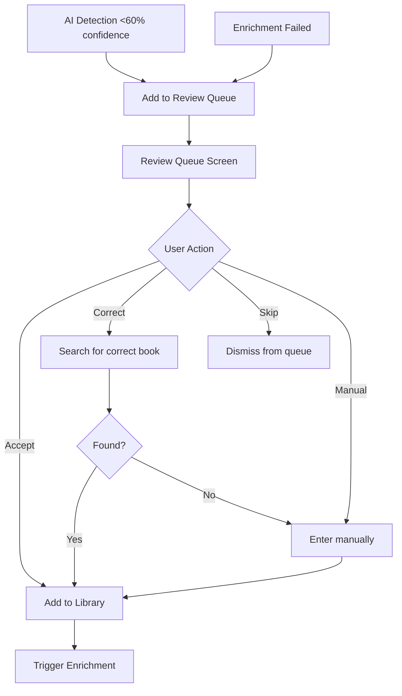

# Review Queue - Product Requirements Document

**Status:** Shipped
**Owner:** Product Team
**Target Release:** v3.0.0+
**Last Updated:** December 2025

---

## Executive Summary

The Review Queue provides a human-in-the-loop workflow for verifying low-confidence AI detections (<60% confidence) from bookshelf scans. Users can review cropped spine images alongside editable title/author fields, ensuring data quality while maintaining the speed benefits of automated detection. This feature reduces false positives and builds user trust in the AI scanning system.

---

## Problem Statement

### User Pain Point

AI bookshelf scanning achieves 70-95% accuracy on clear images, but misreads books when:
- Spine text is blurry or at odd angles
- Lighting creates glare on glossy covers
- Books have unusual fonts or faded text
- Spines are partially obscured

Without human verification, these low-confidence detections (typically 10-30% of scans) would pollute user libraries with incorrect titles/authors, eroding trust and requiring tedious manual cleanup.

**Impact:**
- 20-30 incorrect books per 100-book shelf scan without verification
- Users lose confidence in AI accuracy after seeing wrong books
- Finding and deleting incorrect entries post-import is frustrating

---

## Target Users

| Attribute | Description |
|-----------|-------------|
| **User Type** | Book collectors who value library accuracy |
| **Usage Frequency** | After each bookshelf scan (periodic) |
| **Tech Savvy** | Medium-High |
| **Primary Goal** | Ensure library contains only books they actually own |

**Example User Story:**

> "As a **collector with 300 carefully curated books**, I want to **review AI detections the system isn't confident about** so that **my digital library matches my physical shelves exactly**."

---

## Success Metrics

| Metric | Target | Measurement |
|--------|--------|-------------|
| **Queue Awareness** | 80% of users with pending reviews see badge | Analytics |
| **Correction Rate** | 60%+ of queued books get corrected | Outcome tracking |
| **Completion Rate** | 70%+ users clear entire queue | Funnel |
| **False Positive Prevention** | 90%+ queued books would have been errors | QA sampling |
| **Time to Clear** | <2 min for 10 books | User testing |

---

## User Stories & Acceptance Criteria

### Must-Have (P0)

#### US-1: Surface Low-Confidence Detections

**As a** user who just scanned a bookshelf
**I want to** see a visual indicator when books need verification
**So that** I know to review uncertain detections

**Acceptance Criteria:**
- [x] Books with <60% confidence flagged during import
- [x] Badge count visible on Review Queue button
- [x] Low-confidence indicator on individual books in scan results
- [x] Edge case: All books >=60% → No badge shown

#### US-2: Review Books with Visual Context

**As a** user reviewing uncertain detections
**I want to** see the cropped spine image alongside editable fields
**So that** I can verify titles/authors by looking at the actual spine

**Acceptance Criteria:**
- [x] Queue shows all books needing review, sorted by confidence
- [x] Correction view shows cropped spine image
- [x] Title/author fields pre-filled with AI-detected values
- [x] Edge case: Image unavailable → Text-only editing with message

#### US-3: Correct or Verify Detections

**As a** user in correction view
**I want to** edit incorrect fields or confirm correct detections
**So that** queued books are marked resolved

**Acceptance Criteria:**
- [x] Edit title/author → Save → Marked as user-edited
- [x] No changes → Verify → Marked as verified
- [x] Both actions remove book from queue
- [x] Edge case: Navigate away → Book remains in queue

---

### Should-Have (P1)

#### US-4: Batch Actions

**As a** user with many books in queue
**I want to** swipe through corrections quickly
**So that** I can review in one continuous flow

**Acceptance Criteria:**
- [ ] Swipe gestures for next/previous book
- [ ] Current book auto-saves on swipe
- [ ] "Accept all AI suggestions" bulk action

---

### Nice-to-Have (P2)

- [ ] Confidence score display ("AI is 45% confident")
- [ ] Manual bounding box adjustment
- [ ] Smart suggestions from book database
- [ ] Bulk verify for trusted scans

---

## Functional Requirements

### High-Level Flow



### Confidence Thresholds

| Confidence | Action |
|------------|--------|
| >= 80% | Auto-add to library |
| 60-79% | Add to library, flag for optional review |
| < 60% | Require review before adding |

### Image Cropping

**Description:** Display cropped book spine using AI-detected bounding box

**Requirements:**
- Input: Original image path + normalized bounding box (0.0-1.0)
- Output: Cropped spine image for display
- Fallback: Full image if crop fails, text-only if no image

---

## Data Models

### Review Queue Item

```typescript
interface ReviewQueueItem {
  id: string;
  sourceType: 'ai_scan' | 'enrichment_failed' | 'import_error';
  sourceJobId?: string;
  detectedData: {
    title: string;
    author?: string;
    isbn?: string;
    coverUrl?: string;
  };
  confidence: number; // 0.0 - 1.0
  aiSuggestions: BookSuggestion[];
  status: 'pending' | 'accepted' | 'corrected' | 'skipped';
  boundingBox?: BoundingBox; // For image cropping
  originalImagePath?: string;
  createdAt: Date;
  resolvedAt?: Date;
}

interface BoundingBox {
  x: number;      // 0.0 - 1.0 normalized
  y: number;
  width: number;
  height: number;
}

enum ReviewStatus {
  VERIFIED = 'verified',      // AI or user confirmed
  NEEDS_REVIEW = 'needsReview', // Low confidence
  USER_EDITED = 'userEdited'    // Human corrected
}
```

---

## Non-Functional Requirements

### Performance

| Requirement | Target | Rationale |
|-------------|--------|-----------|
| **Queue Load** | <100ms | Instant navigation |
| **Image Crop** | <50ms | Smooth UX |
| **Badge Update** | <2s after scan | Real-time feedback |

### Accessibility

- [x] Screen reader announces queue count
- [x] High contrast badge visibility
- [x] Keyboard navigation for correction form
- [x] Dynamic text sizing support

---

## Testing Strategy

### Unit Tests

- [ ] Confidence threshold routing (>=60 vs <60)
- [ ] Image cropping coordinate conversion
- [ ] Queue filtering accuracy
- [ ] Auto-cleanup logic

### Integration Tests

- [ ] Scan → Queue populated → Correct → Removed from queue
- [ ] All verified → Badge disappears
- [ ] App relaunch → Temp images cleaned up

### Manual QA

- [ ] Mix of high/low confidence scans
- [ ] Edit title → verify saved
- [ ] Image missing → fallback works
- [ ] VoiceOver navigation

---

## Platform Implementation Notes

### iOS Implementation

**Status:** Completed

**Key Files:**
- `ReviewQueue/ReviewQueueView.swift` - Queue list UI
- `ReviewQueue/CorrectionView.swift` - Editing with image crop
- `ReviewQueue/ManualMatchView.swift` - Search/correct flow
- `Services/ImageCleanupService.swift` - Temp file cleanup

**Platform-Specific Details:**
- Uses SwiftData for persistence
- Core Graphics for image cropping
- Sheet presentation for correction view
- Automatic cleanup on app launch

**Image Cropping Algorithm:**
```swift
let cropRect = CGRect(
    x: boundingBox.x * imageWidth,
    y: boundingBox.y * imageHeight,
    width: boundingBox.width * imageWidth,
    height: boundingBox.height * imageHeight
)
guard let cropped = cgImage.cropping(to: cropRect) else { return nil }
return UIImage(cgImage: cropped)
```

---

### Flutter Implementation

**Status:** Not Started

**Recommended Approach:**
- Use `image` package for cropping
- `flutter_slidable` for swipe gestures
- Modal bottom sheet for correction view

**Key Dependencies:**
```yaml
dependencies:
  image: ^4.0.0
  flutter_slidable: ^3.0.0
```

**Implementation Notes:**
- Normalize bounding box to pixel coords before crop
- Cache cropped images for performance
- Handle image memory on large batches

---

## Decision Log

### [October 2025] Decision: 60% Confidence Threshold

**Context:** Balance automation vs accuracy
**Decision:** <60% requires review, >=60% auto-adds
**Rationale:** User testing showed 60% aligned with "probably right" perception
**Outcome:** Good balance of convenience and accuracy

---

## Related Documentation

- **Bookshelf Scanner:** `docs/prd/Bookshelf-AI-Scanner-PRD.md`
- **Technical Spec:** `docs/features/REVIEW_QUEUE.md`

---

## Changelog

| Date | Change | Author |
|------|--------|--------|
| Oct 2025 | Initial implementation | Engineering |
| Oct 2025 | Added image cropping | Engineering |
| Dec 2025 | Refactored to platform-agnostic PRD | Documentation |
