# Award Tracking - Product Requirements Document

**Status:** Draft
**Owner:** Product Team
**Target Release:** v3.8.0
**Last Updated:** January 5, 2026

---

## Executive Summary

Award Tracking automatically detects and displays prestigious literary awards (Pulitzer Prize, Man Booker, Nobel, National Book Award, Hugo, Nebula) on book cards and detail views. Users can filter their library by award winners, track award coverage statistics, and discover critically acclaimed books through curated award lists. This feature elevates library prestige visibility and helps readers identify "must-read" classics and contemporary masterpieces.

---

## Problem Statement

### User Pain Point

**What problem are we solving?**

Readers struggle to identify award-winning books in their libraries and discover critically acclaimed titles:

1. **Hidden Prestige:** "I didn't realize I had 5 Pulitzer winners until I Googled each book"
2. **Discovery Friction:** "How do I find Hugo Award winners for my sci-fi reading list?"
3. **Quality Signals Missing:** "Which books in my TBR are universally acclaimed?"
4. **Completionist Gaps:** "I want to read all Booker Prize winners but can't track which I'm missing"

**Impact:**
- Award-winning books buried in 500+ title libraries (no visual indicator)
- Users miss high-quality recommendations (awards are strong quality signals)
- No gamification for award collectors ("Read 10 Nobel laureates")
- Library stats don't reflect award coverage (e.g., "You've read 15 award winners!")

**Example Frustration:**

> "I love literary fiction but can't tell which books in my library are Pulitzer or Booker winners without Googling each one. I wish there was a badge or filter."

### Current Experience

**How do users currently solve this problem?**

Users rely on external resources:
- **Goodreads Award Lists:** Manual cross-reference against personal library
- **Wikipedia:** Copy award winner lists into notes
- **Publisher Descriptions:** Look for "Pulitzer Prize Winner" mentions
- **Manual Tagging:** Create custom tags/shelves for award books

**Pain Points:**
- Tedious manual lookups (50+ books to check)
- No visual badges on book cards
- Can't filter library by awards
- Award data not integrated with stats/insights

---

## Target Users

### Primary Persona

| Attribute | Description |
|-----------|-------------|
| **User Type** | Quality-focused readers, literary fiction fans, completionists |
| **Usage Frequency** | Weekly (browsing award winners, checking stats) |
| **Tech Savvy** | Medium |
| **Primary Goal** | Discover and track critically acclaimed books |

**Example User Story:**

> "As a **literary fiction enthusiast**, I want to **see Pulitzer and Booker badges on my books** so that I can **quickly identify award winners and prioritize them in my TBR pile**."

---

## Success Metrics

### Key Performance Indicators (KPIs)

| Metric | Target | Measurement Method |
|--------|--------|-------------------|
| **Award Detection Accuracy** | 90%+ awards correctly identified | Validation against award databases |
| **Adoption Rate** | 35% of users filter by awards at least once | Analytics |
| **Discovery Impact** | 20% increase in award-winner book additions | Conversion tracking |
| **Engagement** | Award filter users add 2x more books/month | Cohort analysis |
| **User Satisfaction** | 4.6/5 stars for award discovery feature | Surveys |

---

## User Stories & Acceptance Criteria

### Must-Have (P0) - Core Functionality

#### User Story 1: Auto-Detect Awards from Metadata

**As a** user adding an award-winning book
**I want to** have awards automatically detected and displayed
**So that** I see award badges without manual tagging

**Acceptance Criteria:**
- [ ] Given I add "The Road" by Cormac McCarthy, when metadata enrichment completes, system detects "Pulitzer Prize for Fiction (2007)" badge
- [ ] Given a book won multiple awards, when viewing book detail, I see all award badges (e.g., Hugo + Nebula for "The Left Hand of Darkness")
- [ ] Given award metadata is missing, when enrichment fails, book shows no badges (no false positives)
- [ ] Edge case: Given "Beloved" (Pulitzer 1988 + Nobel laureate author), system shows both book award + author award

---

#### User Story 2: Filter Library by Awards

**As a** user discovering quality books
**I want to** filter my library to show only award winners
**So that** I can prioritize acclaimed books

**Acceptance Criteria:**
- [ ] Given I tap "Filter" in Library, when I select "Pulitzer Prize," library shows only Pulitzer winners (15 books)
- [ ] Given I select multiple awards (Pulitzer + Booker), when filtered, library shows books with either/both awards
- [ ] Given I filter by Hugo Award, when viewing results, books are sorted by award year (most recent first)
- [ ] Edge case: Given I have 0 Hugo winners, filter shows empty state: "No Hugo Award winners yet. Discover some!"

---

#### User Story 3: Award Statistics in Insights

**As a** user tracking reading achievements
**I want to** see award coverage in my stats
**So that** I can celebrate award-winner milestones

**Acceptance Criteria:**
- [ ] Given I've read 12 award-winning books, when I view Insights, I see "Award Winners Read: 12" stat
- [ ] Given I've read 3 Pulitzers and 2 Bookers, when viewing award breakdown, I see "Pulitzer: 3, Man Booker: 2, Hugo: 0"
- [ ] Given I complete my 10th National Book Award winner, when viewing stats, I see "Badge Earned: Award Enthusiast 🏆"
- [ ] Edge case: Given I haven't read any award winners, stat shows "0 award winners - Discover curated classics!"

---

### Should-Have (P1) - Enhanced Experience

#### User Story 4: Award Winner Discovery Lists

**As a** user discovering new books
**I want to** browse curated award winner lists
**So that** I find high-quality books to add

**Acceptance Criteria:**
- [ ] Given I tap "Discover → Awards," when I select "Pulitzer Prize Fiction," I see chronological list (2023, 2022, ..., 1948)
- [ ] Given I view a discovery list, when I tap a book I don't own, I see "Add to Library" button
- [ ] Given I already own a book, when viewing discovery list, it shows "In Library ✓" badge
- [ ] Edge case: Given I'm offline, discovery lists load from cached data (last 5 years)

---

#### User Story 5: Award Badges on Book Cards

**As a** user browsing my library
**I want to** see award badges on book covers
**So that** I visually identify winners at a glance

**Acceptance Criteria:**
- [ ] Given a book won Pulitzer, when viewing Library grid, book card shows small "P" badge in corner
- [ ] Given a book won 3+ awards, when viewing card, badge shows "3 awards" instead of individual icons
- [ ] Given I tap an award badge, when modal opens, I see full award list with years
- [ ] Edge case: Given badge obscures cover art, ensure 90% opacity + small size (20x20pt)

---

### Nice-to-Have (P2) - Future Enhancements

- **Award Reading Goals:** "Read 5 Pulitzer Prize winners in 2026"
- **Author Award Tracking:** "Toni Morrison: Nobel Prize 1993, Pulitzer 1988"
- **Award Timelines:** Visual timeline of award winners by decade
- **Custom Award Lists:** User-created awards ("Local Book Awards," "University Reading List")
- **Award Notifications:** "New Pulitzer Prize announced! Add to TBR?"

---

## Functional Requirements

### High-Level Flow

**End-to-end user journey:**

```mermaid
flowchart TD
    Start([Add Book to Library]) --> Enrich[Backend Enrichment]
    Enrich --> Metadata{Award Metadata Exists?}
    Metadata -->|Yes| AutoDetect[Parse Award Names & Years]
    Metadata -->|No| NoAwards[Book Remains Unbadged]
    AutoDetect --> Match{Award in Recognized List?}
    Match -->|Yes| AssignBadge[Assign Award Badge]
    Match -->|No| LogUnknown[Log Unknown Award for Review]
    AssignBadge --> Display[Show Badge on Book Card]
    Display --> Filter[User Filters by Pulitzer]
    Filter --> Results[Show 15 Pulitzer Winners]
    Results --> Detail[Tap Book → See All Awards]
    Detail --> Stats[View Insights → Award Stats]
    Stats --> Discover[Discover Tab → Browse Award Lists]
    Discover --> AddBook[Add Recommended Award Winner]
```



---

### Feature Specifications

#### Award Detection

**Description:** Parse award data from enrichment metadata or backend award database

**Recognized Awards (Priority Order):**

| Award | Category | Notes |
|-------|----------|-------|
| **Pulitzer Prize** | Fiction, Non-Fiction, Biography, Poetry | US-centric, high prestige |
| **Man Booker Prize** | Fiction | International (Commonwealth) |
| **Nobel Prize in Literature** | Author-level | Rare but highest prestige |
| **National Book Award** | Fiction, Non-Fiction, Poetry | US literary award |
| **Hugo Award** | Science Fiction | Genre-specific |
| **Nebula Award** | Science Fiction/Fantasy | SFWA award |
| **Edgar Award** | Mystery/Crime | Genre-specific |
| **Newbery Medal** | Children's Literature | Youth category |
| **Caldecott Medal** | Picture Books | Illustrated books |
| **PEN/Faulkner Award** | Fiction | Regional US award |

**Metadata Sources:**
1. **Google Books:** `volumeInfo.industryIdentifiers` or description field (text parsing)
2. **OpenLibrary:** `awards` array (if available)
3. **Backend Award Database:** Cloudflare D1 table with ISBN → Award mappings

**Requirements:**
- **Input:** Enrichment JSON or backend award DB query
- **Processing:** Match book ISBN/title against award winner databases
- **Output:** Award entity linked to Work
- **Error Handling:** If parsing fails, log unknown award for manual review

---

#### Award Data Model

```typescript
interface LiteraryAward {
  id: string;              // UUID
  name: string;            // "Pulitzer Prize for Fiction"
  shortName: string;       // "Pulitzer" (for badges)
  category: string;        // "Fiction", "Non-Fiction", "Poetry"
  year: number;            // 2007
  prestigeLevel: number;   // 1-5 (1 = Nobel, 2 = Pulitzer/Booker, 3 = National, etc.)
  iconURL?: string;        // Optional badge icon

  // Relationships
  bookISBN?: string;       // If book-specific award
  authorName?: string;     // If author-level (Nobel)
}

// Work model extension
interface Work {
  // ... existing fields
  awards: LiteraryAward[];
}
```

### SwiftData Schema

```swift
@Model
public class LiteraryAward {
    @Attribute(.unique) public var id: UUID
    public var name: String
    public var shortName: String
    public var category: String
    public var year: Int
    public var prestigeLevel: Int
    public var iconURL: String?

    // Relationships
    @Relationship(inverse: \Work.awards)
    public var works: [Work] = []
}

// Work extension
extension Work {
    @Relationship(deleteRule: .nullify)
    public var awards: [LiteraryAward] = []
}
```

---

#### Award Badges UI

**Book Card Display:**
- Small badge in top-right corner (20x20pt)
- If 1 award: Show award icon (e.g., "P" for Pulitzer)
- If 2-3 awards: Show first award icon + "+2"
- If 4+ awards: Show trophy icon + "4"

**Book Detail View:**
- "Awards" section below metadata
- List format: "🏆 Pulitzer Prize for Fiction (2007)"
- Tap award → Show all books with that award

**Library Filtering:**
- Filter menu: "Awards" dropdown with checkboxes
- Multi-select support (Pulitzer + Booker)
- Clear filters button

---

#### Award Statistics

**Insights Tab:**
- New card: "Award Winners Read: 12"
- Tap card → Breakdown by award type (bar chart)
- Milestones: "10 Award Winners 🏆" badge

**Award Breakdown:**
- Pulitzer: 5
- Man Booker: 3
- Hugo: 2
- Nobel (author): 1
- National Book Award: 1

---

## Non-Functional Requirements

### Performance

| Requirement | Target | Rationale |
|-------------|--------|-----------|
| **Award Detection** | <50ms | During enrichment pipeline |
| **Award Filter** | <200ms | Query SwiftData with predicate |
| **Award Stats Calculation** | <100ms | Count distinct awards |
| **Memory Usage** | +5MB max | Award metadata is small |

---

### Reliability

- **Error Rate:** 90%+ award detection accuracy
- **Offline Support:** Full offline (awards cached in SwiftData)
- **Data Integrity:** Awards persist across library resets

---

### Accessibility (WCAG AA Compliance)

- [ ] Screen reader announces "Pulitzer Prize winner" on book cards
- [ ] Color contrast 4.5:1 for award badges
- [ ] Dynamic text sizing for award names
- [ ] VoiceOver describes award icons

---

### Security & Privacy

- **Data Storage:** Awards stored locally (SwiftData) + CloudKit sync
- **API Security:** Backend award DB requires authentication
- **Privacy Considerations:** No award data shared externally

---

## API Contracts

### Backend Enhancement (v3.8+)

**New Endpoint:** Award database lookup

```
GET /v1/awards/{isbn}

Response:
{
  "success": true,
  "data": {
    "isbn": "9780307387899",
    "awards": [
      {
        "name": "Pulitzer Prize for Fiction",
        "shortName": "Pulitzer",
        "year": 2007,
        "category": "Fiction",
        "prestigeLevel": 2
      }
    ]
  }
}
```

**Benefit:** Centralized award database (maintained by backend, shared across iOS/Flutter)

---

## Testing Strategy

### Unit Tests

- [ ] AwardParser - Extracts "Pulitzer Prize 2007" from metadata
- [ ] AwardMatcher - Matches "The Road" to Pulitzer DB entry
- [ ] AwardFilter - Correctly filters library by Pulitzer+Booker
- [ ] AwardStatsCalculator - Counts 12 award winners from 200 books
- [ ] Edge case: Book with no awards shows no badges
- [ ] Edge case: Book with 5 awards shows "5 awards" badge

### Integration Tests

- [ ] End-to-end: Add "The Road" → Award detected → Badge shown → Filter works
- [ ] CloudKit sync: Award data syncs across devices
- [ ] Library reset: Awards persist (separate entity)

### Manual QA Checklist

- [ ] Real device: Add Pulitzer winner, verify badge appears
- [ ] Accessibility: VoiceOver announces "Pulitzer Prize winner 2007"
- [ ] Edge case: Add book with unknown award (e.g., "Costa Book Award"), verify logged
- [ ] Performance: 50 award winners in library, filter loads <200ms

---

## Platform Implementation Notes

### iOS Implementation

**Status:** Not Started (Target: v3.8.0)

**Key Files:**
- `BooksTrackerPackage/Sources/BooksTrackerFeature/Models/LiteraryAward.swift` - SwiftData model
- `BooksTrackerPackage/Sources/BooksTrackerFeature/Awards/AwardBadgeView.swift` - Badge UI component
- `BooksTrackerPackage/Sources/BooksTrackerFeature/Awards/AwardFilterView.swift` - Filter UI
- `BooksTrackerPackage/Sources/BooksTrackerFeature/Awards/AwardDiscoveryView.swift` - Browse award lists
- `BooksTrackerPackage/Sources/BooksTrackerFeature/Services/AwardDetectionService.swift` - Auto-detection logic
- `BooksTrackerPackage/Sources/BooksTrackerFeature/Services/AwardStatsService.swift` - Stats calculation

**Platform-Specific Considerations:**
- SwiftData `@Model` for LiteraryAward
- CloudKit sync via `.modelContainer(for: [Work.self, LiteraryAward.self], ...)`
- Badge overlay using SwiftUI `.overlay` modifier
- Award icon assets (P, B, H, N symbols)
- Integration with enrichment pipeline

---

### Flutter Implementation

**Status:** Not Started (Required for v1.0 Parity)

**Key Files:**
- `lib/features/awards/models/literary_award.dart` - Data model
- `lib/features/awards/screens/award_discovery_screen.dart` - Browse awards
- `lib/features/awards/widgets/award_badge.dart` - Badge component
- `lib/features/awards/services/award_detection_service.dart` - Auto-detection

**Platform-Specific Considerations:**
- Local storage: Drift or Isar with relationships
- Reactive state: Riverpod or Bloc
- Badge overlay: Stack widget with positioned badges
- Award icons: Custom IconData or SVG assets

**Flutter Package Dependencies:**
```yaml
dependencies:
  drift: ^2.x         # Local database
  isar: ^3.x          # Alternative
  riverpod: ^2.x      # State management
  flutter_svg: ^2.x   # Award icons
```

---

## Related Documentation

- **Book Enrichment PRD:** `docs/product/Book-Enrichment-PRD.md` (award metadata source)
- **Reading Goals PRD:** `docs/product/Reading-Goals-PRD.md` (future: award-based goals)
- **Diversity Insights PRD:** `docs/product/Diversity-Insights-PRD.md` (stats integration)

---

## Open Questions & Risks

### Unresolved Decisions

- [ ] **Award Database Source:** Build our own or use third-party API (Goodreads, Library of Congress)? **Owner:** Engineering - **Due:** Feb 1, 2026
- [ ] **Badge Design:** Icon-based (P, B) vs color-coded (gold, silver)? **Owner:** Design - **Due:** Feb 10, 2026
- [ ] **Author-Level Awards:** Show Nobel on all books by laureate or only winning book? **Owner:** Product - **Due:** Feb 5, 2026

### Known Risks

| Risk | Impact | Probability | Mitigation |
|------|--------|-------------|------------|
| Award database incomplete (missing 30%+ winners) | High | High | Start with top 5 awards, expand incrementally |
| Award metadata parsing fails (text format inconsistent) | Medium | High | Use structured backend DB instead of text parsing |
| Badge clutter on book cards (too small, hard to read) | Low | Medium | Limit to 1 primary badge + count |
| Maintenance burden (annual award updates) | Medium | Low | Automated backend scraper for new winners |

---

## Changelog

| Date | Change | Author |
|------|--------|--------|
| Jan 5, 2026 | Initial draft (top 10 awards, auto-detection) | Product Team |

---

## Approvals

**Sign-off required from:**

- [ ] Product Manager
- [ ] Engineering Lead (iOS + Flutter + Backend)
- [ ] Design Lead
- [ ] QA Lead

**Approved by:** [Names] on [Date]
