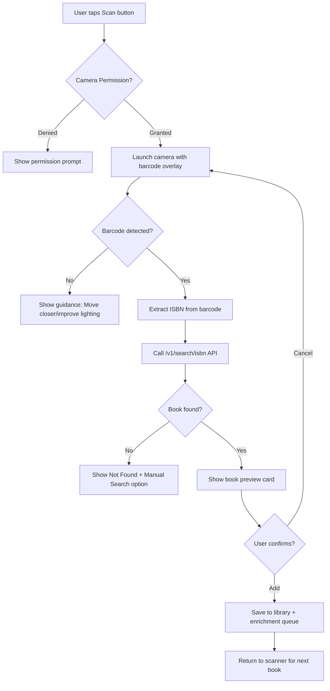

# Barcode Scanner - Product Requirements Document

**Status:** Shipped
**Owner:** Product Team
**Target Release:** v3.0.0+
**Last Updated:** December 2025

---

## Executive Summary

The Barcode Scanner enables users to add books by scanning ISBN barcodes using their device's camera. This one-tap workflow transforms the camera into a book discovery tool, automatically fetching metadata (cover, title, author, description) from backend APIs. The feature reduces book entry time from 30+ seconds of manual search to under 5 seconds per book.

---

## Problem Statement

### User Pain Point

Manual book entry is the #1 friction point during library building. Users must:
1. Open the app
2. Navigate to Search
3. Type the book title (often long, with typos)
4. Scroll through results to find the correct edition
5. Tap to add

For users with 50+ books to add, this process takes 30+ minutes and causes abandonment.

### Current Experience

Users rely on manual title search, which:
- Requires accurate spelling
- Often returns wrong editions (audiobook vs paperback)
- Takes 30+ seconds per book
- Causes fatigue during bulk library building

**Competitor benchmarks:** Libib and Bookbuddy offer barcode scanning as a primary input method.

---

## Target Users

### Primary Persona

| Attribute | Description |
|-----------|-------------|
| **User Type** | Avid readers building their digital library |
| **Usage Frequency** | Burst usage during initial library setup, occasional for new purchases |
| **Tech Savvy** | Medium (comfortable with camera apps) |
| **Primary Goal** | Quickly add physical books without typing |

**Example User Story:**

> "As a **reader who just bought 5 books from a bookstore**, I want to **scan the barcodes on the back** so that I can **add them to my library in under a minute total**."

---

## Success Metrics

| Metric | Target | Measurement |
|--------|--------|-------------|
| **Scan Success Rate** | 95%+ (barcode detected) | Analytics |
| **Metadata Fetch Success** | 90%+ (book found in API) | Backend logs |
| **Time to Add** | <5 seconds per book | User testing |
| **Adoption Rate** | 40% of users try scanner in first week | Funnel analytics |
| **User Satisfaction** | 4.5/5 stars | In-app feedback |

---

## User Stories & Acceptance Criteria

### Must-Have (P0)

#### US-1: Single Book Scan

**As a** user with a physical book
**I want to** point my camera at the barcode and have the book automatically identified
**So that** I can add it without typing anything

**Acceptance Criteria:**
- [x] Camera preview shows live view with barcode detection zone
- [x] ISBN-13 and ISBN-10 barcodes recognized (EAN-13, EAN-8, UPC-E)
- [x] Successful scan triggers haptic feedback and audio cue
- [x] Book metadata fetched within 2 seconds of scan
- [x] Preview card shows cover, title, author before adding
- [x] Edge case: Invalid/unknown ISBN shows "Book not found" with manual search option

#### US-2: Continuous Scanning Mode

**As a** user adding multiple books
**I want to** scan books one after another without navigating back
**So that** I can add my entire shelf quickly

**Acceptance Criteria:**
- [x] After adding a book, scanner automatically returns to ready state
- [x] Visual counter shows "5 books added this session"
- [x] Duplicate detection warns before adding same book twice
- [x] Edge case: Poor lighting shows guidance overlay ("Move to better light")

#### US-3: Permission Handling

**As a** first-time user
**I want to** understand why camera access is needed
**So that** I feel comfortable granting permission

**Acceptance Criteria:**
- [x] Pre-permission screen explains feature with illustration
- [x] Permission denial shows alternative (manual search)
- [x] Settings deep-link provided to enable camera later

---

### Should-Have (P1)

#### US-4: Multi-Barcode Detection

**As a** user with a book that has multiple barcodes
**I want** the app to pick the ISBN barcode automatically
**So that** I don't have to cover up other barcodes

**Acceptance Criteria:**
- [x] If multiple barcodes detected, prioritize ISBN format (978-, 979-)
- [x] Ignore price barcodes and store inventory codes
- [x] Visual highlight on detected ISBN barcode

---

### Nice-to-Have (P2)

- [ ] Bulk scan history with undo
- [ ] Flashlight toggle for low-light scanning
- [ ] Accessibility mode with audio feedback for visually impaired users
- [ ] Offline queue for scans without network

---

## Functional Requirements

### High-Level Flow



### Feature Specifications

#### Barcode Detection

**Description:** Real-time camera analysis to detect and decode ISBN barcodes

**Requirements:**
- **Input:** Live camera feed
- **Supported Formats:** EAN-13 (ISBN-13), EAN-8, UPC-E (some ISBN-10)
- **Output:** Decoded ISBN string
- **Performance:** Detection within 500ms of barcode entering frame
- **Error Handling:** Damaged/blurry barcodes show "Can't read barcode, try again"

#### ISBN Lookup

**Description:** Backend API call to fetch book metadata from ISBN

**Requirements:**
- **Endpoint:** `GET /v1/search/isbn?isbn={isbn}`
- **Response Time:** <2 seconds (95th percentile)
- **Fallback:** If primary provider fails, try secondary provider
- **Caching:** Results cached 7 days in CDN

---

## Non-Functional Requirements

### Performance

| Requirement | Target | Rationale |
|-------------|--------|-----------|
| **Detection Latency** | <500ms | Feels instant |
| **API Response** | <2s | User patience threshold |
| **Battery Impact** | <3% for 10 scans | Camera is power-hungry |

### Reliability

- **Detection Accuracy:** 95%+ for clean, well-lit barcodes
- **Offline Support:** Not required (ISBN lookup needs network)
- **Error Recovery:** Camera restart button if preview freezes

### Accessibility

- [x] VoiceOver announces "Barcode detected: [book title]"
- [x] High contrast detection zone border
- [x] Haptic and audio feedback (not just visual)
- [x] Works with zoom accessibility feature enabled

---

## Data Models

### Scanned Book (Transient)

```typescript
interface ScannedBook {
  isbn: string;
  title: string;
  authors: string[];
  coverUrl?: string;
  publisher?: string;
  publishedDate?: string;
  confidence: number;  // 0.0-1.0 match confidence
}
```

### Scan Session (Analytics)

```typescript
interface ScanSession {
  sessionId: string;
  startTime: Date;
  booksScanned: number;
  booksAdded: number;
  failedScans: number;
  averageScanTime: number; // milliseconds
}
```

---

## API Contracts

### ISBN Lookup

| Endpoint | Method | Purpose |
|----------|--------|---------|
| `/v1/search/isbn` | GET | Lookup book by ISBN |

**Request:**
```
GET /v1/search/isbn?isbn=9780141036144
```

**Response:**
```json
{
  "success": true,
  "data": {
    "works": [{
      "title": "1984",
      "authors": ["George Orwell"],
      "primaryProvider": "google-books"
    }],
    "editions": [{
      "isbn": "9780141036144",
      "coverImageURL": "https://...",
      "publisher": "Penguin"
    }]
  }
}
```

**Error Codes:**
- `INVALID_ISBN` (400): Malformed ISBN
- `NOT_FOUND` (404): No book matches ISBN
- `RATE_LIMIT` (429): Too many requests

---

## Testing Strategy

### Unit Tests

- [ ] ISBN validation (valid ISBN-10, ISBN-13, invalid formats)
- [ ] Barcode format filtering (ignore non-ISBN codes)
- [ ] Duplicate detection logic

### Integration Tests

- [ ] Full flow: Scan → API → Save to library
- [ ] Permission denial → Manual search fallback
- [ ] Network timeout → Error message + retry

### Manual QA Checklist

- [ ] Scan in bright light, dim light, and artificial light
- [ ] Scan glossy vs matte book covers
- [ ] Scan damaged/partially obscured barcodes
- [ ] Test with ISBN-10 and ISBN-13 barcodes
- [ ] Verify haptic feedback on successful scan
- [ ] Test with screen reader enabled

---

## Platform Implementation Notes

### iOS Implementation

**Status:** Completed

**Key Files:**
- `ISBNScannerView.swift` - Main scanner view using VisionKit
- `ISBNValidator.swift` - ISBN format validation
- `BookSearchAPIService.swift` - API client for ISBN lookup

**Platform-Specific Details:**
- Uses Apple VisionKit `DataScannerViewController` (iOS 16+)
- Native barcode detection (no third-party library)
- Symbologies: `.ean13`, `.ean8`, `.upce`
- Built-in guidance UI ("Move Closer", "Slow Down")
- Accessibility: VoiceOver announces detected text automatically

**VisionKit Configuration:**
```swift
let config = DataScannerViewController.RecognizedDataType.barcode(symbologies: [.ean13, .ean8, .upce])
let scanner = DataScannerViewController(
    recognizedDataTypes: [config],
    qualityLevel: .balanced,
    recognizesMultipleItems: false,
    isHighFrameRateTrackingEnabled: true,
    isGuidanceEnabled: true,
    isHighlightingEnabled: true
)
```

---

### Flutter Implementation

**Status:** Not Started

**Recommended Approach:**
- Use `mobile_scanner` package (maintained, cross-platform)
- Alternative: `flutter_barcode_scanner` for simpler integration
- Platform channels needed: Camera permission handling

**Key Dependencies:**
```yaml
dependencies:
  mobile_scanner: ^3.0.0
  permission_handler: ^11.0.0
```

**Implementation Notes:**
- Configure for ISBN formats only (EAN-13, EAN-8, UPC-E)
- Handle Android camera permission flow (different from iOS)
- Consider `CameraController` lifecycle on Android (pause/resume)

---

### Android Implementation

**Status:** Not Started

**Recommended Approach:**
- Use ML Kit Barcode Scanning API (Google, free)
- Alternative: ZXing library (older but proven)

**Key Dependencies:**
```gradle
implementation 'com.google.mlkit:barcode-scanning:17.2.0'
```

---

## Decision Log

### [October 2025] Decision: VisionKit over Third-Party Libraries (iOS)

**Context:** Needed to choose barcode scanning approach for iOS
**Decision:** Use Apple's VisionKit DataScannerViewController
**Rationale:**
- Native API = better performance and battery efficiency
- Built-in accessibility support (VoiceOver)
- No third-party dependency maintenance
- Matches Apple's recommended patterns
**Alternatives Considered:** ZXing, AVFoundation custom implementation
**Outcome:** Shipped with zero barcode detection issues

---

## Related Documentation

- **Workflow Diagram:** `docs/workflows/isbn-scan-workflow.md`
- **Technical Spec:** `docs/features/ISBN_SCANNER.md`
- **API Contract:** See AGENTS.md Backend API Contract section

---

## Changelog

| Date | Change | Author |
|------|--------|--------|
| Oct 2025 | Initial iOS implementation | Engineering |
| Nov 2025 | Added continuous scan mode | Engineering |
| Dec 2025 | Refactored to platform-agnostic PRD | Documentation |
