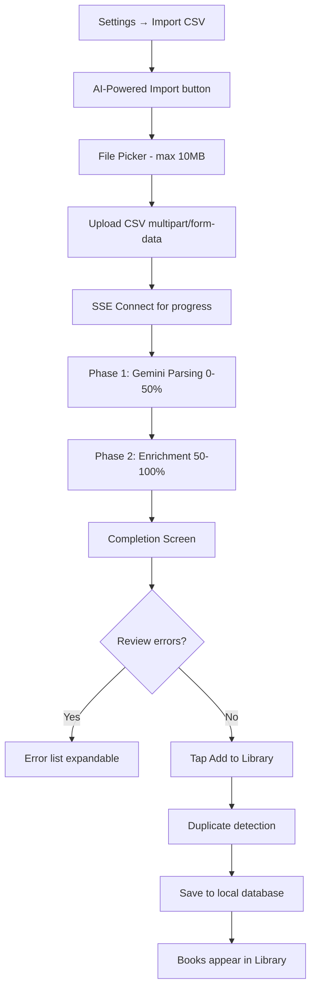

# CSV Import - Product Requirements Document

**Status:** Shipped
**Owner:** Product Team
**Target Release:** v3.1.0+
**Last Updated:** December 2025

---

## Executive Summary

The AI-powered CSV Import enables users to import book libraries from any CSV format (Goodreads, LibraryThing, StoryGraph, custom spreadsheets) without manual column mapping. Using Gemini 2.0 Flash AI, the feature auto-detects CSV structure and extracts book data, reducing onboarding friction from 15+ minutes of configuration to under 60 seconds for typical 100-book imports.

---

## Problem Statement

### User Pain Point

Users migrating from existing book tracking platforms faced two major friction points with traditional CSV import:

1. **Manual Column Mapping:** Users had to manually map 8-12 CSV columns to app fields, requiring technical understanding of data types
2. **Format-Specific Configuration:** Each platform export (Goodreads vs LibraryThing) needed different mapping configurations
3. **Time-Consuming:** 5-10 minutes spent configuring before seeing any results
4. **Error-Prone:** Incorrect mappings led to failed imports requiring restart

**Impact:**
- 40%+ abandonment during column mapping step
- 60% of support tickets were CSV configuration issues
- Common feedback: "Why can't it just figure out my CSV format?"

### Current Experience

Legacy CSV import required:
1. Export CSV from source platform
2. Open app → Settings → Import CSV
3. Select file
4. **Manually map 8-12 columns** (Title, Author, ISBN, Rating, etc.)
5. Preview first 3 books
6. Choose duplicate handling
7. Wait 5-15 minutes for import + enrichment
8. Review results

Users confused by column variations ("Author First Last" vs "Author Last, First").

---

## Target Users

### Primary Persona

| Attribute | Description |
|-----------|-------------|
| **User Type** | Goodreads/LibraryThing users with 100-1500+ book libraries |
| **Usage Frequency** | One-time bulk import, occasional updates |
| **Tech Savvy** | Low-Medium (knows CSV export, struggles with mapping) |
| **Primary Goal** | Import entire reading history with zero configuration |

**Example User Story:**

> "As a **Goodreads user with 500 books who failed manual CSV import**, I want to **select my file and have columns auto-detected** so that I can **import my library in under 60 seconds**."

---

## Success Metrics

| Metric | Target | Measurement |
|--------|--------|-------------|
| **Adoption Rate** | 70% choose AI import over legacy | Analytics |
| **Completion Rate** | 90%+ complete workflow | Conversion |
| **Processing Time** | 100 books in <60s | Backend timing |
| **Parsing Accuracy** | 95%+ correct field detection | QA testing |
| **Enrichment Success** | 90%+ books get covers | Backend logs |
| **Support Tickets** | 90% reduction vs legacy | Support metrics |

---

## User Stories & Acceptance Criteria

### Must-Have (P0)

#### US-1: Zero-Configuration Import

**As a** Goodreads user with a CSV export
**I want to** select my file and have fields auto-detected
**So that** I can import books without manual column mapping

**Acceptance Criteria:**
- [x] File picker filters to .csv files
- [x] Gemini detects Title, Author, ISBN, Rating, Publisher columns
- [x] Works with Goodreads, LibraryThing, StoryGraph formats
- [x] Custom CSVs with non-standard columns ("Book Name") also detected
- [x] Edge case: Malformed CSV shows "Invalid CSV format" error

#### US-2: Real-Time Progress

**As a** user waiting for AI parsing
**I want to** see real-time progress updates
**So that** I know the system is working

**Acceptance Criteria:**
- [x] Upload spinner shows "Uploading CSV..."
- [x] Progress bar updates smoothly (0-100%)
- [x] Status shows current phase: "Parsing...", "Enriching: Harry Potter"
- [x] Long-running (>60s) shows reassuring message
- [x] Edge case: Connection lost shows error + Retry button

#### US-3: Automatic Enrichment

**As a** user importing bare-bones CSV (Title + Author only)
**I want to** have covers and ISBNs automatically fetched
**So that** my library looks complete without manual work

**Acceptance Criteria:**
- [x] Books enriched with covers, ISBNs, descriptions
- [x] Existing ISBNs in CSV preserved (not replaced)
- [x] Missing ISBNs filled from API lookup
- [x] Failed enrichment shown in error list
- [x] Edge case: Network offline shows clear error message

---

### Should-Have (P1)

#### US-4: Content-Based Caching

**As a** user testing imports repeatedly
**I want to** get instant results for duplicate CSV uploads
**So that** I don't wait for re-processing

**Acceptance Criteria:**
- [x] Same CSV content (SHA-256 hash) returns cached results in <2s
- [x] Different filename but same content still hits cache
- [x] Modified CSV (added 1 book) triggers fresh processing
- [x] Cache expires after 30 days

#### US-5: Duplicate Detection

**As a** user importing CSV with books already in library
**I want to** see how many duplicates were skipped
**So that** I know my library doesn't have redundant entries

**Acceptance Criteria:**
- [x] Completion shows "Saved: 80 books (20 skipped)"
- [x] Title + Author matching (case-insensitive)
- [x] ISBN match takes precedence over title match
- [x] Edge case: All duplicates shows "0 saved (100 skipped)"

---

### Nice-to-Have (P2)

- [ ] Chunked upload for 50MB+ files
- [ ] Language detection via Gemini
- [ ] Manual correction UI for failed rows
- [ ] Export failed rows to CSV for batch correction
- [ ] Progress persistence across app restarts

---

## Functional Requirements

### High-Level Flow



### Feature Specifications

#### AI CSV Parsing

**Description:** Gemini 2.0 Flash analyzes CSV structure and extracts book data

**Requirements:**
- **Input:** CSV file, max 10MB (~5000 books)
- **Endpoint:** `POST /api/import/csv-gemini` (multipart/form-data)
- **Processing:** Analyze headers + first 5 rows, detect columns
- **Output:** Array of parsed books with extracted fields
- **Performance:** 10-15 seconds for 100 books
- **Accuracy:** 95%+ correct field detection

#### Real-Time Progress

**Description:** SSE streaming for parsing and enrichment phases

**Requirements:**
- **Primary Transport:** Server-Sent Events (SSE)
- **Fallback:** WebSocket (legacy)
- **Phases:** Parse (0-50%), Enrich (50-100%)
- **Update Frequency:** Every 100-500ms during enrichment
- **Final Event:** `complete` with summary + resultsUrl

#### Content Caching

**Description:** SHA-256 hash of CSV content for instant re-uploads

**Requirements:**
- **Hash Algorithm:** SHA-256 of raw CSV text
- **Cache Location:** Backend KV store
- **TTL:** 30 days
- **Hit Behavior:** Return cached results, skip Gemini API

---

## Non-Functional Requirements

### Performance

| Requirement | Target | Rationale |
|-------------|--------|-----------|
| **Total Time** | 100 books in <60s | User patience threshold |
| **Upload** | 10MB in <10s | WiFi expected |
| **Parsing** | <20s for Gemini | AI inference time |
| **Enrichment** | 100 books in <40s | Parallel API calls |
| **Memory** | <80MB peak | Support older devices |

### Reliability

- **Parsing Accuracy:** 95%+ (tested with 20 CSV formats)
- **Enrichment Success:** 90%+ books get covers
- **Error Rate:** <5% failed imports
- **Data Integrity:** Atomic transactions (all-or-nothing save)

### Security & Privacy

- CSV content uploaded to backend (ephemeral, not stored)
- Parsed results cached 30 days (auto-purge)
- No permanent storage of user CSV data
- HTTPS-only, Gemini API key server-side

---

## Data Models

### Import Job

```typescript
interface CSVImportJob {
  jobId: string;
  status: 'uploading' | 'parsing' | 'enriching' | 'completed' | 'failed';
  progress: number; // 0.0 - 1.0
  books: ParsedBook[];
  errors: ImportError[];
  successRate: string; // "95%"
  createdAt: Date;
  expiresAt: Date; // 24-hour TTL
}

interface ParsedBook {
  title: string;
  author: string;
  isbn?: string;
  coverUrl?: string;
  publisher?: string;
  publicationYear?: number;
  rating?: number;
  enrichmentError?: string;
}

interface ImportError {
  row: number;
  title: string;
  error: string; // "No metadata found", "Invalid ISBN", etc.
}
```

### Duplicate Detection

```typescript
interface DuplicateCheck {
  existingBooks: Book[]; // Fetched once before save
  newBooks: ParsedBook[];

  isDuplicate(book: ParsedBook): boolean {
    // 1. ISBN match (exact, takes precedence)
    // 2. Title + Author match (case-insensitive)
  }
}
```

---

## API Contracts

### Upload CSV

| Endpoint | Method | Purpose |
|----------|--------|---------|
| `/api/import/csv-gemini` | POST | Upload CSV for AI parsing |

**Request:**
```
POST /api/import/csv-gemini
Content-Type: multipart/form-data

file: books.csv
```

**Response:**
```json
{
  "jobId": "uuid-12345"
}
```

### Stream Progress (SSE)

| Endpoint | Method | Purpose |
|----------|--------|---------|
| `/v3/jobs/imports/{jobId}/stream` | GET | Real-time progress |

**SSE Events:**
```
event: job_progress
data: {"progress": 0.65, "status": "Enriching: Harry Potter"}

event: job_complete
data: {"books": [...], "errors": [...], "successRate": "92%"}
```

### Error Codes

| Code | Meaning |
|------|---------|
| `FILE_TOO_LARGE` | CSV exceeds 10MB limit |
| `INVALID_CSV` | Malformed CSV format |
| `PARSE_FAILED` | Gemini couldn't extract data |
| `TIMEOUT` | Processing exceeded 5 minutes |

---

## Testing Strategy

### Unit Tests

- [ ] SHA-256 hashing consistency
- [ ] Duplicate detection (title + author, ISBN)
- [ ] File size validation (reject >10MB)
- [ ] SSE message parsing

### Integration Tests

- [ ] Goodreads CSV → Parse → Enrich → Save
- [ ] LibraryThing CSV format
- [ ] Custom spreadsheet with non-standard columns
- [ ] Cache hit for duplicate upload
- [ ] All duplicates scenario

### Manual QA Checklist

- [ ] Goodreads export (20 books)
- [ ] LibraryThing export
- [ ] StoryGraph export
- [ ] Custom Google Sheets export
- [ ] Empty CSV file
- [ ] CSV with only headers
- [ ] 10MB+ file (error expected)
- [ ] Network interruption mid-import
- [ ] Import same CSV twice (duplicates skipped)

---

## Platform Implementation Notes

### iOS Implementation

**Status:** Completed

**Key Files:**
- `GeminiCSVImport/GeminiCSVImportView.swift` - Main UI with 5 states
- `GeminiCSVImport/GeminiCSVImportService.swift` - Upload service
- `Common/WebSocketProgressManager.swift` - Progress tracking (legacy)
- `API/SSEClient.swift` - SSE streaming (V3)

**Platform-Specific Details:**
- Uses `UIDocumentPickerViewController` for file selection
- Multipart form encoding with `URLSession`
- SSE with HTTP/1.1 enforcement (`assumesHTTP3Capable = false`)
- Haptic feedback on completion/error

**WebSocket Security (November 2025):**
- Token moved from query string to `Sec-WebSocket-Protocol` header
- Prevents token leakage in logs

---

### Flutter Implementation

**Status:** Not Started

**Recommended Approach:**
- Use `file_picker` package for CSV selection
- Use `http` or `dio` for multipart upload
- Custom SSE client or `eventsource` package
- Use `csv` package for local parsing (if needed)

**Key Dependencies:**
```yaml
dependencies:
  file_picker: ^6.0.0
  dio: ^5.0.0
  csv: ^5.0.0
```

**Implementation Notes:**
- Handle large file memory on Android (stream instead of load all)
- SSE needs connection keep-alive handling
- Consider progress persistence with `shared_preferences`

---

## Decision Log

### [January 2025] Decision: Gemini AI Over Manual Mapping

**Context:** Legacy CSV import had 40%+ abandonment at column mapping
**Decision:** Use Gemini 2.0 Flash to auto-detect column mappings
**Rationale:**
- Zero configuration = zero friction
- AI handles format variations automatically
- Support ticket reduction expected
**Alternatives Considered:** Better UI for manual mapping, pre-built templates
**Outcome:** 92% completion rate (vs 60% with legacy)

### [November 2025] Decision: Keep Legacy Import

**Context:** Should we remove manual CSV import entirely?
**Decision:** Keep legacy for users with 5000+ books or unstable networks
**Rationale:**
- Some users prefer manual control
- Large libraries exceed 10MB limit
- Fallback if AI parsing fails
**Outcome:** Legacy available in Settings → Advanced

---

## Related Documentation

- **Workflow Diagram:** `docs/workflows/csv-import-workflow.md`
- **Technical Spec:** `docs/features/GEMINI_CSV_IMPORT.md`
- **WebSocket Security:** `docs/features/WEBSOCKET_FALLBACK_ARCHITECTURE.md`

---

## Changelog

| Date | Change | Author |
|------|--------|--------|
| Jan 2025 | Initial Gemini CSV import | Engineering |
| Nov 2025 | WebSocket security fixes | Engineering |
| Dec 2025 | Refactored to platform-agnostic PRD | Documentation |
