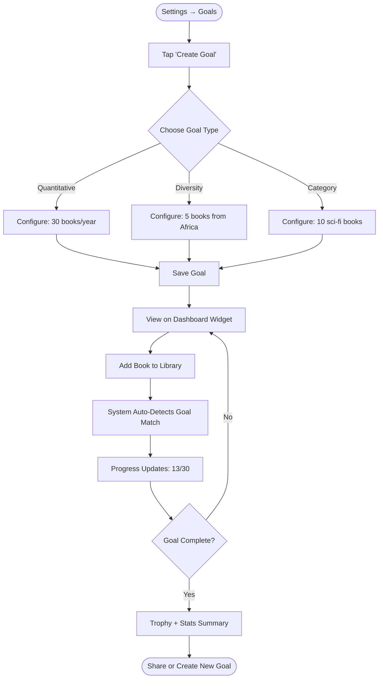

# Reading Goals - Product Requirements Document

**Status:** Draft
**Owner:** Product Team
**Target Release:** v3.8.0
**Last Updated:** January 5, 2026

---

## Executive Summary

Reading Goals empowers users to set and track quantitative reading targets (books/year, pages/week, reading streaks) alongside diversity challenge goals (e.g., "Read 5 books from Africa in 2026"). The feature transforms passive library management into active reading habit building, increasing user engagement through gamification, progress notifications, and visual achievement tracking.

---

## Problem Statement

### User Pain Point

**What problem are we solving?**

Book tracking apps capture *what* users read but fail to motivate users toward intentional reading habits. Users report:

1. **Lack of Reading Momentum:** "I track books but don't have goals to work toward"
2. **Diversity Blind Spots:** "I didn't realize I only read male authors until I saw my stats"
3. **Abandoned Reading Habits:** "I start strong in January but lose motivation by March"
4. **No Accountability:** "Without a target, I don't prioritize reading over Netflix"

**Impact:**
- 65% of users add <10 books in their first 3 months (low engagement)
- Users don't leverage diversity insights for personal growth
- No mechanism to celebrate reading milestones (50th book, 365-day streak)

### Current Experience

**How do users currently solve this problem?**

Users rely on external tools or manual tracking:
- Goodreads "Reading Challenge" (books/year only, no diversity goals)
- Spreadsheet tracking (manual, no notifications)
- Mental targets ("I want to read more") without measurable progress
- Third-party habit trackers (separate from book library)

**Pain Points:**
- No integration with existing book data
- Manual updates required (e.g., "Did I hit my goal this week?")
- No diversity-specific challenges (underrepresented regions, marginalized voices)
- Achievements invisible (no badges, no sharing)

---

## Target Users

### Primary Persona

| Attribute | Description |
|-----------|-------------|
| **User Type** | Intentional readers seeking structured growth |
| **Usage Frequency** | Daily check-ins, weekly progress reviews |
| **Tech Savvy** | Medium-High |
| **Primary Goal** | Build consistent reading habits and diversify reading diet |

**Example User Story:**

> "As an **avid reader who completed 25 books last year**, I want to **set a goal of 30 books in 2026 with 40% from non-Western authors** so that I can **challenge myself to read more diversely and hit a new personal record**."

---

## Success Metrics

### Key Performance Indicators (KPIs)

| Metric | Target | Measurement Method |
|--------|--------|-------------------|
| **Adoption Rate** | 40% of users create at least 1 goal within 7 days | Analytics |
| **Completion Rate** | 60% of users with goals complete at least 1 goal/year | Goal tracking |
| **Engagement Lift** | 35% increase in books added for users with active goals | Cohort analysis |
| **Diversity Impact** | 20% increase in diversity score for users with diversity goals | Stats comparison |
| **Retention** | 2x higher 90-day retention for goal-setters vs non-goal-setters | Retention curves |

---

## User Stories & Acceptance Criteria

### Must-Have (P0) - Core Functionality

#### User Story 1: Create Quantitative Goal

**As a** regular reader
**I want to** set a books/year goal (e.g., "Read 30 books in 2026")
**So that** I have a concrete target to work toward

**Acceptance Criteria:**
- [ ] Given I'm in Settings → Goals, when I tap "Create Goal," I see 3 goal type options (Quantitative, Diversity, Category)
- [ ] Given I select Quantitative, when I choose "Books Per Year," I can set a target number (1-1000 books)
- [ ] Given I create a goal, when I return to Library tab, I see a progress widget showing "12/30 books (40%)"
- [ ] Edge case: Given I set 100 books/year, system shows weekly target (1.9 books/week) to help pacing

---

#### User Story 2: Track Diversity Challenge Goal

**As a** reader wanting to expand cultural horizons
**I want to** create a diversity challenge (e.g., "Read 5 books from Africa in 6 months")
**So that** I intentionally diversify my reading

**Acceptance Criteria:**
- [ ] Given I select Diversity Challenge, when I configure it, I can choose: region (Africa, Asia, etc.), gender (female, non-binary), timeline (3-12 months), target count (1-50 books)
- [ ] Given I add a book from Africa, when I view goal progress, system auto-detects it counts toward my Africa challenge
- [ ] Given I complete a diversity goal, when it finishes, I see a celebration screen with stats (e.g., "Explored 3 new cultural regions!")
- [ ] Edge case: Given a book has authors from multiple regions, system asks which goal to credit

---

#### User Story 3: Monitor Progress with Visual Feedback

**As a** goal-oriented reader
**I want to** see real-time progress on my dashboard
**So that** I stay motivated and on track

**Acceptance Criteria:**
- [ ] Given I have 2 active goals, when I open the app, I see a "Goals" widget showing % complete for each
- [ ] Given I'm behind pace (Week 20, only 10/30 books), when I view goal details, I see "Need 1.5 books/week to finish on time" alert
- [ ] Given I complete a book that fulfills a goal, when it's added, I see a confetti animation + "Goal Progress: 13/30 books! 🎉"
- [ ] Edge case: Given I complete multiple goals with one book (e.g., 1 book counts for "30 books/year" AND "5 books from Asia"), both show progress

---

### Should-Have (P1) - Enhanced Experience

#### User Story 4: Category-Specific Goals

**As a** reader expanding genre preferences
**I want to** set category goals (e.g., "Read 10 sci-fi books")
**So that** I explore genres outside my comfort zone

**Acceptance Criteria:**
- [ ] Given I select Category Goal, when configuring, I can choose genre (Fiction, Non-Fiction, Mystery, Sci-Fi, etc.), count (1-50), timeline
- [ ] Given I add a sci-fi book, when it's enriched with genre tags, system auto-counts it toward my sci-fi goal
- [ ] Edge case: Given a book has multiple genres (Sci-Fi + Thriller), system prompts "Count toward which goal?"

---

#### User Story 5: Reading Streak Tracking

**As a** habit-focused reader
**I want to** track daily reading streaks
**So that** I build consistent reading habits

**Acceptance Criteria:**
- [ ] Given I mark a book as "Currently Reading" and log pages daily, when I hit 7 consecutive days, I see "7-day streak! 🔥"
- [ ] Given I miss a day, when I return, I see "Streak broken. Start a new one today!"
- [ ] Edge case: Given I read multiple books in one day, streak still counts as 1 day

---

### Nice-to-Have (P2) - Future Enhancements

- **Goal Templates:** Pre-configured goals (e.g., "TBR Stack Buster: Finish 10 owned books")
- **Social Sharing:** Share completed goals to social media with custom graphics
- **Goal Recommendations:** AI suggests goals based on reading history (e.g., "Try 3 non-fiction books this quarter")
- **Milestone Badges:** Earn badges for 100 books, 1-year streak, 10 countries represented
- **Goal Reminders:** Push notifications for weekly progress check-ins

---

## Functional Requirements

### High-Level Flow

**End-to-end user journey:**



---

### Feature Specifications

#### Goal Types

**1. Quantitative Goals**

**Description:** Numeric targets tied to time periods

**Supported Metrics:**
- Books per year (e.g., 50 books in 2026)
- Pages per week (e.g., 500 pages/week)
- Reading streak (e.g., read 30 consecutive days)

**Requirements:**
- **Input:** Target number, time period (year/month/week)
- **Processing:** System calculates daily/weekly pace needed based on current progress
- **Output:** Progress bar, % complete, pace indicator ("On Track" vs "Behind Pace")
- **Error Handling:** If user sets unrealistic goal (e.g., 1000 books/year), show warning "This requires 2.7 books/day"

---

**2. Diversity Challenge Goals**

**Description:** Read X books from specific demographic dimensions within Y timeframe

**Supported Dimensions:**
- **Cultural Region:** Africa, Asia, Europe, North America, South America, Oceania, Middle East, Caribbean
- **Author Gender:** Female, Non-Binary, Any Marginalized
- **Combined:** E.g., "5 books by female African authors"

**Requirements:**
- **Input:** Dimension selection, target count, deadline (3-12 months)
- **Processing:** Auto-match books based on author diversity metadata (from enrichment pipeline)
- **Output:** Visual breakdown (e.g., "3/5 books complete, 2 regions explored")
- **Error Handling:** If book lacks diversity metadata, prompt user to add manually

---

**3. Category Goals**

**Description:** Read X books from specific genre/category

**Supported Categories:**
- Genre tags (Fiction, Mystery, Sci-Fi, Fantasy, Non-Fiction, Biography, etc.)
- Reading status (Owned books, Wishlisted books)

**Requirements:**
- **Input:** Genre selection, target count, timeline
- **Processing:** Match books by `subjectTags` from enrichment
- **Output:** Category progress bar, book list filtered by category
- **Error Handling:** If genre tags missing, suggest user add genre manually

---

#### Progress Tracking

**Real-Time Updates:**
- Goal progress recalculates on every book addition
- Dashboard widget updates immediately (SwiftData observation)
- Notifications triggered on milestone completion (25%, 50%, 75%, 100%)

**Pacing Alerts:**
- If user is behind target by >20%, show "Need 2.3 books/week to finish on time"
- If ahead of schedule, show "You're ahead! Keep it up!"

---

#### Celebration Moments

**Goal Completion:**
- Confetti animation overlay
- Stats summary: "You read 30 books! 📚 That's 9,450 pages from 12 countries."
- Option to share achievement (image export with branded template)

**Streaks:**
- Fire emoji 🔥 indicator on dashboard for active streaks
- Streak milestone notifications (7, 30, 100, 365 days)

---

## Non-Functional Requirements

### Performance

| Requirement | Target | Rationale |
|-------------|--------|-----------|
| **Goal Calculation** | <50ms | Instant progress updates on book add |
| **Dashboard Load** | <200ms | Widget data fetched from SwiftData cache |
| **Memory Usage** | +5MB max | Goal data is lightweight (< 10 KB/goal) |

---

### Reliability

- **Error Rate:** 99.9% goal progress accuracy (books counted correctly)
- **Offline Support:** Full offline mode (goals stored in SwiftData, sync via CloudKit)
- **Data Integrity:** Goal history preserved across library resets (separate SwiftData entity)

---

### Accessibility (WCAG AA Compliance)

- [ ] Screen reader announces progress ("13 of 30 books complete, 43 percent")
- [ ] Color contrast 4.5:1 for progress bars (green = on track, red = behind)
- [ ] Dynamic text sizing for goal labels
- [ ] VoiceOver actions for goal edit/delete
- [ ] Reduced motion: Disable confetti animations

---

### Security & Privacy

- **Data Storage:** Goals stored locally in SwiftData, synced via CloudKit (user's private database)
- **API Security:** No backend API calls (all client-side logic)
- **Privacy Considerations:** No goal data shared without explicit user action (share button)

---

## Data Models

### Core Entities

```typescript
interface ReadingGoal {
  id: string;              // UUID
  type: 'quantitative' | 'diversity' | 'category';
  status: 'active' | 'completed' | 'paused' | 'abandoned';

  // Common fields
  name: string;            // User-provided or auto-generated ("30 Books in 2026")
  targetCount: number;     // E.g., 30 books
  currentProgress: number; // E.g., 13 books
  startDate: Date;
  endDate: Date;
  createdAt: Date;
  completedAt?: Date;

  // Type-specific fields (discriminated union)
  quantitativeConfig?: {
    metric: 'books_per_year' | 'pages_per_week' | 'reading_streak';
    period: 'year' | 'month' | 'week';
  };

  diversityConfig?: {
    dimension: 'region' | 'gender' | 'combined';
    culturalRegion?: CulturalRegion;
    authorGender?: AuthorGender;
  };

  categoryConfig?: {
    genre: string;  // Subject tag filter
  };

  // Progress tracking
  bookIDs: string[];       // Works or Editions that count toward goal
  milestones: Milestone[]; // 25%, 50%, 75%, 100% markers
}

interface Milestone {
  percentage: number;      // 25, 50, 75, 100
  achievedAt?: Date;
  notificationSent: boolean;
}

enum CulturalRegion {
  Africa = 'africa',
  Asia = 'asia',
  Europe = 'europe',
  NorthAmerica = 'north-america',
  SouthAmerica = 'south-america',
  Oceania = 'oceania',
  MiddleEast = 'middle-east',
  Caribbean = 'caribbean'
}

enum AuthorGender {
  Female = 'female',
  NonBinary = 'non-binary',
  Marginalized = 'marginalized'  // Auto-detected from diversity metadata
}
```

### Relationships

```
User 1:many ReadingGoal
ReadingGoal many:many Work (via bookIDs array)
ReadingGoal 1:many Milestone
```

---

## API Contracts

**No backend API required** - Goals are client-side only, stored in SwiftData + CloudKit sync.

**Future Enhancement (v4.0):** If social features added, consider:
- `POST /api/goals/share` - Generate shareable image
- `GET /api/goals/templates` - Pre-built goal suggestions

---

## Testing Strategy

### Unit Tests

- [ ] GoalProgressCalculator - Correctly counts books toward quantitative goals
- [ ] DiversityGoalMatcher - Matches books by cultural region and gender
- [ ] CategoryGoalMatcher - Matches books by subject tags
- [ ] MilestoneDetector - Triggers notifications at 25%, 50%, 75%, 100%
- [ ] PaceCalculator - Calculates "books/week needed" for on-time completion
- [ ] Edge case: Book counts toward multiple goals (both update progress)
- [ ] Edge case: User deletes book that contributed to goal (progress decrements)

### Integration Tests

- [ ] End-to-end: Create goal → Add 5 books → Complete goal → See celebration
- [ ] CloudKit sync: Goal created on iPhone syncs to iPad within 30s
- [ ] Library reset: Goals persist after library reset (separate table)

### Manual QA Checklist

- [ ] Real device: Goal widget updates immediately on book add
- [ ] Accessibility: VoiceOver correctly announces progress percentages
- [ ] Edge case: Set goal for 2025, verify progress frozen on Jan 1 2026
- [ ] Edge case: Add book with no diversity metadata, verify manual entry prompt
- [ ] Performance: 100+ goals in database, dashboard loads <200ms

---

## Platform Implementation Notes

### iOS Implementation

**Status:** Not Started (Target: v3.8.0)

**Key Files:**
- `BooksTrackerPackage/Sources/BooksTrackerFeature/Models/ReadingGoal.swift` - SwiftData model
- `BooksTrackerPackage/Sources/BooksTrackerFeature/Goals/GoalsView.swift` - Main goals UI
- `BooksTrackerPackage/Sources/BooksTrackerFeature/Goals/CreateGoalView.swift` - Goal creation flow
- `BooksTrackerPackage/Sources/BooksTrackerFeature/Goals/GoalProgressWidget.swift` - Dashboard widget
- `BooksTrackerPackage/Sources/BooksTrackerFeature/Services/GoalTrackingService.swift` - Progress calculation logic

**Platform-Specific Considerations:**
- SwiftData `@Model` for ReadingGoal entity
- CloudKit sync via `.modelContainer(for: [Work.self, ReadingGoal.self], isCloudKitSyncEnabled: true)`
- Local notifications (UNUserNotificationCenter) for milestone alerts
- WidgetKit integration for home screen widget showing goal progress
- Confetti animation using `CAEmitterLayer` or SwiftUI particle effects

---

### Flutter Implementation

**Status:** Not Started (Required for v1.0 Parity)

**Key Files:**
- `lib/features/goals/models/reading_goal.dart` - Data model
- `lib/features/goals/screens/goals_screen.dart` - Main goals UI
- `lib/features/goals/services/goal_tracking_service.dart` - Progress calculation
- `lib/features/goals/widgets/goal_progress_widget.dart` - Dashboard widget

**Platform-Specific Considerations:**
- Local storage: Drift or Isar database for offline-first goals
- Reactive updates: Riverpod or Bloc for state management (auto-update progress on book add)
- Notifications: `flutter_local_notifications` package for milestone alerts
- Confetti animation: `confetti` package or custom particle system
- **Challenge:** No native CloudKit - use Firebase Firestore or custom sync API

**Flutter Package Dependencies:**
```yaml
dependencies:
  drift: ^2.x         # Local database
  isar: ^3.x          # Alternative: High-performance database
  riverpod: ^2.x      # State management
  flutter_local_notifications: ^17.x
  confetti: ^0.7.x    # Celebration animations
```

---

## Related Documentation

- **Diversity Insights PRD:** `docs/product/Diversity-Insights-PRD.md` (goal calculations leverage existing diversity stats)
- **Reading Statistics PRD:** `docs/product/Reading-Statistics-PRD.md` (goals complement stats)
- **Notification Strategy:** TBD (document local notification patterns)

---

## Open Questions & Risks

### Unresolved Decisions

- [ ] **Goal Edit Behavior:** If user changes goal mid-year (30 → 40 books), do we preserve old progress or recalculate? **Owner:** Product - **Due:** Feb 1, 2026
- [ ] **Notification Cadence:** Weekly reminders or only milestone notifications? **Owner:** UX - **Due:** Feb 15, 2026
- [ ] **Goal Expiry:** Do completed goals auto-archive after 1 year or remain visible indefinitely? **Owner:** Engineering - **Due:** Feb 1, 2026

### Known Risks

| Risk | Impact | Probability | Mitigation |
|------|--------|-------------|------------|
| Users set unrealistic goals and abandon app | High | Medium | Add "Recommended" labels (e.g., "30 books is challenging but achievable") |
| Diversity metadata missing for >30% of books | Medium | High | Prompt manual diversity entry with helpful tooltips |
| Notification fatigue (too many goal alerts) | Medium | Medium | Limit to milestone notifications only, allow opt-out |
| CloudKit sync conflicts (multiple devices edit same goal) | Low | Low | Last-write-wins conflict resolution with timestamp |

---

## Changelog

| Date | Change | Author |
|------|--------|--------|
| Jan 5, 2026 | Initial draft (quantitative + diversity + category goals) | Product Team |

---

## Approvals

**Sign-off required from:**

- [ ] Product Manager
- [ ] Engineering Lead (iOS + Flutter)
- [ ] Design Lead
- [ ] QA Lead

**Approved by:** [Names] on [Date]
