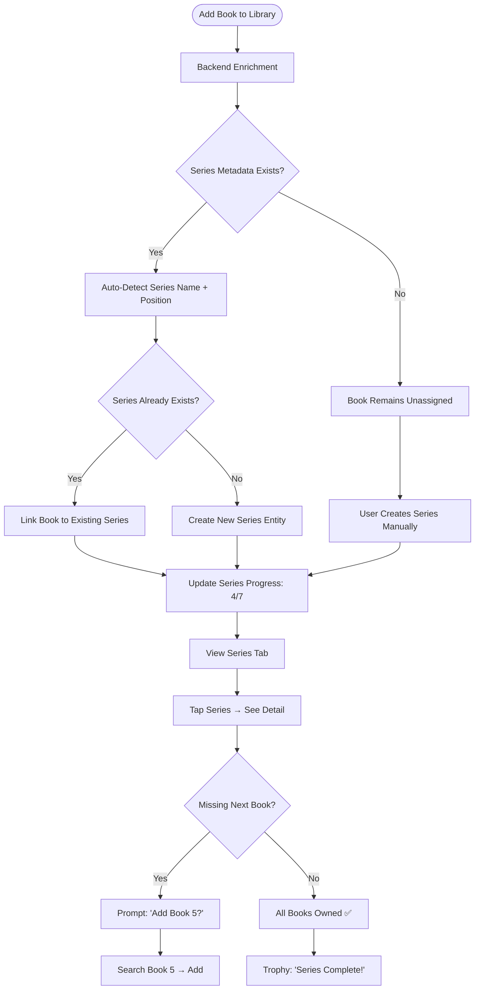

# Series Tracking - Product Requirements Document

**Status:** Draft
**Owner:** Product Team
**Target Release:** v3.8.0
**Last Updated:** January 5, 2026

---

## Executive Summary

Series Tracking enables users to automatically detect, organize, and track multi-book series (Harry Potter, The Expanse, Foundation, etc.) with visual completion indicators, reading order guidance, and "next in series" recommendations. By auto-detecting series from Google Books and OpenLibrary metadata, the feature eliminates manual organization while helping readers discover unread books in beloved series.

---

## Problem Statement

### User Pain Point

**What problem are we solving?**

Users reading multi-book series face three major friction points:

1. **Lost Context:** "Did I read books 1-3 of Foundation or just 1 and 2?"
2. **Discovery Gap:** "I loved Red Rising but didn't know there were 6 books in the series"
3. **Reading Order Confusion:** "Is this book part of a series? Which order should I read them?"
4. **Manual Organization:** Users create custom shelves/tags to track series (tedious for 50+ series)

**Impact:**
- Users abandon series mid-way because they forget where they left off
- Missed opportunities to recommend "next in series" (high-confidence suggestion)
- Library feels disorganized when series books scattered across 500+ titles
- No way to celebrate "Completed The Expanse! 9/9 books 🎉"

**Example Frustration:**

> "I have 200 books in my library. I know I've read some Discworld novels but can't remember which ones. There's no way to see all Terry Pratchett series in one place and track my progress."

### Current Experience

**How do users currently solve this problem?**

Users rely on external tools:
- **Goodreads Series Pages:** Manual lookups to find series order
- **Wikipedia:** Copy series lists into notes app
- **Spreadsheets:** Track "Foundation: 3/7 books read"
- **Memory:** "I think I read books 1-4..."

**Pain Points:**
- No auto-detection (user must research each book)
- No in-app series visualization
- Reading order not enforced or suggested
- Completion % invisible

---

## Target Users

### Primary Persona

| Attribute | Description |
|-----------|-------------|
| **User Type** | Series readers (fantasy, sci-fi, mystery fans) |
| **Usage Frequency** | Weekly (checking series progress, discovering next book) |
| **Tech Savvy** | Medium |
| **Primary Goal** | Track series completion, never miss a book in a favorite series |

**Example User Story:**

> "As a **fantasy reader with 15 active series**, I want to **see all books in each series with completion status** so that I can **easily find the next unread book and prioritize which series to continue**."

---

## Success Metrics

### Key Performance Indicators (KPIs)

| Metric | Target | Measurement Method |
|--------|--------|-------------------|
| **Auto-Detection Accuracy** | 85%+ series correctly identified from metadata | Validation against Goodreads |
| **Adoption Rate** | 50% of users with 3+ series books use Series view | Analytics |
| **Discovery Impact** | 25% increase in "next in series" book additions | Conversion tracking |
| **Completion Celebration** | 30% of completed series trigger "Finished!" celebration | Event tracking |
| **User Satisfaction** | 4.5/5 stars for series organization feature | Surveys |

---

## User Stories & Acceptance Criteria

### Must-Have (P0) - Core Functionality

#### User Story 1: Auto-Detect Series from Metadata

**As a** user adding a book from a series
**I want to** have the series automatically detected and linked
**So that** I don't manually organize books into series

**Acceptance Criteria:**
- [ ] Given I add "Harry Potter and the Sorcerer's Stone," when metadata is enriched, the book is auto-assigned to "Harry Potter (7 books)" series
- [ ] Given a book has series metadata from Google Books, when saved, system parses series name and position (e.g., "Foundation #1")
- [ ] Given series metadata is missing, when enrichment fails, book remains unassigned (no false positives)
- [ ] Edge case: Given "The Hobbit" (technically part of Middle-earth legendarium), system respects Google Books classification (standalone vs series)

---

#### User Story 2: View All Series with Completion Progress

**As a** user with multiple series
**I want to** see a dedicated Series view showing all my series
**So that** I can quickly find which series to continue

**Acceptance Criteria:**
- [ ] Given I have books from 5 series, when I tap "Series" tab/section, I see a list showing: Series Name, Cover grid (4 books), Progress (3/7 books)
- [ ] Given I tap a series, when detail view opens, I see all books in reading order with checkmarks for owned/read books
- [ ] Given I complete all books in a series, when viewing series detail, I see "Completed! 🎉" badge
- [ ] Edge case: Given I own books 1, 3, 5 (missing 2, 4), series detail shows gaps with "Add Missing Books" prompt

---

#### User Story 3: Manual Series Creation and Assignment

**As a** user with books missing series metadata
**I want to** manually create series and assign books
**So that** I can organize books the API didn't detect

**Acceptance Criteria:**
- [ ] Given I tap "Create Series," when I enter series name, I can search my library to assign books
- [ ] Given I manually create "The Expanse (9 books)," when I assign books, I can drag-to-reorder reading sequence
- [ ] Given I assign a book to multiple series (e.g., "The Hobbit" in both "Middle-earth" and "Standalone"), system allows dual assignment
- [ ] Edge case: Given I delete a manual series, books remain in library (only series grouping removed)

---

### Should-Have (P1) - Enhanced Experience

#### User Story 4: Series Completion Visualization

**As a** user tracking progress
**I want to** see visual completion indicators
**So that** I feel motivated to finish series

**Acceptance Criteria:**
- [ ] Given I own 4/7 Foundation books, when I view series, I see "57% complete" progress bar
- [ ] Given I complete a series, when the last book is marked "Read," I see confetti animation + "You finished Foundation! 🎉"
- [ ] Given I'm viewing Library, when a book is part of a series, its card shows a subtle badge (e.g., "Book 3 of 7")

---

#### User Story 5: "Next in Series" Recommendations

**As a** user finishing a series book
**I want to** be prompted to add the next book
**So that** I continue reading without interruption

**Acceptance Criteria:**
- [ ] Given I finish "Red Rising (Book 1)," when I mark it "Read," I see prompt: "Add 'Golden Son (Book 2)' to your library?"
- [ ] Given the next book is already owned, when I finish book N, system prompts "Continue with Book N+1?"
- [ ] Given I'm missing multiple books (e.g., finished Book 1, missing Books 2-3, own Book 4), system prioritizes Book 2 recommendation
- [ ] Edge case: Given I finish the last book in a series, system suggests related series by same author

---

### Nice-to-Have (P2) - Future Enhancements

- **Series-Based Reading Goals:** "Finish 3 series in 2026"
- **Series Discovery:** "Readers who liked Foundation also read The Expanse"
- **Multi-Series Authors:** View all series by Brandon Sanderson in one place
- **Reading Order Variations:** Support "publication order" vs "chronological order" (e.g., Narnia)
- **Series Badges:** Earn achievements for completing long series (10+ books)

---

## Functional Requirements

### High-Level Flow

**End-to-end user journey:**



---

### Feature Specifications

#### Series Auto-Detection

**Description:** Parse series metadata from Google Books / OpenLibrary enrichment

**Metadata Fields:**
- **Google Books:** `volumeInfo.seriesInfo.volumeSeries[0].seriesId`, `volumeInfo.seriesInfo.volumeSeries[0].orderNumber`
- **OpenLibrary:** `series[0]` (e.g., "The Lord of the Rings #2")

**Parsing Logic:**
```
Input: "Foundation #1"
Output:
  - Series Name: "Foundation"
  - Position: 1
  - Total Books: (fetch from series lookup or default to unknown)
```

**Requirements:**
- **Input:** Enrichment response JSON
- **Processing:** Regex extraction: `^(.+?)\s*#(\d+)$` or structured `seriesInfo` object
- **Output:** Series entity created/updated, book linked at position N
- **Error Handling:** If parsing fails (e.g., "Foundation Book 1" without #), log warning and skip auto-assignment

---

#### Series Data Model

**Series Entity:**
- ID (UUID)
- Name (e.g., "Harry Potter")
- Total Books (7, or null if unknown)
- Author (optional, for multi-author series like Star Wars)
- Source (auto-detected vs manual)
- Books (array of Work IDs in reading order)

**Book → Series Relationship:**
- Many-to-many (books can belong to multiple series, e.g., "The Hobbit")
- Position field: Integer (1, 2, 3, ...)

---

#### Series View UI

**Main Series List:**
- Card layout: Series cover grid (4 books), Series name, Author, Progress bar ("4/7 books")
- Sort options: Alphabetical, Recently Updated, Completion %
- Filter: In Progress, Completed, Not Started

**Series Detail:**
- Header: Series name, Author, Total books, Completion %
- Book list: Reading order, Cover + Title, Status icons (Owned ✓, Read ✓✓, Missing ➕)
- Actions: "Add Missing Books" button (searches for unowned books)

---

#### Manual Series Management

**Create Series:**
- Input: Series name, Total books (optional)
- Book assignment: Search library, drag-to-reorder
- Save: Creates Series entity, links books

**Edit Series:**
- Add/remove books
- Reorder books (drag handles)
- Change series name or total count

**Delete Series:**
- Confirmation prompt: "Delete 'Foundation' series? Books will remain in library."
- Cascade: Remove series links, preserve book data

---

## Non-Functional Requirements

### Performance

| Requirement | Target | Rationale |
|-------------|--------|-----------|
| **Series Detection** | <100ms | Real-time during enrichment |
| **Series List Load** | <300ms | Fetch all series from SwiftData |
| **Series Detail Load** | <200ms | Single series + books query |
| **Memory Usage** | +10MB max | Series metadata is lightweight |

---

### Reliability

- **Error Rate:** 95%+ series detection accuracy (validated against Goodreads)
- **Offline Support:** Full offline (series stored in SwiftData, sync via CloudKit)
- **Data Integrity:** Series persists across library resets (separate entity)

---

### Accessibility (WCAG AA Compliance)

- [ ] Screen reader announces series progress ("4 of 7 books complete")
- [ ] Color contrast 4.5:1 for progress bars
- [ ] Dynamic text sizing for series names
- [ ] VoiceOver actions for "Add to series" / "Remove from series"
- [ ] Reduced motion: Disable completion confetti

---

### Security & Privacy

- **Data Storage:** Series stored locally (SwiftData) + CloudKit sync
- **API Security:** No backend API (series logic is client-side)
- **Privacy Considerations:** No series data shared externally

---

## Data Models

### Core Entities

```typescript
interface BookSeries {
  id: string;              // UUID
  name: string;            // "Harry Potter"
  totalBooks?: number;     // 7 (or null if unknown)
  author?: string;         // Optional: for series attribution
  source: 'auto-detected' | 'manual';
  createdAt: Date;
  updatedAt: Date;

  // Relationships
  books: SeriesBook[];     // Books in reading order
}

interface SeriesBook {
  workID: string;          // Reference to Work entity
  position: number;        // Reading order (1, 2, 3, ...)
  title: string;           // Cached for quick display
  coverURL?: string;       // Cached cover
  owned: boolean;          // Is this book in user's library?
  read: boolean;           // Has user marked it "Read"?
}

// Work model extension
interface Work {
  // ... existing fields
  seriesMemberships: SeriesMembership[];  // Many-to-many
}

interface SeriesMembership {
  seriesID: string;
  position: number;
}
```

### Relationships

```
BookSeries 1:many SeriesBook
Work many:many BookSeries (via SeriesMembership)
```

### SwiftData Schema

```swift
@Model
public class BookSeries {
    @Attribute(.unique) public var id: UUID
    public var name: String
    public var totalBooks: Int?
    public var author: String?
    public var source: SeriesSource
    public var createdAt: Date
    public var updatedAt: Date

    // Relationships
    @Relationship(deleteRule: .cascade)
    public var books: [SeriesBook] = []
}

@Model
public class SeriesBook {
    public var workID: UUID  // Foreign key to Work
    public var position: Int
    public var title: String
    public var coverURL: String?
    public var owned: Bool
    public var read: Bool

    // Inverse relationship
    @Relationship(inverse: \BookSeries.books)
    public var series: BookSeries?
}

public enum SeriesSource: String, Codable {
    case autoDetected = "auto-detected"
    case manual = "manual"
}
```

---

## API Contracts

### Backend Enhancement (Optional - v3.9)

**Current:** Series detection is client-side (parse Google Books/OpenLibrary metadata)

**Future Enhancement:** Backend endpoint to fetch series metadata

```
GET /v1/series/{seriesID}

Response:
{
  "success": true,
  "data": {
    "seriesID": "abc123",
    "name": "Foundation",
    "totalBooks": 7,
    "books": [
      {
        "position": 1,
        "title": "Foundation",
        "isbn": "9780553293357",
        "publicationYear": 1951
      },
      // ... books 2-7
    ]
  }
}
```

**Benefit:** Discover missing books not in user's library (for "Add Missing Books" feature)

---

## Testing Strategy

### Unit Tests

- [ ] SeriesParser - Correctly extracts series name and position from "Foundation #1"
- [ ] SeriesParser - Handles edge cases ("The Hobbit" no series, "Book 1 of The Expanse")
- [ ] SeriesProgressCalculator - Calculates 4/7 = 57% completion
- [ ] SeriesRecommender - Suggests Book 2 after finishing Book 1
- [ ] SeriesRecommender - Suggests related series when all books read
- [ ] Edge case: Book belongs to 2 series (dual membership)
- [ ] Edge case: User deletes series, books persist in library

### Integration Tests

- [ ] End-to-end: Add Harry Potter Book 1 → Series auto-created → Add Books 2-7 → Series shows 7/7
- [ ] CloudKit sync: Series created on iPhone syncs to iPad
- [ ] Library reset: Series persist after reset (separate table)

### Manual QA Checklist

- [ ] Real device: Add Foundation Book 1, verify auto-detection
- [ ] Accessibility: VoiceOver announces "4 of 7 books complete"
- [ ] Edge case: Add book with no series metadata, verify no false positive
- [ ] Edge case: Manually create series, add 5 books, verify drag-to-reorder works
- [ ] Performance: 50 series in database, Series view loads <300ms

---

## Platform Implementation Notes

### iOS Implementation

**Status:** Not Started (Target: v3.8.0)

**Key Files:**
- `BooksTrackerPackage/Sources/BooksTrackerFeature/Models/BookSeries.swift` - SwiftData model
- `BooksTrackerPackage/Sources/BooksTrackerFeature/Models/SeriesBook.swift` - SwiftData model
- `BooksTrackerPackage/Sources/BooksTrackerFeature/Series/SeriesListView.swift` - Main series list
- `BooksTrackerPackage/Sources/BooksTrackerFeature/Series/SeriesDetailView.swift` - Series detail
- `BooksTrackerPackage/Sources/BooksTrackerFeature/Series/CreateSeriesView.swift` - Manual creation
- `BooksTrackerPackage/Sources/BooksTrackerFeature/Services/SeriesDetectionService.swift` - Auto-detection logic
- `BooksTrackerPackage/Sources/BooksTrackerFeature/Services/SeriesRecommendationService.swift` - Next book suggestions

**Platform-Specific Considerations:**
- SwiftData `@Model` for BookSeries and SeriesBook
- CloudKit sync via `.modelContainer(for: [Work.self, BookSeries.self], ...)`
- Parse series from enrichment JSON (`volumeInfo.seriesInfo` for Google Books)
- Confetti animation on series completion (CAEmitterLayer)
- Drag-to-reorder using SwiftUI `.onMove` modifier

**Integration Points:**
- Hook into enrichment pipeline (`DTOMapper` or `V3BooksService`)
- After enrichment, call `SeriesDetectionService.detectAndLink(work:)`
- Add "Next in Series" prompt to `WorkDetailView` completion flow

---

### Flutter Implementation

**Status:** Not Started (Required for v1.0 Parity)

**Key Files:**
- `lib/features/series/models/book_series.dart` - Data model
- `lib/features/series/models/series_book.dart` - Data model
- `lib/features/series/screens/series_list_screen.dart` - Main series list
- `lib/features/series/screens/series_detail_screen.dart` - Series detail
- `lib/features/series/services/series_detection_service.dart` - Auto-detection
- `lib/features/series/widgets/series_progress_widget.dart` - Progress indicators

**Platform-Specific Considerations:**
- Local storage: Drift or Isar database (relationships via foreign keys)
- Reactive updates: Riverpod or Bloc for state management
- Drag-to-reorder: `reorderable_list` package
- Confetti animation: `confetti` package
- Parse series from JSON enrichment responses

**Flutter Package Dependencies:**
```yaml
dependencies:
  drift: ^2.x         # Local database with relationships
  isar: ^3.x          # Alternative: High-performance
  riverpod: ^2.x      # State management
  reorderable_list: ^1.x  # Drag-to-reorder UI
  confetti: ^0.7.x    # Celebration animations
```

**Challenge:** CloudKit sync alternative (Firebase Firestore or custom API)

---

## Related Documentation

- **Book Enrichment PRD:** `docs/product/Book-Enrichment-PRD.md` (series metadata source)
- **Reading Goals PRD:** `docs/product/Reading-Goals-PRD.md` (future: series completion goals)
- **Library Management PRD:** `docs/product/Library-Management-PRD.md` (series filtering)

---

## Open Questions & Risks

### Unresolved Decisions

- [ ] **Series Merge:** If user manually creates "Foundation" but API also creates "Foundation," how to merge? **Owner:** Engineering - **Due:** Feb 1, 2026
- [ ] **Reading Order Variants:** Support publication order vs chronological? (e.g., Narnia) **Owner:** Product - **Due:** Feb 15, 2026
- [ ] **Standalone Books in Series:** How to handle "The Hobbit" (standalone but also Middle-earth)? **Owner:** UX - **Due:** Feb 10, 2026

### Known Risks

| Risk | Impact | Probability | Mitigation |
|------|--------|-------------|------------|
| Series metadata missing for 40%+ books | High | High | Provide manual series creation with good UX |
| Google Books series data inconsistent | Medium | Medium | Fallback to OpenLibrary, then manual |
| Users create duplicate series (typos) | Low | Medium | Fuzzy matching + "Did you mean...?" prompts |
| CloudKit sync conflicts (multi-device edits) | Low | Low | Last-write-wins with timestamp |

---

## Changelog

| Date | Change | Author |
|------|--------|--------|
| Jan 5, 2026 | Initial draft (auto-detection + manual override) | Product Team |

---

## Approvals

**Sign-off required from:**

- [ ] Product Manager
- [ ] Engineering Lead (iOS + Flutter)
- [ ] Design Lead
- [ ] QA Lead

**Approved by:** [Names] on [Date]
