# Bookshelf AI Scanner - Product Requirements Document

**Status:** ✅ Shipped (Build 46+)
**Owner:** Product Team
**Engineering Lead:** iOS Development Team
**Design Lead:** iOS 26 HIG Compliance
**Target Release:** Build 46 (October 2025)
**Last Updated:** November 24, 2025

---

## Executive Summary

The Bookshelf AI Scanner allows users to photograph their physical bookshelves and automatically extract book titles and authors using Gemini 2.0 Flash AI vision technology. This feature reduces library onboarding time from hours to minutes, enabling users with large collections (100+ books) to experience BooksTrack's value immediately.

---

## Problem Statement

### User Pain Point

**What problem are we solving?**

Users with large book collections (100-500+ books) spend 2-5 hours manually searching and adding each book to their digital library. This tedious onboarding process creates massive friction and causes many users to abandon setup before experiencing the app's core value (reading insights, cultural diversity analytics).

**Impact:**
- **Onboarding drop-off:** 60%+ of users with 50+ books never complete library setup
- **Time investment:** Average 1-2 minutes per book × 200 books = 3-6 hours
- **Competitor advantage:** Goodreads and LibraryThing have CSV import, but no computer vision alternative

### Current Experience

**How do users currently solve this problem?**

1. **Manual Search (Current App):** Users search each book individually in BooksTrack's search tab → tap result → add to library. Tedious for 10+ books.
2. **CSV Import (Existing Feature):** Export from Goodreads → Import to BooksTrack. Works well but requires users already have digital library elsewhere.
3. **Competitor Apps:** Goodreads barcode scanner (one-by-one), no bulk shelf scanning exists.
4. **Third-Party Apps:** Dedicated shelf scanners like Libib ($10/month), but users want single-app solution.

**User Quote (Beta Feedback):**
> "I have 300 books on my shelves but only 20 in the app. I know I should add them all, but it's just too much work."

---

## Target Users

### Primary Persona: **The Avid Collector**

| Attribute | Description |
|-----------|-------------|
| **User Type** | Book collectors, avid readers with physical libraries (100-500+ books) |
| **Usage Frequency** | Onboarding (one-time bulk use), then occasional (new book additions) |
| **Tech Savvy** | Medium-High (comfortable with iOS camera features) |
| **Primary Goal** | Quickly digitize existing physical library without manual data entry |

**Example User Story:**

> "As a **book collector with 250 books on my shelves**, I want to **photograph my bookshelves and auto-import detected books** so that I can **start tracking new reads within 10 minutes instead of 5+ hours**."

### Secondary Persona: **The Digital Minimalist**

Users who prefer physical books but want digital tracking for reading goals/stats. Less tech-savvy, values simplicity.

---

## Success Metrics

### Key Performance Indicators (KPIs)

| Metric | Target | Current | Measurement Method |
|--------|--------|---------|-------------------|
| **Adoption Rate** | 30% of users scan within first 7 days | TBD | Analytics event: `bookshelf_scan_completed` |
| **Completion Rate** | 70%+ complete scan workflow (don't abandon) | ~75% | Funnel: camera → capture → review → import |
| **Processing Time** | <60 seconds total (AI + enrichment) | 25-40s AI + 5-10s enrichment | Server-side instrumentation |
| **Detection Accuracy** | 80%+ books detected correctly (≥60% confidence) | 70-95% (varies by image quality) | Manual QA + user feedback |
| **User Satisfaction** | 4.5/5 stars on App Store for feature | TBD | App Store review sentiment analysis |

**Success Criteria for GA:**
- 30%+ of new users try Bookshelf Scanner within first session
- 80%+ accuracy on clear, well-lit shelf images
- <5% fallback to HTTP polling (WebSocket success rate)

---

## vNext (Build 47): Realtime Overlay + Unified JobStream

Goal: Cut perceived waiting time and error recovery while unifying progress communication across Scanner, CSV Import, and Enrichment.

### Architecture Changes
1) Client pre-pass (on-device)
- Perform a fast Vision-based spine OCR pass to propose candidates and alignment hints before upload.
- If ≥1 high-confidence ISBN/Title found, prefill results and crop suggested ROIs. Always upload full image for server AI.
- Maintain feature flag `FeatureFlags.shelfPrePass`.

2) Unified JobStream (WS primary, SSE fallback)
- Introduce a single progress schema used by all long-running jobs.
- Primary comms: WebSocket `/ws/job-stream?jobId={jobId}`.
- New fallback: Server-Sent Events `/sse/job-stream/{jobId}` with JSON Lines messages.
- Keep-alive every 15s; resume tokens supported for app backgrounding up to 10 minutes.

3) Durable Object refactor
- New `JobStreamDO` multiplexes phases: `upload → ai_detect → enrich → finalize`.
- Short-lived HMAC token (job-scoped) replaces ad-hoc tokens; parallel storage reads remain.
- Cropped spine thumbnails persisted to R2 with 24h TTL for Review Queue context.

4) Media pipeline
- Client encodes JPEG @ 85% or HEIC with target 400–600 KB; progressive upload allowed.
- If network type == cellular and RTT > 200ms, automatically switch to SSE fallback and lower upload quality.

### UX and Visual Design Changes
- Live Detection Overlay: optional bounding boxes animate in the viewfinder after shutter half-press; subtle haptics when locks achieved.
- Confidence Slider: default 60%; user can raise to 70–80% to reduce review load.
- Inline Corrections: tap a low-confidence chip in results to edit title/author without leaving the flow.
- Batch Review: grid with quick actions (Verify, Edit, Remove) and per-book thumbnails.
- Microcopy improvements: shorter, action-first strings; add progress subtext like “Gemini is reading spines…”.

### KPIs (for GA of Build 47)
- P50 total time ≤ 40s; P90 ≤ 75s.
- Review Queue rate reduced by 20% vs Build 46 (quality proxy).
- WebSocket success ≥ 98%; SSE usage ≤ 2% (fallback only).
- User CSAT ≥ 4.6/5 for scanning session.

### Acceptance Criteria (P0)
- Given a poor network, SSE fallback maintains progress updates without UI freeze; reconnection resumes within 3s using resume token.
- Given overlay enabled, bounding boxes render ≤ 200ms after capture on iPhone 17 Pro.
- Given app backgrounded mid-job (<10 min), upon return, stream resumes and final results render without reupload.
- Given confidence slider set to 80%, imported books below threshold route to Review Queue.

### API Additions
- GET `/sse/job-stream/{jobId}` → text/event-stream; data: JobStreamMessage (JSON Lines)
- POST `/v1/scans/{jobId}/resume` → returns new resumeToken (10-minute TTL)
- R2 lifecycle rule: `shelf-scans/*` auto-delete after 24h

---

## User Stories & Acceptance Criteria

### Must-Have (P0) - Core Functionality

#### User Story 1: Capture & Analyze Bookshelf Photo

**As a** user with 100+ books on shelves
**I want to** take a photo of my bookshelf and have AI detect all visible books
**So that** I can import my entire collection in minutes

**Acceptance Criteria:**
- [x] Given camera permission granted, when user taps "Scan Bookshelf", then live camera preview appears
- [x] Given clear bookshelf photo (good lighting, readable spines), when user captures image, then AI detects 80%+ of visible books
- [x] Given detected books with ≥60% confidence, when import completes, then books are marked as `.verified` and added to library
- [x] Given detected books with <60% confidence, when import completes, then books are sent to Review Queue for human verification
- [x] Edge case: Given poor lighting/blur, when AI processes, system shows suggestions banner with actionable guidance

---

#### User Story 2: Real-Time Progress Tracking

**As a** user waiting for AI analysis
**I want to** see real-time progress updates
**So that** I know the system is working and don't abandon the scan

**Acceptance Criteria:**
- [x] Given image uploaded, when AI processing starts, then WebSocket connects and shows "Processing with AI..." status
- [x] Given AI processing takes 25-40 seconds, when 30+ seconds elapse, then server sends keep-alive pings to prevent timeout
- [x] Given enrichment in progress, when metadata fetched for each book, then progress updates show "15/20 books enriched (75%)"
- [x] Edge case: Given WebSocket connection fails, when timeout occurs, system automatically falls back to HTTP polling with 2s interval

---

#### User Story 3: Review Low-Confidence Detections

**As a** user reviewing scan results
**I want to** see which books need human verification (AI uncertainty)
**So that** I can correct errors before adding to my library

**Acceptance Criteria:**
- [x] Given scan complete with mix of high/low confidence, when ScanResultsView appears, then books show visual indicator for confidence level
- [x] Given books with <60% confidence imported, when user opens Library tab, then Review Queue badge (🔴 indicator) appears in toolbar
- [x] Given user taps Review Queue, when CorrectionView opens, then cropped spine image + editable title/author fields are shown
- [x] Given user corrects book title, when saved, then `reviewStatus = .userEdited` and book removed from queue

---

### Should-Have (P1) - Enhanced Experience

#### User Story 4: Batch Scanning (Multiple Photos)

**As a** user with multiple bookshelves
**I want to** capture up to 5 photos in one session
**So that** I can scan all my shelves without restarting the workflow

**Acceptance Criteria:**
- [x] Given Batch Mode enabled, when user captures 5 photos, then all upload in parallel to R2 storage
- [x] Given 5 photos uploaded, when processing starts, then Gemini processes each photo sequentially with per-photo progress
- [x] Given batch complete, when results shown, then duplicate books (same ISBN) are auto-merged
- [x] Edge case: Given user cancels mid-batch, when cancellation triggered, system returns partial results for photos already processed

---

#### User Story 5: Actionable Improvement Suggestions

**As a** user with poor scan results
**I want to** see specific tips on improving photo quality
**So that** I can retake the photo and get better accuracy

**Acceptance Criteria:**
- [x] Given blurry image detected, when results shown, then banner suggests "Try holding camera steady or using better lighting"
- [x] Given glare detected, when results shown, then banner suggests "Reduce glare by turning off flash or adjusting angle"
- [x] Given books cut off at frame edge, when results shown, then banner suggests "Move camera back to fit entire shelf in frame"
- [x] Given user dismisses suggestion, when dismissed, then suggestion doesn't reappear for same scan (per-session storage)

---

### Nice-to-Have (P2) - Future Enhancements

- [ ] **Multi-Shelf Stitching:** Capture panorama of entire wall of books (iOS 26 panorama API)
- [ ] **Live Detection Overlay:** Real-time bounding boxes on viewfinder (like QR scanner)
- [ ] **Confidence Threshold Setting:** User-adjustable threshold (40%-80%) for Review Queue
- [ ] **Export Detected Books:** Save detected books as CSV before importing
- [ ] **Apple Watch Remote Shutter:** Trigger camera from watch for hands-free operation

---

## Functional Requirements

### High-Level Flow

**End-to-end user journey:**

```mermaid
flowchart TD
    Start([User Opens Shelf Tab]) --> Permission{Camera Permission?}
    Permission -->|Not Granted| RequestPerm[Show permission alert]
    Permission -->|Granted| ShowCamera[Live camera preview]

    ShowCamera --> Capture[User taps shutter button]
    Capture --> Review[Show preview sheet]
    Review --> Upload[Upload to /api/scan-bookshelf]

    Upload --> WebSocket[WebSocket /ws/progress connects]
    WebSocket --> AIProcess[Gemini 2.0 Flash - 25-40s]
    AIProcess --> Enrich[Backend enrichment - 5-10s]
    Enrich --> Results[ScanResultsView]

    Results --> ConfidenceCheck{Confidence ≥ 60%?}
    ConfidenceCheck -->|Yes| AutoVerify[Add as .verified]
    ConfidenceCheck -->|No| NeedsReview[Add to Review Queue]

    AutoVerify --> Complete([Scan Complete])
    NeedsReview --> Complete
```



**Detailed workflow:** See `docs/workflows/bookshelf-scanner-workflow.md`

---

### Feature Specifications

#### 1. Camera Session Management

**Description:** Manages AVFoundation camera session with live preview and photo capture

**Technical Requirements:**
- **Input:** AVCaptureDevice access (rear camera)
- **Processing:**
  - `BookshelfCameraSessionManager` (@BookshelfCameraActor) handles session lifecycle
  - Configure for max photo quality (4032×3024 on iPhone 17 Pro)
  - Flash mode: auto (user-toggleable)
- **Output:** JPEG data (Sendable type for cross-actor transfer)
- **Error Handling:**
  - Camera permission denied → Show settings alert
  - Session interrupted → Pause preview, resume when active
  - Photo capture failed → Show retry button

**Key Files:**
- `BookshelfCameraSessionManager.swift` - Actor-isolated camera logic
- `BookshelfCameraView.swift` - SwiftUI camera UI

---

#### 2. iOS Image Preprocessing

**Description:** Resize and compress image client-side before upload to reduce bandwidth and processing time

**Technical Requirements:**
- **Input:** Original photo (4032×3024, ~8-12MB HEIC)
- **Processing:**
  - Resize to max dimension 3072px (preserves aspect ratio)
  - Convert to JPEG @ 90% quality
  - Result: 400-600KB optimized image
- **Output:** Data object uploaded to backend
- **Error Handling:** If resize fails, upload original (backend handles gracefully)

**Performance:**
- Preprocessing time: <200ms on iPhone 17 Pro
- Bandwidth savings: 95%+ reduction (12MB → 500KB)

**See:** `docs/guides/ios-image-preprocessing-for-ai.md`

---

#### 3. Gemini 2.0 Flash AI Processing

**Description:** Server-side AI vision analysis using Google's Gemini 2.0 Flash model

**Technical Requirements:**
- **Input:** Base64-encoded JPEG from iOS
- **Processing:**
  - POST to Gemini Vision API with bookshelf-optimized prompt
  - Gemini returns JSON array of detected books:
    ```json
    {
      "books": [
        {
          "title": "Harry Potter and the Sorcerer's Stone",
          "author": "J.K. Rowling",
          "confidence": 0.92,
          "boundingBox": {"x": 0.1, "y": 0.2, "width": 0.05, "height": 0.3}
        }
      ]
    }
    ```
- **Output:** `DetectedBook` array sent to iOS via WebSocket
- **Error Handling:**
  - API timeout (>60s) → Return partial results if any
  - API rate limit → Retry with exponential backoff
  - Malformed response → Return empty array + error message

**Performance:**
- Processing time: 25-40 seconds (varies by number of books in image)
- Accuracy: 70-95% (depends on image quality)

**Backend:** `cloudflare-workers/api-worker/src/providers/gemini-provider.js`

---

#### 4. WebSocket Real-Time Progress

**Description:** Push-based progress updates during AI processing and enrichment

**Technical Requirements:**
- **Input:** jobId (UUID) from iOS
- **Processing:**
  - iOS connects to `/ws/progress?jobId={uuid}`
  - Backend sends ProgressData messages:
    ```json
    {
      "progress": 0.5,
      "currentStatus": "Enriching metadata... 10/20",
      "processedItems": 10,
      "totalItems": 20,
      "keepAlive": false
    }
    ```
  - Keep-alive pings sent every 30s during AI processing (prevents timeout)
- **Output:** Real-time UI updates in ScanResultsView
- **Error Handling:**
  - WebSocket timeout → Auto-fallback to HTTP polling (2s interval)
  - Connection lost → Attempt reconnect (3 tries), fallback to polling
  - Malformed message → Skip, continue listening

**Performance:**
- Latency: 8ms average (WebSocket)
- Fallback rate: <5% (95%+ WebSocket success)

**See:** `docs/WEBSOCKET_ARCHITECTURE.md`

---

#### 5. Review Queue (Human-in-the-Loop)

**Description:** Surface low-confidence detections (<60%) for user correction

**Technical Requirements:**
- **Input:** Works with `reviewStatus = .needsReview`
- **Processing:**
  - Fetch all works where `reviewStatus == .needsReview` (in-memory filter, no SwiftData predicate)
  - CorrectionView crops original image using stored `boundingBox` coordinates
  - User edits title/author or marks as verified
- **Output:** Updated Work with `reviewStatus = .userEdited` or `.verified`
- **Error Handling:**
  - Image file missing → Show placeholder + text-only editing
  - Bounding box invalid → Show full image (no crop)

**Cleanup:**
- ImageCleanupService runs on app launch
- Deletes temp images when all books from scan are reviewed
- Prevents storage bloat

**See:** `docs/features/REVIEW_QUEUE.md`

---

## Non-Functional Requirements

### Performance

| Requirement | Target | Current | Rationale |
|-------------|--------|---------|-----------|
| **AI Processing Time** | <60s | 25-40s | Users won't wait longer than 1 minute |
| **Total Workflow Time** | <90s | 30-50s | Competitive with barcode scanning (1-2 min per book) |
| **Memory Usage** | <150MB | ~100MB | Support older devices (iPhone 12+) |
| **Image Upload Time** | <5s | 2-3s | 500KB @ 10 Mbps WiFi |
| **WebSocket Latency** | <100ms | 8ms | Real-time feel for progress updates |

---

### Reliability

- **AI Accuracy:** 80%+ books detected correctly on clear images (70-95% observed)
- **WebSocket Success Rate:** 95%+ connections successful (fallback to polling for 5%)
- **Offline Support:** Not required (network needed for AI and enrichment)
- **Data Integrity:** Atomic SwiftData transactions ensure all-or-nothing imports

**Error Recovery:**
- Failed uploads: 3 retry attempts with exponential backoff
- AI timeout: Return partial results if any books detected
- Enrichment failures: Queue for background retry

---

### Accessibility (WCAG AA Compliance)

- [x] VoiceOver labels on camera shutter, flash toggle, review queue buttons
- [x] Color contrast ratio ≥ 4.5:1 (orange Review Queue badge, white text on primary color buttons)
- [x] Dynamic Type support (all text scales with system settings)
- [x] Reduced motion: Disable pulsing icon animations when `UIAccessibility.isReduceMotionEnabled`
- [x] Keyboard navigation: Camera can be triggered with space bar (iPad external keyboard)

---

### Security & Privacy

**Data Storage:**
- Temp images stored in `FileManager.temporaryDirectory` (auto-cleaned by iOS after 3 days)
- Manual cleanup via ImageCleanupService on app launch after review complete

**API Security:**
- HTTPS-only communication with Cloudflare Workers
- No authentication required (public API, rate-limited by IP)
- **Known Risk:** API endpoints publicly accessible if URL discovered

**Privacy:**
- Bookshelf photos uploaded to Cloudflare Workers for AI processing
- Images not stored permanently (deleted after enrichment complete)
- Gemini API processes images but does not retain per Google Cloud terms
- No user-identifiable data sent (only anonymous book detection)

**Privacy Policy Compliance:**
- Disclose in App Store privacy declaration: "Photos uploaded for AI analysis"
- NSCameraUsageDescription: "Scan your bookshelves to automatically import books"

---

## Design & User Experience

### UI Mockups / Wireframes

**See:** Feature documentation screenshots in `docs/features/BOOKSHELF_SCANNER.md`

**Key Screens:**
1. **Camera View:** Live preview + shutter button + flash toggle
2. **Review Sheet:** Photo preview + "Use Photo" / "Retake" buttons
3. **Processing View:** Progress bar + status text ("Processing with AI...")
4. **ScanResultsView:** List of detected books with confidence indicators
5. **Review Queue:** List of low-confidence books needing verification
6. **CorrectionView:** Cropped spine image + editable fields

---

### iOS 26 HIG Compliance

- [x] Liquid Glass design system (`.ultraThinMaterial` backgrounds on results cards)
- [x] Theme-aware gradient (`themeStore.backgroundGradient` full-screen backdrop)
- [x] Standard corner radius (16pt for cards, 8pt for spine images)
- [x] System semantic colors (`.primary` for titles, `.secondary` for authors)
- [x] Proper navigation (push navigation for WorkDetailView, sheet for camera)
- [x] No `.searchable()` + `@FocusState` conflicts (camera doesn't use search)

**Known HIG Concerns (Issue #120):**
- Review Queue toolbar button visual hierarchy needs review (all 3 buttons equal weight)

---

### User Feedback & Affordances

| State | Visual Feedback | Example |
|-------|----------------|---------|
| **Camera Ready** | Live preview + pulsing shutter button | Green camera icon |
| **Uploading** | Progress indicator | "Uploading photo..." |
| **AI Processing** | Animated icon + status text | Spinning icon + "Processing with AI... 30s" |
| **Enriching** | Progress bar | "Enriching metadata... 15/20 (75%)" |
| **Success** | Checkmark animation | "20 books detected!" |
| **Partial Success** | Warning badge | "15 books detected, 5 need review" |
| **Error** | Clear error message + retry | "AI analysis failed - try different angle" + Retry button |

**Suggestions Banner:**
- Contextual tips based on AI feedback (blur, glare, cutoff, lighting issues)
- Individual dismissal (per suggestion type)
- Liquid Glass styling with orange accent for warnings

---

## Technical Architecture

### System Components

| Component | Type | Responsibility | File Location |
|-----------|------|---------------|---------------|
| **BookshelfScannerView** | SwiftUI View | Main UI coordinator | `BookshelfScannerView.swift` |
| **BookshelfCameraSessionManager** | @BookshelfCameraActor | AVFoundation camera session | `BookshelfCameraSessionManager.swift` |
| **BookshelfAIService** | Service | API client for scan endpoint | `BookshelfAIService.swift:837` |
| **WebSocketProgressManager** | Service | Real-time progress tracking | `WebSocketProgressManager.swift` |
| **ScanResultsView** | SwiftUI View | Results display & import | `ScanResultsView.swift` |
| **ReviewQueueView** | SwiftUI View | Low-confidence book review | `ReviewQueueView.swift` |
| **ImageCleanupService** | Service | Automatic temp file cleanup | `ImageCleanupService.swift` |
| **SuggestionViewModel** | @Observable Model | Suggestion banner state | `SuggestionViewModel.swift` |

---

### Data Model Changes

**Work Model Extensions:**
```swift
@Model
public class Work {
    // Review Queue properties (added Build 48)
    public var reviewStatus: ReviewStatus = .verified
    public var originalImagePath: String?  // Temp file path for correction UI
    public var boundingBox: CGRect?        // Normalized (0.0-1.0) crop coordinates
}
```

**New Enum:**
```swift
public enum ReviewStatus: String, Codable, Sendable {
    case verified       // AI or user confirmed accurate
    case needsReview    // Low confidence (< 60%)
    case userEdited     // Human corrected AI result
}
```

---

### API Contracts

| Endpoint | Method | Purpose | Request | Response |
|----------|--------|---------|---------|----------|
| `/api/scan-bookshelf` | POST | Upload image for AI processing (single photo) | FormData with image, jobId query param | `{ success: true }` |
| `/api/scan-bookshelf/batch` | POST | Upload multiple images (batch mode) | FormData with 5 images, jobId | `{ success: true }` |
| `/ws/progress` | WebSocket | Real-time progress updates | `?jobId={uuid}` | ProgressData JSON messages |
| `/api/enrichment/cancel` | POST | Cancel in-flight job | `{ jobId: "uuid" }` | `{ canceled: true }` |

**Response Models:**
```typescript
// DetectedBook (sent via WebSocket on completion)
{
  title: string;
  author: string;
  confidence: number;          // 0.0-1.0
  boundingBox: BoundingBox;    // {x, y, width, height}
  enrichmentStatus?: string;   // "ENRICHED" | "UNCERTAIN" | "REJECTED"
  coverUrl?: string;           // From Google Books/OpenLibrary
}

// ProgressData (WebSocket messages during processing)
{
  progress: number;            // 0.0-1.0
  currentStatus: string;
  processedItems: number;
  totalItems: number;
  keepAlive?: boolean;         // true for ping messages
}
```

**See:** `cloudflare-workers/api-worker/src/index.js` for implementation

---

### Dependencies

**iOS:**
- SwiftUI (UI framework)
- SwiftData (local storage)
- AVFoundation (camera access)
- UIKit (UIImage preprocessing)
- Foundation (URLSession for networking, WebSocket)

**Backend:**
- Cloudflare Workers (serverless runtime)
- Cloudflare R2 (image storage for batch mode)
- Cloudflare Durable Objects (ProgressWebSocketDO for real-time updates)
- Cloudflare KV (caching search results)

**External APIs:**
- Google Gemini 2.0 Flash API (vision AI)
- Google Books API (metadata enrichment)
- OpenLibrary API (fallback metadata)

---

## Testing Strategy

### Unit Tests

**Component Tests:**
- [x] Title normalization - Strips series markers/subtitles correctly
- [x] Duplicate detection - Matches ISBN accurately
- [x] Image preprocessing - Resizes to 3072px @ 90% quality
- [x] WebSocket keep-alive - Skips UI updates for `keepAlive: true` messages
- [x] Review Queue filtering - Returns only `.needsReview` works
- [x] Bounding box cropping - Converts normalized coords to pixel coords

**Edge Cases:**
- [x] Empty response from AI - Shows "No books detected" message
- [x] Malformed JSON from backend - Handles gracefully, shows error
- [x] Image file missing during review - Shows text-only editing

**Test Files:**
- `BookshelfAIServiceTests.swift`
- `ReviewQueueModelTests.swift`
- `ImageCleanupServiceTests.swift`

---

### Integration Tests

**End-to-End Flows:**
- [x] Camera → Capture → Upload → WebSocket → Results → Import (all books verified)
- [x] Scan with low confidence → Review Queue → Correction → Mark verified
- [x] Batch scan 5 photos → Sequential processing → Deduplicated results
- [x] WebSocket timeout → Fallback to HTTP polling → Complete successfully
- [x] Cancel mid-scan → Partial results returned → Temp images cleaned

**Backend Tests:**
- [x] Gemini API integration - Real API call with test image (mocked in CI)
- [x] WebSocket message delivery - Verify progress updates received
- [x] Job cancellation - Confirm DO stops processing on cancel

---

### Manual QA Checklist

**Real Device Testing:**
- [ ] iPhone 17 Pro (iOS 26.0.1) - primary test device
- [ ] iPhone 12 (iOS 26.0) - older hardware validation
- [ ] iPad Pro 13" (iOS 26.0) - tablet layout

**Test Scenarios:**
- [ ] Well-lit shelf (optimal conditions) → 80%+ accuracy
- [ ] Low-light shelf → Suggestion banner appears
- [ ] Blurry photo → Suggestion banner + lower accuracy
- [ ] Books with glare → Suggestion banner + retry option
- [ ] Empty shelf → "No books detected" message
- [ ] Mixed confidence results → Some verified, some in Review Queue
- [ ] 5-photo batch scan → All books deduplicated by ISBN
- [ ] Cancel during AI processing → Partial results shown
- [ ] Network offline → Clear error message + retry

**Accessibility Testing:**
- [ ] VoiceOver - Navigate entire flow with screen reader
- [ ] Dynamic Type - Test at largest accessibility font size
- [ ] Reduce Motion - Verify animations disabled
- [ ] Color Blindness - Orange warning colors still distinguishable

**Performance Testing:**
- [ ] 50-book shelf → Processing time <60s
- [ ] Memory usage during scan → <150MB peak
- [ ] Temp file cleanup → Images deleted after review

---

## Rollout Plan

### Phased Release

| Phase | Audience | Features Enabled | Success Criteria | Timeline |
|-------|----------|------------------|------------------|----------|
| **Alpha** | Internal team (5 users) | Single photo mode only | Zero crashes, 70%+ accuracy | Week 1-2 (Oct 1-14) |
| **Beta** | TestFlight (50 users) | Single + batch mode | 80%+ accuracy, <5% WebSocket fallback | Week 3-4 (Oct 15-28) |
| **GA** | All users (App Store) | Full feature set | 30%+ adoption, 4.5/5 stars | Week 5 (Oct 29+) |

**Rollout completed:** Build 46 shipped October 2025

---

### Feature Flags

**Current Implementation:**
- Feature always enabled (no flag)
- Access via Shelf tab (permanent UI)

**Future Flags (if needed):**
```swift
public static var enableBatchScanning: Bool {
    return UserDefaults.standard.bool(forKey: "feature_batch_scanning")
}
```

---

### Rollback Plan

**If critical issue discovered post-launch:**

1. **Emergency Hotfix (< 1 hour):**
   - Remove Shelf tab from TabBar temporarily
   - Push Build 47 with tab hidden
   - Investigate root cause

2. **Backend Rollback:**
   - Revert Cloudflare Worker deployment to previous version
   - Command: `wrangler rollback --message "Rollback Gemini provider"`

3. **Data Migration:**
   - No schema changes made (Review Queue fields optional)
   - Existing data remains intact

---

## Launch Checklist

**Pre-Launch:**
- [x] All P0 acceptance criteria met
- [x] Unit tests passing (26 test files, 90%+ coverage)
- [x] Manual QA completed on iPhone 17 Pro + iPhone 12
- [x] Performance benchmarks validated (25-40s AI, <60s total)
- [x] iOS 26 HIG compliance review (pending #120 toolbar button feedback)
- [x] Accessibility audit (VoiceOver, Dynamic Type, color contrast)
- [x] Analytics events instrumented (`bookshelf_scan_completed`, `review_queue_viewed`)
- [x] Documentation updated (CLAUDE.md, feature docs, workflow diagrams)

**Post-Launch:**
- [ ] Monitor analytics for 30% adoption rate (Day 7 target)
- [ ] Track error rates via console logs (zero crash target)
- [ ] Collect user feedback (App Store reviews mentioning "scan")
- [ ] Measure success metrics (accuracy, processing time)
- [ ] Review Queue usage analytics (% of scans requiring review)

---

## Open Questions & Risks

### Unresolved Decisions

- [x] ~~Should we support Google Vision API as fallback?~~ **Decision:** Gemini-only for simplicity (Oct 10)
- [ ] What's the maximum batch size (5 photos vs 10)? **Owner:** Product - **Due:** Nov 1
- [ ] Should we persist temp images longer than app relaunch? **Owner:** Engineering - **Due:** Nov 5

---

### Known Risks

| Risk | Impact | Probability | Mitigation Plan |
|------|--------|-------------|-----------------|
| Gemini API rate limits exceeded | High (feature unusable) | Low (quota: 1000 req/day) | Implement client-side caching + queue system |
| Poor accuracy on non-English books | Medium (international users affected) | High (Gemini optimized for English) | Add language selection setting (future P2) |
| WebSocket timeout on slow networks | Medium (fallback works but slower UX) | Medium (5% observed) | Keep automatic HTTP polling fallback |
| Temp image storage bloat | Low (auto-cleanup exists) | Low | Monitor storage usage, alert if >500MB |
| User privacy concerns (photo upload) | High (App Store rejection risk) | Low | Disclose clearly in privacy policy + NSCameraUsageDescription |

---

## Related Documentation

- **Workflow Diagram:** `docs/workflows/bookshelf-scanner-workflow.md`
- **Technical Implementation:** `docs/features/BOOKSHELF_SCANNER.md` - Complete technical deep-dive
- **Batch Scanning:** `docs/features/BATCH_BOOKSHELF_SCANNING.md`
- **Review Queue:** `docs/features/REVIEW_QUEUE.md`
- **WebSocket Architecture:** `docs/WEBSOCKET_ARCHITECTURE.md`
- **Backend Code:** `cloudflare-workers/api-worker/src/services/ai-scanner.js`
- **iOS Preprocessing Guide:** `docs/guides/ios-image-preprocessing-for-ai.md`

---

## Decision Log

### [November 23, 2025] Decision: Add expiresAt Validation and Centralize API Error Handling

**Context:** Bookshelf scan results lacked client-side expiration validation, and API error handling was duplicated across fetch methods (Issues #2, #3).

**Decision:** Implement client-side expiration checks and extract generic envelope unwrapping helper.

**Changes:**
1. **Add expiresAt Field** (Issue #2)
   - Added `expiresAt: String?` to `ScanResultPayload` (24-hour TTL per v2.4 API)
   - Validates ISO 8601 timestamp with fractional seconds support
   - Throws `BookshelfAIError.resultsExpired` if expired client-side
   - Complements backend 404 response for expired results

2. **Eliminate ResponseEnvelope Duplication** (Issue #3)
   - Extracted `unwrapEnvelope<T>()` generic helper method
   - Centralized error handling for API envelope responses
   - Refactored `fetchJobResults()` and `fetchScanResults()` to use helper
   - Eliminated ~30 lines of duplicated code

**New Error Cases:**
```swift
case resultsExpired              // User-friendly expired results message
case apiError(code: String, message: String)  // Generic API errors
```

**Rationale:**
- **Defense in depth:** Client validates expiration even if backend doesn't 404
- **User experience:** Clear "Results expired (24h limit)" error message
- **Code quality:** DRY principle, single source of truth for envelope unwrapping
- **Maintainability:** Future API endpoints reuse unwrapEnvelope helper

**Implementation:**
```swift
// Before (duplicated)
guard response.success else {
    throw BookshelfAIError.jobNotFound
}
guard let data = response.data else {
    throw BookshelfAIError.invalidData
}

// After (centralized)
let result = try self.unwrapEnvelope(response, as: ScanResultPayload.self)

// Expiration check
if let expiresAtString = result.expiresAt {
    let dateFormatter = ISO8601DateFormatter()
    dateFormatter.formatOptions = [.withInternetDateTime, .withFractionalSeconds]
    if let expiresAt = dateFormatter.date(from: expiresAtString),
       expiresAt < Date() {
        throw BookshelfAIError.resultsExpired
    }
}
```

**Impact:**
- **Reliability:** Client catches expired results before attempting to display
- **UX:** Clear error message instead of generic "failed to fetch"
- **Maintainability:** 3 files changed, 99 insertions(+), 28 deletions(-)

**Outcome:** ✅ Shipped in commit `7810279` (November 23, 2025)

**Files Modified:**
- `JobModels.swift` - Added expiresAt field to ScanResultPayload
- `BookshelfAIService.swift` - Added unwrapEnvelope helper, new error cases
- `WebSocketProgressManager.swift` - Pass through expiresAt from backend

**Closes:** Issues #2, #3

---

### [November 23, 2025] Decision: Structured WebSocket Keep-Alive Detection

**Context:** WebSocket keep-alive detection used fragile string parsing, creating maintenance risk (Issue #4).

**Decision:** Replace string-based detection with structured JSON decoding.

**Changes:**
- Removed `json.contains("\"type\":\"ready_ack\"")` check
- Separated `.readyAck` case in switch statement with debug logging
- Uses TypedWebSocketMessage decoding consistently for all messages

**Rationale:**
- Type safety: Compiler-verified message type handling
- Maintainability: Backend schema changes don't break detection
- Prevents false positives/negatives

**Outcome:** ✅ Shipped in commit `2c0c386` (November 23, 2025)

**Files Modified:**
- `WebSocketProgressManager.swift` - Enhanced switch statement (Issue #4)

**Closes:** Issue #4

---

## Changelog

| Date | Change | Author |
|------|--------|--------|
| Oct 1, 2025 | Initial draft | Product Team |
| Oct 10, 2025 | Added Gemini-only decision | Engineering |
| Oct 15, 2025 | Added batch scanning P1 feature | Product |
| Oct 20, 2025 | Approved for Build 46 | PM |
| Oct 23, 2025 | Post-launch metrics added | Analytics |
| Oct 25, 2025 | Converted to PRD format from feature doc | Documentation |
| Nov 23, 2025 | Added expiresAt validation (Issues #2, #3) | Engineering |
| Nov 23, 2025 | Added WebSocket keep-alive fix (Issue #4) | Engineering |
| Nov 24, 2025 | Updated PRD with November decisions | Documentation |

---

## Approvals

**Sign-off required from:**

- [x] Product Manager - Approved Oct 20, 2025
- [x] Engineering Lead - Approved Oct 20, 2025
- [x] Design Lead (iOS 26 HIG) - Pending Issue #120 toolbar review
- [x] QA Lead - Approved Oct 22, 2025

**Approved for Production:** Build 46 shipped October 29, 2025
