# Bookshelf AI Scanner - Product Requirements Document

**Status:** 📝 Draft (Flutter Conversion)
**Owner:** Product Team
**Engineering Lead:** Flutter Development Team
**Design Lead:** Material Design 3 / UI/UX
**Target Platform:** iOS and Android
**Target Release:** Version 1.0.0 (TBD)
**Last Updated:** November 12, 2025

---

## Executive Summary

The Bookshelf AI Scanner allows users to photograph their physical bookshelves and automatically extract book titles and authors using Gemini 2.0 Flash AI vision technology. This feature reduces library onboarding time from hours to minutes, enabling users with large collections (100+ books) to experience BooksTrack's value immediately.

---

## Problem Statement

### User Pain Point

**What problem are we solving?**

Users with large book collections (100-500+ books) spend 2-5 hours manually searching and adding each book to their digital library. This tedious onboarding process creates massive friction and causes many users to abandon setup before experiencing the app's core value (reading insights, cultural diversity analytics).

**Impact:**
- **Onboarding drop-off:** 60%+ of users with 50+ books never complete library setup
- **Time investment:** Average 1-2 minutes per book × 200 books = 3-6 hours
- **Competitor advantage:** Goodreads and LibraryThing have CSV import, but no computer vision alternative

### Current Experience

**How do users currently solve this problem?**

1. **Manual Search (Current App):** Users search each book individually in BooksTrack's search tab → tap result → add to library. Tedious for 10+ books.
2. **CSV Import (Existing Feature):** Export from Goodreads → Import to BooksTrack. Works well but requires users already have digital library elsewhere.
3. **Competitor Apps:** Goodreads barcode scanner (one-by-one), no bulk shelf scanning exists.
4. **Third-Party Apps:** Dedicated shelf scanners like Libib ($10/month), but users want single-app solution.

**User Quote (Beta Feedback):**
> "I have 300 books on my shelves but only 20 in the app. I know I should add them all, but it's just too much work."

---

## Target Users

### Primary Persona: **The Avid Collector**

| Attribute | Description |
|-----------|-------------|
| **User Type** | Book collectors, avid readers with physical libraries (100-500+ books) |
| **Usage Frequency** | Onboarding (one-time bulk use), then occasional (new book additions) |
| **Tech Savvy** | Medium-High (comfortable with smartphone camera features) |
| **Primary Goal** | Quickly digitize existing physical library without manual data entry |

**Example User Story:**

> "As a **book collector with 250 books on my shelves**, I want to **photograph my bookshelves and auto-import detected books** so that I can **start tracking new reads within 10 minutes instead of 5+ hours**."

### Secondary Persona: **The Digital Minimalist**

Users who prefer physical books but want digital tracking for reading goals/stats. Less tech-savvy, values simplicity.

---

## Success Metrics

### Key Performance Indicators (KPIs)

| Metric | Target | Current | Measurement Method |
|--------|--------|---------|-------------------|
| **Adoption Rate** | 30% of users scan within first 7 days | TBD | Analytics event: `bookshelf_scan_completed` |
| **Completion Rate** | 70%+ complete scan workflow (don't abandon) | TBD | Funnel: camera → capture → review → import |
| **Processing Time** | <60 seconds total (AI + enrichment) | 25-40s AI + 5-10s enrichment | Server-side instrumentation |
| **Detection Accuracy** | 80%+ books detected correctly (≥60% confidence) | 70-95% (varies by image quality) | Manual QA + user feedback |
| **User Satisfaction** | 4.5/5 stars on App Stores for feature | TBD | App Store & Play Store review sentiment analysis |

**Success Criteria for GA:**
- 30%+ of new users try Bookshelf Scanner within first session
- 80%+ accuracy on clear, well-lit shelf images
- <5% fallback to HTTP polling (WebSocket success rate)
- Cross-platform feature parity (iOS and Android)

---

## User Stories & Acceptance Criteria

### Must-Have (P0) - Core Functionality

#### User Story 1: Capture & Analyze Bookshelf Photo

**As a** user with 100+ books on shelves
**I want to** take a photo of my bookshelf and have AI detect all visible books
**So that** I can import my entire collection in minutes

**Acceptance Criteria:**
- [ ] Given camera permission granted, when user taps "Scan Bookshelf", then live camera preview appears
- [ ] Given clear bookshelf photo (good lighting, readable spines), when user captures image, then AI detects 80%+ of visible books
- [ ] Given detected books with ≥60% confidence, when import completes, then books are marked as `verified` and added to library
- [ ] Given detected books with <60% confidence, when import completes, then books are sent to Review Queue for human verification
- [ ] Edge case: Given poor lighting/blur, when AI processes, system shows suggestions banner with actionable guidance

---

#### User Story 2: Real-Time Progress Tracking

**As a** user waiting for AI analysis
**I want to** see real-time progress updates
**So that** I know the system is working and don't abandon the scan

**Acceptance Criteria:**
- [ ] Given image uploaded, when AI processing starts, then WebSocket connects and shows "Processing with AI..." status
- [ ] Given AI processing takes 25-40 seconds, when 30+ seconds elapse, then server sends keep-alive pings to prevent timeout
- [ ] Given enrichment in progress, when metadata fetched for each book, then progress updates show "15/20 books enriched (75%)"
- [ ] Edge case: Given WebSocket connection fails, when timeout occurs, system automatically falls back to HTTP polling with 2s interval

---

#### User Story 3: Review Low-Confidence Detections

**As a** user reviewing scan results
**I want to** see which books need human verification (AI uncertainty)
**So that** I can correct errors before adding to my library

**Acceptance Criteria:**
- [ ] Given scan complete with mix of high/low confidence, when results appear, then books show visual indicator for confidence level
- [ ] Given books with <60% confidence imported, when user opens Library tab, then Review Queue badge appears in navigation
- [ ] Given user taps Review Queue, when correction screen opens, then cropped spine image + editable title/author fields are shown
- [ ] Given user corrects book title, when saved, then `reviewStatus = userEdited` and book removed from queue

---

### Should-Have (P1) - Enhanced Experience

#### User Story 4: Batch Scanning (Multiple Photos)

**As a** user with multiple bookshelves
**I want to** capture up to 5 photos in one session
**So that** I can scan all my shelves without restarting the workflow

**Acceptance Criteria:**
- [ ] Given Batch Mode enabled, when user captures 5 photos, then all upload in parallel to R2 storage
- [ ] Given 5 photos uploaded, when processing starts, then Gemini processes each photo sequentially with per-photo progress
- [ ] Given batch complete, when results shown, then duplicate books (same ISBN) are auto-merged
- [ ] Edge case: Given user cancels mid-batch, when cancellation triggered, system returns partial results for photos already processed

---

#### User Story 5: Actionable Improvement Suggestions

**As a** user with poor scan results
**I want to** see specific tips on improving photo quality
**So that** I can retake the photo and get better accuracy

**Acceptance Criteria:**
- [ ] Given blurry image detected, when results shown, then banner suggests "Try holding camera steady or using better lighting"
- [ ] Given glare detected, when results shown, then banner suggests "Reduce glare by turning off flash or adjusting angle"
- [ ] Given books cut off at frame edge, when results shown, then banner suggests "Move camera back to fit entire shelf in frame"
- [ ] Given user dismisses suggestion, when dismissed, then suggestion doesn't reappear for same scan (session storage)

---

### Nice-to-Have (P2) - Future Enhancements

- [ ] **Multi-Shelf Stitching:** Capture panorama of entire wall of books (platform-specific panorama APIs)
- [ ] **Live Detection Overlay:** Real-time bounding boxes on viewfinder (like QR scanner)
- [ ] **Confidence Threshold Setting:** User-adjustable threshold (40%-80%) for Review Queue
- [ ] **Export Detected Books:** Save detected books as CSV before importing

---

## Functional Requirements

### High-Level Flow

**End-to-end user journey:**

```mermaid
flowchart TD
    Start([User Opens Shelf Tab]) --> Permission{Camera Permission?}
    Permission -->|Not Granted| RequestPerm[Show permission alert]
    Permission -->|Granted| ShowCamera[Live camera preview]

    ShowCamera --> Capture[User taps shutter button]
    Capture --> Review[Show preview sheet]
    Review --> Upload[Upload to /api/scan-bookshelf]

    Upload --> WebSocket[WebSocket /ws/progress connects]
    WebSocket --> AIProcess[Gemini 2.0 Flash - 25-40s]
    AIProcess --> Enrich[Backend enrichment - 5-10s]
    Enrich --> Results[ScanResultsView]

    Results --> ConfidenceCheck{Confidence ≥ 60%?}
    ConfidenceCheck -->|Yes| AutoVerify[Add as verified]
    ConfidenceCheck -->|No| NeedsReview[Add to Review Queue]

    AutoVerify --> Complete([Scan Complete])
    NeedsReview --> Complete
```



**Detailed workflow:** See `docs/workflows/bookshelf-scanner-workflow.md`

---

## Non-Functional Requirements

### Performance

| Requirement | Target | Rationale |
|-------------|--------|-----------|
| **AI Processing Time** | <60s | Users won't wait longer than 1 minute |
| **Total Workflow Time** | <90s | Competitive with barcode scanning |
| **Memory Usage** | <250MB | Support mid-range devices (3GB RAM+) |
| **Image Upload Time** | <5s | 500KB @ 10 Mbps WiFi |
| **WebSocket Latency** | <100ms | Real-time feel for progress updates |
| **UI Performance (Jank)** | 60 FPS | Smooth camera preview and scrolling |
| **App Startup Impact** | Camera initializes in <500ms | Responsive feature entry |

**Flutter-Specific Requirements:**
- **Camera Performance:** Native camera plugin must maintain 60 FPS preview on both iOS and Android
- **Background Processing:** Image preprocessing (resize, compress) must run on background isolate
- **Memory Management:** Large images must be disposed properly to prevent memory leaks
- **Platform-Specific:** iOS camera initialization uses `CameraDescription`, Android uses hardware camera2 API

---

### Reliability

- **AI Accuracy:** 80%+ books detected correctly on clear images (70-95% observed)
- **WebSocket Success Rate:** 95%+ connections successful (fallback to polling for 5%)
- **Offline Support:** Not required (network needed for AI and enrichment)
- **Data Integrity:** Atomic Drift transactions ensure all-or-nothing imports

**Error Recovery:**
- Failed uploads: 3 retry attempts with exponential backoff
- AI timeout: Return partial results if any books detected
- Enrichment failures: Queue for background retry

---

### Accessibility (WCAG AA Compliance)

- [ ] Screen reader support (TalkBack on Android, VoiceOver on iOS) with labels on camera controls
- [ ] Color contrast ratio ≥ 4.5:1 (orange Review Queue badge, white text on buttons)
- [ ] Platform font scaling support (`MediaQuery.textScaleFactor`)
- [ ] Reduced motion: Disable pulsing animations when `MediaQuery.disableAnimations` is true
- [ ] Keyboard navigation: Camera can be triggered with space bar (tablet support)

---

### Security & Privacy

**Data Storage:**
- Temp images stored in `path_provider.getTemporaryDirectory()` (auto-cleaned by OS)
- Manual cleanup via ImageCleanupService on app launch after review complete

**API Security:**
- HTTPS-only communication with Cloudflare Workers
- No authentication required (public API, rate-limited by IP)
- **Known Risk:** API endpoints publicly accessible if URL discovered

**Privacy:**
- Bookshelf photos uploaded to Cloudflare Workers for AI processing
- Images not stored permanently (deleted after enrichment complete)
- Gemini API processes images but does not retain per Google Cloud terms
- No user-identifiable data sent (only anonymous book detection)

**Platform Permissions:**
- **Android:** `<uses-permission android:name="android.permission.CAMERA" />`
- **iOS:** `NSCameraUsageDescription` in Info.plist: "Scan your bookshelves to automatically import books"

**Privacy Policy Compliance:**
- Disclose in App Store and Play Store privacy declarations: "Photos uploaded for AI analysis"

---

## Design & User Experience

### UI Mockups / Wireframes

**See:** Feature documentation screenshots in `docs/features/BOOKSHELF_SCANNER.md`

**Key Screens:**
1. **Camera Screen:** Live preview + floating action button (shutter) + flash toggle
2. **Review Sheet:** Photo preview + "Use Photo" / "Retake" buttons (Material bottom sheet)
3. **Processing Screen:** Linear progress indicator + status text ("Processing with AI...")
4. **Scan Results Screen:** List of detected books with confidence indicators (Material Cards)
5. **Review Queue:** List of low-confidence books needing verification (Material List)
6. **Correction Screen:** Cropped spine image + editable TextFields

---

### Material Design 3 Compliance

**Color Scheme:**
- **Primary Seed Color:** `#1976D2` (Blue 700)
- **Dynamic Color Support:** Disabled (maintain consistent brand identity across platforms)
- **Light/Dark Mode:** Both supported via `ThemeMode.system`

**Design Tokens:**
- [x] Material 3 color system (`ColorScheme.fromSeed(seedColor: Color(0xFF1976D2))`)
- [x] Typography scale (`Theme.of(context).textTheme.headlineMedium` for titles)
- [x] Elevation and shadows (Cards with elevation 2dp for results)
- [x] Corner radius (12dp for cards, 8dp for buttons)
- [x] Proper navigation patterns (push for detail screens, bottom sheet for camera review)

**Platform-Specific Adaptations:**
- **Android:** Material You dynamic color **disabled** for brand consistency
- **iOS:** CupertinoTheme overlay for iOS-native feel where appropriate (alerts, switches)
- **Camera UI:** Floating Action Button (FAB) for shutter on both platforms

---

### User Feedback & Affordances

| State | Visual Feedback | Example |
|-------|----------------|---------|
| **Camera Ready** | Live preview + pulsing FAB | Material FAB with camera icon |
| **Uploading** | Linear progress indicator | "Uploading photo..." |
| **AI Processing** | Circular progress + status text | Spinning icon + "Processing with AI... 30s" |
| **Enriching** | Linear progress bar | "Enriching metadata... 15/20 (75%)" |
| **Success** | Checkmark icon animation | "20 books detected!" |
| **Partial Success** | Warning badge | "15 books detected, 5 need review" |
| **Error** | Clear error message + retry | "AI analysis failed - try different angle" + Retry button |

**Suggestions Banner:**
- Contextual tips based on AI feedback (blur, glare, cutoff, lighting issues)
- Individual dismissal (per suggestion type)
- Material 3 Card with orange accent for warnings

---

## Technical Architecture

### System Components

| Component | Type | Responsibility | File Location |
|-----------|------|---------------|---------------|
| **BookshelfScannerScreen** | StatefulWidget | Main UI coordinator | `lib/features/bookshelf_scanner/screens/bookshelf_scanner_screen.dart` |
| **CameraManager** | Service | Manages camera plugin lifecycle | `lib/features/bookshelf_scanner/services/camera_manager.dart` |
| **BookshelfAIService** | Service | API client for scan endpoint | `lib/core/services/bookshelf_ai_service.dart` |
| **WebSocketProgressManager** | Service | Real-time progress tracking | `lib/core/services/websocket_progress_manager.dart` |
| **ScanResultsScreen** | StatelessWidget | Results display & import | `lib/features/bookshelf_scanner/screens/scan_results_screen.dart` |
| **ReviewQueueScreen** | ConsumerWidget | Low-confidence book review | `lib/features/review_queue/screens/review_queue_screen.dart` |
| **ImageCleanupService** | Service | Automatic temp file cleanup | `lib/core/services/image_cleanup_service.dart` |
| **ScanStateNotifier** | StateNotifier (Riverpod) | Manages scan workflow state | `lib/features/bookshelf_scanner/providers/scan_state_provider.dart` |

**Flutter Architecture Pattern:**
- **Presentation Layer:** Screens and widgets (`lib/features/.../screens/`, `lib/features/.../widgets/`)
- **State Management:** Riverpod providers (`lib/features/.../providers/`)
- **Business Logic:** Services (`lib/core/services/`)
- **Data Layer:** Drift database (`lib/core/database/`)

---

### Data Model Changes

**Drift Tables:**
```dart
import 'package:drift/drift.dart';

// Works table with review queue support
class Works extends Table {
  TextColumn get id => text()();
  TextColumn get title => text()();
  TextColumn get author => text().nullable()();

  // Review Queue properties
  IntColumn get reviewStatus => intEnum<ReviewStatus>().withDefault(const Constant(0))();
  TextColumn get originalImagePath => text().nullable()();  // Temp file path for correction UI
  TextColumn get boundingBox => text().nullable()();        // JSON-encoded crop coordinates

  @override
  Set<Column> get primaryKey => {id};
}

// ReviewStatus enum
enum ReviewStatus {
  verified,      // AI or user confirmed accurate
  needsReview,   // Low confidence (< 60%)
  userEdited,    // Human corrected AI result
}
```

---

### API Contracts

**Backend endpoints remain unchanged (platform-agnostic Cloudflare Workers):**

| Endpoint | Method | Purpose | Request | Response |
|----------|--------|---------|---------|----------|
| `/api/scan-bookshelf` | POST | Upload image for AI processing (single photo) | FormData with image, jobId query param | `{ success: true }` |
| `/api/scan-bookshelf/batch` | POST | Upload multiple images (batch mode) | FormData with 5 images, jobId | `{ success: true }` |
| `/ws/progress` | WebSocket | Real-time progress updates | `?jobId={uuid}` | ProgressData JSON messages |
| `/api/enrichment/cancel` | POST | Cancel in-flight job | `{ jobId: "uuid" }` | `{ canceled: true }` |

**Response Models:**
```dart
// DetectedBook (sent via WebSocket on completion)
class DetectedBook {
  final String title;
  final String author;
  final double confidence;          // 0.0-1.0
  final BoundingBox boundingBox;    // {x, y, width, height}
  final String? enrichmentStatus;   // "ENRICHED" | "UNCERTAIN" | "REJECTED"
  final String? coverUrl;           // From Google Books/OpenLibrary
}

// ProgressData (WebSocket messages during processing)
class ProgressData {
  final double progress;            // 0.0-1.0
  final String currentStatus;
  final int processedItems;
  final int totalItems;
  final bool? keepAlive;            // true for ping messages
}
```

---

### Dependencies

**Flutter packages:**

```yaml
dependencies:
  flutter:
    sdk: flutter

  # State Management
  flutter_riverpod: ^2.4.0
  riverpod_annotation: ^2.3.0

  # Database
  drift: ^2.14.0
  drift_flutter: ^0.1.0
  sqlite3_flutter_libs: ^0.5.0

  # Networking
  dio: ^5.4.0
  web_socket_channel: ^2.4.0

  # Camera & Image
  camera: ^0.10.5
  image: ^4.1.3             # Image preprocessing
  image_picker: ^1.0.4      # Photo selection fallback

  # File Management
  path_provider: ^2.1.1     # Temp directory access

  # UI
  uuid: ^4.2.1              # Generate job IDs

dev_dependencies:
  build_runner: ^2.4.0
  riverpod_generator: ^2.3.0
  drift_dev: ^2.14.0
```

**Backend:** Cloudflare Workers (no changes)

**External APIs:**
- Google Gemini 2.0 Flash API (vision AI)
- Google Books API (metadata enrichment)
- OpenLibrary API (fallback metadata)

---

## Testing Strategy

### Unit Tests

**Component Tests:**
- [ ] Title normalization - Strips series markers/subtitles correctly
- [ ] Duplicate detection - Matches ISBN accurately
- [ ] Image preprocessing - Resizes to 3072px @ 90% quality on background isolate
- [ ] WebSocket keep-alive - Skips UI updates for `keepAlive: true` messages
- [ ] Review Queue filtering - Returns only `needsReview` works
- [ ] Bounding box cropping - Converts normalized coords to pixel coords

**Edge Cases:**
- [ ] Empty response from AI - Shows "No books detected" message
- [ ] Malformed JSON from backend - Handles gracefully, shows error
- [ ] Image file missing during review - Shows text-only editing

**Test Files:**
- `test/features/bookshelf_scanner/services/bookshelf_ai_service_test.dart`
- `test/features/review_queue/models/review_queue_model_test.dart`
- `test/core/services/image_cleanup_service_test.dart`

---

### Widget Tests

**UI Component Tests:**
- [ ] Camera screen renders correctly
- [ ] Scan results list displays books with confidence indicators
- [ ] Review queue badge appears when low-confidence books exist
- [ ] Suggestion banners display and dismiss correctly

---

### Integration Tests

**End-to-End Flows:**
- [ ] Camera → Capture → Upload → WebSocket → Results → Import (all books verified)
- [ ] Scan with low confidence → Review Queue → Correction → Mark verified
- [ ] Batch scan 5 photos → Sequential processing → Deduplicated results
- [ ] WebSocket timeout → Fallback to HTTP polling → Complete successfully
- [ ] Cancel mid-scan → Partial results returned → Temp images cleaned

**Test Files:**
- `integration_test/bookshelf_scanner_flow_test.dart`

---

### Manual QA Checklist

**Platform Coverage:**
- [ ] iOS real device testing (iPhone 12+, iOS 14.0+)
- [ ] Android real device testing (Pixel 5+, Android 8.0/API 26+)
- [ ] iPad tablet layout
- [ ] Android tablet layout

**Test Scenarios:**
- [ ] Well-lit shelf (optimal conditions) → 80%+ accuracy
- [ ] Low-light shelf → Suggestion banner appears
- [ ] Blurry photo → Suggestion banner + lower accuracy
- [ ] Books with glare → Suggestion banner + retry option
- [ ] Empty shelf → "No books detected" message
- [ ] Mixed confidence results → Some verified, some in Review Queue
- [ ] 5-photo batch scan → All books deduplicated by ISBN
- [ ] Cancel during AI processing → Partial results shown
- [ ] Network offline → Clear error message + retry

**Accessibility Testing:**
- [ ] TalkBack (Android) - Navigate entire flow with screen reader
- [ ] VoiceOver (iOS) - Navigate entire flow with screen reader
- [ ] Font scaling - Test at largest system font size
- [ ] Reduce Motion - Verify animations disabled
- [ ] Color Blindness - Orange warning colors still distinguishable

**Performance Testing:**
- [ ] 50-book shelf → Processing time <60s
- [ ] Memory usage during scan → <250MB peak
- [ ] Temp file cleanup → Images deleted after review
- [ ] Camera preview maintains 60 FPS on both platforms

---

## Rollout Plan

### Phased Release

| Phase | Audience | Features Enabled | Success Criteria | Timeline |
|-------|----------|------------------|------------------|----------|
| **Alpha** | Internal team (5 users) | Single photo mode only | Zero crashes on both platforms | Week 1-2 |
| **Beta** | TestFlight (iOS) + Internal Testing (Android) | Single + batch mode | 80%+ accuracy, <5% WebSocket fallback | Week 3-4 |
| **GA** | All users (App Store + Play Store) | Full feature set | 30%+ adoption, 4.5/5 stars | Week 5 |

---

### Feature Flags

**Implementation:**
```dart
// feature_flags.dart
import 'package:shared_preferences/shared_preferences.dart';

class FeatureFlags {
  static Future<bool> get enableBatchScanning async {
    final prefs = await SharedPreferences.getInstance();
    return prefs.getBool('feature_batch_scanning') ?? false;
  }

  // Alternative: Firebase Remote Config for server-side flags
  // static final RemoteConfig _remoteConfig = RemoteConfig.instance;
  // static bool get enableBatchScanning => _remoteConfig.getBool('batch_scanning');
}
```

---

### Rollback Plan

**If critical issue discovered post-launch:**

1. **Emergency Hotfix (< 1 hour):**
   - Remove Bookshelf Scanner tab from navigation
   - Push hotfix build to both stores
   - Investigate root cause

2. **Backend Rollback:**
   - Revert Cloudflare Worker deployment to previous version
   - Command: `wrangler rollback --message "Rollback Gemini provider"`

3. **Data Migration:**
   - No schema changes (Review Queue fields optional)
   - Existing data remains intact

---

## Launch Checklist

**Pre-Launch:**
- [ ] All P0 acceptance criteria met
- [ ] Unit tests passing (90%+ coverage)
- [ ] Widget tests covering key UI flows
- [ ] Manual QA completed on iOS and Android real devices
- [ ] Performance benchmarks validated (60 FPS, <60s AI processing, <250MB memory)
- [ ] Material Design 3 compliance review
- [ ] Accessibility audit (TalkBack, VoiceOver, color contrast, font scaling)
- [ ] Analytics events instrumented (`bookshelf_scan_completed`, `review_queue_viewed`)
- [ ] App store assets prepared (screenshots for both platforms)
- [ ] Documentation updated (README.md, feature docs, workflow diagrams)

**Post-Launch:**
- [ ] Monitor analytics for 30% adoption rate (Day 7 target)
- [ ] Track error rates via Crashlytics (both platforms)
- [ ] Collect user feedback (App Store and Play Store reviews mentioning "scan")
- [ ] Measure success metrics (accuracy, processing time)
- [ ] Review Queue usage analytics (% of scans requiring review)
- [ ] Monitor performance metrics (Firebase Performance Monitoring)

---

## Open Questions & Risks

### Unresolved Decisions

- [ ] What's the maximum batch size (5 photos vs 10)? **Owner:** Product - **Due:** TBD
- [ ] Should we persist temp images longer than app relaunch? **Owner:** Engineering - **Due:** TBD
- [ ] Android-specific: Support camera2 API for advanced features? **Owner:** Engineering - **Due:** TBD

---

### Known Risks

| Risk | Impact | Probability | Mitigation Plan |
|------|--------|-------------|-----------------|
| Gemini API rate limits exceeded | High (feature unusable) | Low (quota: 1000 req/day) | Implement client-side caching + queue system |
| Poor accuracy on non-English books | Medium (international users affected) | High (Gemini optimized for English) | Add language selection setting (future P2) |
| WebSocket timeout on slow networks | Medium (fallback works but slower UX) | Medium (5% observed) | Keep automatic HTTP polling fallback |
| Temp image storage bloat | Low (auto-cleanup exists) | Low | Monitor storage usage, alert if >500MB |
| User privacy concerns (photo upload) | High (Store rejection risk) | Low | Disclose clearly in privacy policy + permission descriptions |
| Platform-specific camera quirks | Medium (feature broken on one platform) | Medium | Extensive testing on both iOS and Android devices |

---

## Related Documentation

- **Workflow Diagram:** `docs/workflows/bookshelf-scanner-workflow.md`
- **Technical Implementation:** `docs/features/BOOKSHELF_SCANNER.md`
- **Batch Scanning:** `docs/features/BATCH_BOOKSHELF_SCANNING.md`
- **Review Queue:** `docs/features/REVIEW_QUEUE.md`
- **WebSocket Architecture:** `docs/WEBSOCKET_ARCHITECTURE.md`
- **Backend Code:** `cloudflare-workers/api-worker/src/services/ai-scanner.js`
- **Flutter Project Structure:** `docs/FLUTTER_PROJECT_STRUCTURE.md`

---

## Changelog

| Date | Change | Author |
|------|--------|--------|
| Oct 1, 2025 | Initial draft (iOS) | Product Team |
| Oct 20, 2025 | Approved for iOS Build 46 | PM |
| Nov 12, 2025 | Converted to Flutter PRD | Engineering |

---

## Approvals

**Sign-off required from:**

- [ ] Product Manager
- [ ] Flutter Engineering Lead
- [ ] Design Lead (Material Design 3)
- [ ] QA Lead

**Approved for Development:** TBD
