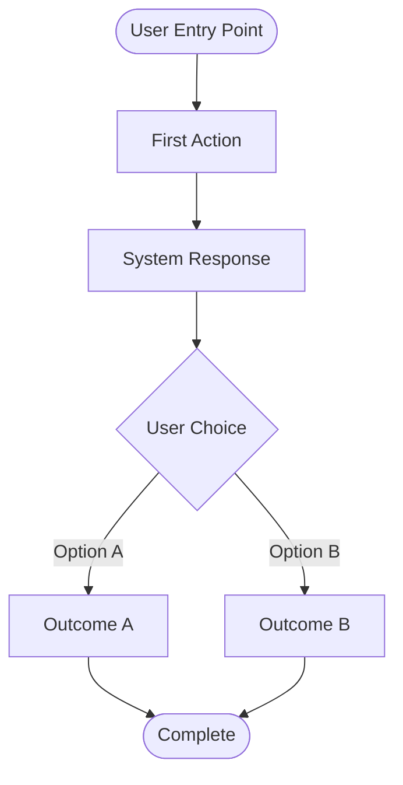

# [Feature Name] - Product Requirements Document

**Status:** [Draft | Review | Approved | Shipped]
**Owner:** [Product Manager / Team Lead]
**Engineering Lead:** [Flutter Developer]
**Design Lead:** [UI/UX Designer (if applicable)]
**Target Platform:** [iOS, Android, or Both]
**Target Release:** [Version Number / Date]
**Last Updated:** [Date]

---

## Executive Summary

**One-paragraph description of what this feature is, who it's for, and why it matters.**

[Write 2-3 sentences summarizing the feature's purpose, target user, and primary benefit.]

---

## Problem Statement

### User Pain Point

**What problem are we solving?**

[Describe the specific user frustration, workflow inefficiency, or unmet need this feature addresses.]

**Example:**
> "Users with large book collections (100+ books) spend hours manually entering each book into BooksTrack. This creates friction during onboarding and prevents users from experiencing the app's value quickly."

### Current Experience

**How do users currently solve this problem (if at all)?**

[Describe existing workarounds, competitor solutions, or manual processes users employ today.]

**Example:**
> "Users either manually search and add books one-by-one (tedious for 100+ books) or skip digital tracking entirely, relying on physical shelves or spreadsheets."

---

## Target Users

### Primary Persona

**Who is this feature primarily for?**

| Attribute | Description |
|-----------|-------------|
| **User Type** | [e.g., Avid readers, collectors, students] |
| **Usage Frequency** | [e.g., Daily, weekly, monthly] |
| **Tech Savvy** | [Low / Medium / High] |
| **Primary Goal** | [What they want to achieve with BooksTrack] |

**Example User Story:**

> "As a **book collector with 500+ books on shelves**, I want to **bulk import my existing library** so that I can **start tracking new reads without manual data entry**."

---

## Success Metrics

### Key Performance Indicators (KPIs)

**How will we measure success?**

| Metric | Target | Measurement Method |
|--------|--------|-------------------|
| **Adoption Rate** | [X%] of users try feature within 30 days | Analytics event tracking |
| **Completion Rate** | [X%] of users complete workflow | Conversion funnel |
| **Performance** | [Response time / processing speed] | Instrumentation |
| **Accuracy** | [X%] success rate (if applicable) | Quality metrics |
| **User Satisfaction** | [X/5 stars or NPS score] | In-app survey / App Store reviews |

**Example:**
> - **Adoption:** 40% of new users import CSV within first session
> - **Performance:** Import 100 books in <60 seconds
> - **Accuracy:** 90%+ metadata enrichment success rate

---

## User Stories & Acceptance Criteria

### Must-Have (P0) - Core Functionality

#### User Story 1: [Feature Name]

**As a** [user type]
**I want to** [action]
**So that** [benefit]

**Acceptance Criteria:**
- [ ] Given [context], when [action], then [expected outcome]
- [ ] Given [context], when [action], then [expected outcome]
- [ ] Edge case: Given [unusual context], system should [handle gracefully]

**Example:**
> **As a** Goodreads user
> **I want to** import my CSV export
> **So that** I don't have to manually re-enter 500 books
>
> **Acceptance Criteria:**
> - [ ] Given a valid Goodreads CSV file, when I select it in the file picker, then the app auto-detects column mappings
> - [ ] Given 500 books in the CSV, when import starts, then all books are processed in <5 minutes
> - [ ] Given duplicate books already in library, when using "Smart" strategy, then metadata is merged without creating duplicates

---

### Should-Have (P1) - Enhanced Experience

[Repeat user story format for medium-priority features]

---

### Nice-to-Have (P2) - Future Enhancements

[Repeat user story format for low-priority or future iteration features]

---

## Functional Requirements

### High-Level Flow

**What is the end-to-end user journey?**



[Replace with actual Mermaid diagram or reference existing workflow doc]

**OR link to existing workflow:**
> See `docs/workflows/[feature]-workflow.md` for detailed flow diagrams.

---

### Feature Specifications

#### [Sub-Feature 1 Name]

**Description:** [What this sub-feature does]

**Technical Requirements:**
- **Input:** [What data/input is required]
- **Processing:** [How the system processes it]
- **Output:** [What the user sees/receives]
- **Error Handling:** [How errors are surfaced and recovered]

**Example:**
> **Auto-Detect CSV Format**
> - **Input:** CSV file from file picker
> - **Processing:** Parse first 5 rows, match column names against known formats (Goodreads, LibraryThing, StoryGraph)
> - **Output:** Display detected format and preview of first 3 books
> - **Error Handling:** If format unknown, show manual mapping UI

---

#### [Sub-Feature 2 Name]

[Repeat specification format]

---

## Non-Functional Requirements

### Performance

| Requirement | Target | Rationale |
|-------------|--------|-----------|
| **UI Performance (Jank)** | 60 FPS | Smooth scrolling/animations on baseline devices |
| **App Startup Time** | Cold: <2s, Warm: <500ms | Measured with `flutter run --trace-startup` |
| **App Size** | Android (AAB): <40MB, iOS: <50MB | Reduce download barriers |
| **Response Time** | [X ms/s] | [Why this matters] |
| **Memory Usage** | <250MB during typical usage | [Device constraints] |
| **Battery Impact** | [Minimal / Moderate] | [User expectations] |
| **Network Usage** | [X MB per operation] | [Data plan considerations] |

**Flutter-Specific Requirements:**
> - **Jank Prevention:** All scrolling views (bookshelf, search results) must maintain 60 FPS on baseline devices (measured with Flutter DevTools)
> - **Background Processing:** Computationally intensive operations (image processing, CSV parsing) **must** execute on background isolates to prevent UI thread blocking
> - **Shader Pre-compilation:** iOS builds must include `--bundle-sksl-path` to mitigate first-run animation jank
> - **Memory Management:** Peak memory usage during heavy operations (1500 book import) must not exceed 250MB

**Example:**
> - **Processing Time:** Import 100 books in <30 seconds (users won't wait longer)
> - **Scroll Performance:** Main bookshelf list maintains 60 FPS with 1000+ books (verified with DevTools)

---

### Reliability

- **Error Rate:** [Target X% success rate]
- **Offline Support:** [Required / Not Required]
- **Data Integrity:** [How data consistency is ensured]

**Example:**
> - **Error Rate:** 90%+ enrichment success (with title normalization)
> - **Offline Support:** Not required (network needed for metadata enrichment)
> - **Data Integrity:** Atomic Drift transactions prevent partial imports

---

### Accessibility (WCAG AA Compliance)

- [ ] Screen reader support (TalkBack on Android, VoiceOver on iOS) with semantic labels on all interactive elements
- [ ] Color contrast ratio ≥ 4.5:1 for text (WCAG AA standard)
- [ ] Platform font scaling support (`MediaQuery.textScaleFactor` handling)
- [ ] Keyboard navigation support (tablet and desktop)
- [ ] Reduced motion option (respect `MediaQuery.disableAnimations`)

---

### Security & Privacy

- **Data Storage:** [Where is user data stored?]
- **API Security:** [How are backend calls authenticated?]
- **Privacy Considerations:** [What data is collected/shared?]

**Example:**
> - **Data Storage:** All books stored locally in Drift (SQLite), encrypted at rest on device
> - **API Security:** HTTPS-only, certificate pinning for sensitive endpoints
> - **Privacy:** Uploaded bookshelf photos processed server-side but not stored permanently
> - **Platform Permissions:** Camera access (Android: CAMERA permission, iOS: NSCameraUsageDescription)

---

## Design & User Experience

### UI Mockups / Wireframes

[Include screenshots, Figma links, or references to design assets]

**Example:**
> See Figma: [Link to design file]
> Screenshots: `docs/designs/[feature]-mockups/`

---

### Material Design 3 Compliance

**Color Scheme:**
- **Primary Seed Color:** [Hex code, e.g., `#6750A4`]
- **Dynamic Color Support:** [Enabled/Disabled - if enabled, app adapts to user's wallpaper on Android 12+]
- **Light/Dark Mode:** Both supported, switches automatically based on system settings

**Design Tokens:**
- [ ] Material 3 color system (`ColorScheme.fromSeed`)
- [ ] Typography scale (Material 3 text styles: `headlineLarge`, `bodyMedium`, etc.)
- [ ] Elevation and shadows (use `ElevatedButton`, `Card` with proper elevation)
- [ ] Corner radius (12dp for cards, 8dp for buttons - Material 3 defaults)
- [ ] Proper navigation patterns (push vs modal bottom sheet vs dialog)

**Example:**
> - **Seed Color:** `#1976D2` (Blue 700)
> - **Dynamic Color:** Disabled (maintain consistent brand identity)
> - **Theme:** Light and dark modes supported via `ThemeMode.system`

---

### User Feedback & Affordances

**How does the system communicate state to the user?**

| State | Visual Feedback | Example |
|-------|----------------|---------|
| **Loading** | Progress indicator | Spinner with "Processing..." |
| **Success** | Confirmation message | Checkmark + "100 books imported" |
| **Error** | Clear error message + recovery action | "Import failed - check file format" + Retry button |
| **Empty State** | Helpful guidance | "Tap + to import your first CSV" |

---

## Technical Architecture

### System Components

**What new/modified components are required?**

| Component | Type | Responsibility | File Location |
|-----------|------|---------------|---------------|
| **[ComponentName]** | [Widget / Provider / Service] | [What it does] | `lib/path/to/file.dart` |

**Example:**
> | Component | Type | Responsibility | File Location |
> |-----------|------|---------------|---------------|
> | **CSVParsingService** | Service (with Isolate) | High-performance CSV parsing on background isolate | `lib/services/csv_parsing_service.dart` |
> | **CSVImportFlowScreen** | StatefulWidget | Multi-step import wizard UI | `lib/features/import/screens/csv_import_flow_screen.dart` |
> | **CSVImportNotifier** | StateNotifier (Riverpod) | Manages CSV import state | `lib/features/import/providers/csv_import_provider.dart` |

---

### Data Model Changes

**What Drift tables are added/modified?**

```dart
// Example: New Drift table for import jobs
import 'package:drift/drift.dart';

class ImportJobs extends Table {
  TextColumn get id => text()();
  IntColumn get status => intEnum<ImportStatus>()();
  IntColumn get totalBooks => integer()();
  IntColumn get processedBooks => integer()();
  DateTimeColumn get createdAt => dateTime()();

  @override
  Set<Column> get primaryKey => {id};
}

// Companion data class (generated by Drift)
// Used in application logic
class ImportJob {
  final String id;
  final ImportStatus status;
  final int totalBooks;
  final int processedBooks;
  final DateTime createdAt;
}
```

---

### API Contracts

**What backend endpoints are required?**

| Endpoint | Method | Purpose | Request | Response |
|----------|--------|---------|---------|----------|
| `/api/[endpoint]` | GET/POST | [What it does] | [Payload] | [Response structure] |

**Example:**
> | Endpoint | Method | Purpose | Request | Response |
> |----------|--------|---------|---------|----------|
> | `/search/title` | GET | Book metadata search | `?q={title}` | `[SearchResult]` JSON |

---

### Dependencies

**What Flutter packages and frameworks are needed?**

```yaml
dependencies:
  flutter:
    sdk: flutter

  # State Management
  flutter_riverpod: ^2.4.0
  riverpod_annotation: ^2.3.0

  # Database (Local Persistence)
  drift: ^2.14.0
  drift_flutter: ^0.1.0
  sqlite3_flutter_libs: ^0.5.0

  # Networking
  dio: ^5.4.0
  web_socket_channel: ^2.4.0

  # [Add feature-specific packages]

dev_dependencies:
  build_runner: ^2.4.0
  riverpod_generator: ^2.3.0
  drift_dev: ^2.14.0
```

**Backend:** [Cloudflare Workers, Durable Objects, etc.]

**External APIs:** [Google Books API, OpenLibrary, etc.]

**Example Feature-Specific Packages:**
> - **Camera/Barcode:** `camera: ^0.10.5`, `mobile_scanner: ^3.5.0`
> - **Image Processing:** `image: ^4.1.3`, `image_picker: ^1.0.4`
> - **Navigation:** `go_router: ^12.0.0`

---

## Testing Strategy

### Unit Tests

**What needs automated test coverage?**

- [ ] [Component/function to test] - [Expected behavior]
- [ ] [Edge case] - [Expected handling]

**Example:**
> - [ ] Title normalization - Strips series markers correctly
> - [ ] Duplicate detection - Matches title + author accurately
> - [ ] Empty CSV - Shows appropriate error message

---

### Integration Tests

**What end-to-end flows need validation?**

- [ ] [User flow] from [start] to [end]

**Example:**
> - [ ] Import 100-book CSV → All books inserted → Enrichment queue populated

---

### Manual QA Checklist

**What should be manually tested before launch?**

**Platform Coverage:**
- [ ] Real device testing (iOS: iPhone/iPad, Android: Phone/Tablet)
- [ ] OS version coverage (iOS 14.0+, Android 8.0/API 26+)
- [ ] Edge cases (empty files, malformed data, network failures)
- [ ] Accessibility (iOS: VoiceOver, Android: TalkBack, font scaling)
- [ ] Performance under load (1500 book import, scroll performance)

**Hardware-Specific Validation:**
- [ ] Camera-dependent features tested on physical devices (not emulators)
- [ ] Network behavior validated on real cellular/WiFi conditions
- [ ] Animation smoothness verified at 60 FPS on baseline devices

**Platform-Specific Behaviors:**
- [ ] Android back button navigation
- [ ] iOS swipe-back gestures
- [ ] System permission dialogs (camera, storage)

---

## Rollout Plan

### Phased Release (if applicable)

| Phase | Audience | Features Enabled | Success Criteria | Timeline |
|-------|----------|------------------|------------------|----------|
| **Alpha** | Internal team | Core functionality | Zero crashes on both platforms | Week 1-2 |
| **Beta** | TestFlight (iOS) + Internal Testing (Android) | Full feature set | 90%+ success rate | Week 3-4 |
| **GA** | All users (App Store + Play Store) | Production-ready | <1% error rate | Week 5 |

---

### Feature Flags

**Are there toggles to control rollout?**

```dart
// Example: feature_flags.dart
class FeatureFlags {
  static bool get enableCSVImport {
    return SharedPreferences.getInstance()
        .then((prefs) => prefs.getBool('feature_csv_import') ?? false);
  }
}

// Alternative: Use Firebase Remote Config for server-side feature flags
// import 'package:firebase_remote_config/firebase_remote_config.dart';
```

---

### Rollback Plan

**If the feature causes issues, how do we revert?**

1. **Disable feature flag** → Hide UI entry points
2. **Backend rollback** → Revert Cloudflare Worker deployment
3. **Data migration** → [If schema changes were made, how to roll back?]

---

## Launch Checklist

**Pre-Launch:**
- [ ] All P0 acceptance criteria met
- [ ] Unit tests passing (90%+ coverage)
- [ ] Widget tests covering key UI flows
- [ ] Manual QA completed on both iOS and Android (checklist above)
- [ ] Performance benchmarks validated (60 FPS, startup time, memory usage)
- [ ] Material Design 3 compliance review
- [ ] Accessibility audit (TalkBack, VoiceOver, contrast, font scaling)
- [ ] Analytics events instrumented
- [ ] App store assets prepared (screenshots for both platforms)
- [ ] Documentation updated (README, feature docs)

**Post-Launch:**
- [ ] Monitor analytics for adoption rate
- [ ] Track error rates (Sentry/Crashlytics for both platforms)
- [ ] Collect user feedback (App Store and Play Store reviews, support tickets)
- [ ] Measure success metrics (KPIs table above)
- [ ] Monitor performance metrics (Firebase Performance Monitoring or similar)

---

## Open Questions & Risks

### Unresolved Decisions

**What still needs to be decided?**

- [ ] [Question 1] - **Owner:** [Name] - **Due:** [Date]
- [ ] [Question 2] - **Owner:** [Name] - **Due:** [Date]

**Example:**
> - [ ] Should we support Excel (.xlsx) files in addition to CSV? - **Owner:** Product - **Due:** Oct 30
> - [ ] What's the maximum file size limit? - **Owner:** Engineering - **Due:** Nov 1

---

### Known Risks

| Risk | Impact | Probability | Mitigation Plan |
|------|--------|-------------|-----------------|
| [Risk description] | [High/Med/Low] | [High/Med/Low] | [How to address] |

**Example:**
> | Risk | Impact | Probability | Mitigation Plan |
> |------|--------|-------------|-----------------|
> | API rate limits exceed quota | High | Medium | Implement client-side caching + backoff |
> | Users export invalid CSV formats | Medium | High | Auto-detect + manual mapping fallback |

---

## Related Documentation

- **Workflow Diagram:** `docs/workflows/[feature]-workflow.md`
- **Technical Implementation:** `docs/features/[FEATURE].md`
- **API Documentation:** `cloudflare-workers/README.md`
- **Design Specs:** [Figma link or design doc]

---

## Changelog

| Date | Change | Author |
|------|--------|--------|
| [Date] | Initial draft | [Name] |
| [Date] | Added acceptance criteria | [Name] |
| [Date] | Final approval for Build X | [Name] |

**Example:**
> | Date | Change | Author |
> |------|--------|--------|
> | Oct 15, 2025 | Initial draft | Product Team |
> | Oct 18, 2025 | Added performance benchmarks | Engineering |
> | Oct 20, 2025 | Approved for Build 45 | PM |

---

## Approvals

**Sign-off required from:**

- [ ] Product Manager
- [ ] Engineering Lead
- [ ] Design Lead (if UI changes)
- [ ] QA Lead

**Approved by:** [Names] on [Date]
