# Review Queue (Human-in-the-Loop) - Product Requirements Document

**Status:** 📝 Draft (Flutter Conversion)
**Owner:** Product Team
**Engineering Lead:** Flutter Development Team
**Design Lead:** Material Design 3 / UI/UX
**Target Platform:** iOS and Android
**Target Release:** Version 1.0.0 (TBD)
**Last Updated:** November 12, 2025

---

## Executive Summary

The Review Queue provides a human-in-the-loop workflow for correcting low-confidence AI detections (<60% confidence) from bookshelf scans. Users can review cropped spine images alongside editable title/author fields, ensuring data quality while maintaining the speed benefits of automated detection. This feature reduces false positives in libraries and builds user trust in the AI scanning system.

---

## Problem Statement

### User Pain Point

**What problem are we solving?**

AI bookshelf scanning (Gemini 2.0 Flash) achieves 70-95% accuracy on clear images, but misreads books when:
- Spine text is blurry or at odd angles
- Lighting creates glare on glossy covers
- Books have unusual fonts or faded text
- Spines are partially obscured

Without human verification, these low-confidence detections (typically 10-30% of scans) would pollute user libraries with incorrect titles/authors, eroding trust in the AI feature and requiring tedious manual cleanup.

**Impact:**
- **Data Quality:** 20-30 incorrect books per 100-book shelf scan
- **User Trust:** Users lose confidence in AI accuracy after seeing wrong books
- **Manual Cleanup:** Finding and deleting incorrect entries post-import is frustrating

### Current Experience

**Without Review Queue:**

All detected books imported regardless of confidence level. Users discover errors only after:
1. Browsing library and noticing unfamiliar titles
2. Manually searching for each suspicious book
3. Deleting incorrect entries one-by-one
4. Possibly missing errors that went unnoticed

**User Quote (Beta Feedback):**
> "The scanner added 5 books I don't own. I had to scroll through 200 books to find them. Can you flag uncertain detections before adding them?"

---

## Target Users

### Primary Persona: **The Quality-Conscious Collector**

| Attribute | Description |
|-----------|-------------|
| **User Type** | Book collectors who value library accuracy over speed |
| **Usage Frequency** | After each bookshelf scan (periodic, not daily) |
| **Tech Savvy** | Medium-High (comfortable with AI uncertainty concepts) |
| **Primary Goal** | Ensure library contains only books they actually own |

**Example User Story:**

> "As a **collector with 300 carefully curated books**, I want to **review AI detections the system isn't confident about** so that **my digital library matches my physical shelves exactly**."

### Secondary Persona: **The Casual Scanner**

Users who scan bookshelves occasionally and prefer quick imports but appreciate the option to verify uncertain results.

---

## Success Metrics

### Key Performance Indicators (KPIs)

| Metric | Target | Current | Measurement Method |
|--------|--------|---------|-------------------|
| **Review Queue Awareness** | 80% of users with low-confidence results see badge | TBD | Analytics: badge visibility vs review queue opens |
| **Correction Rate** | 60%+ of queued books get corrected (not just verified) | TBD | Compare `userEdited` vs `verified` outcomes |
| **Queue Completion Rate** | 70%+ users clear entire queue (don't abandon) | TBD | Track users who reduce queue to zero |
| **False Positive Prevention** | 90%+ of queued books would have been errors | Manual QA | Review user corrections vs original AI output |
| **Time to Clear Queue** | <2 min for 10 books | TBD | Time between queue open and last book reviewed |

**Success Criteria:**
- Review Queue badge visible within 2 seconds of scan completion
- 80%+ of users with queued books open Review Queue at least once
- <5% of users report needing to delete books post-import

---

## User Stories & Acceptance Criteria

### Must-Have (P0) - Core Functionality

#### User Story 1: Surface Low-Confidence Detections

**As a** user who just scanned a bookshelf
**I want to** see a visual indicator when books need human verification
**So that** I know to review uncertain detections before trusting my library

**Acceptance Criteria:**
- [ ] Given scan results with ≥1 book <60% confidence, when results appear, then books show visual indicator (Material amber badge/icon)
- [ ] Given scan completes with low-confidence books, when imported, then works saved with `reviewStatus = needsReview`
- [ ] Given works with `needsReview` status exist, when Library tab loads, then Review Queue badge (Material Badge widget) appears in app bar
- [ ] Edge case: Given all books ≥60% confidence, when scan completes, no Review Queue badge shown (clean import)

---

#### User Story 2: Review Books with Visual Context

**As a** user reviewing uncertain detections
**I want to** see the cropped spine image alongside editable fields
**So that** I can verify titles/authors by looking at the actual book spine

**Acceptance Criteria:**
- [ ] Given user taps Review Queue button, when queue loads, then ListView shows all works where `reviewStatus == needsReview`
- [ ] Given user taps a queued book, when CorrectionScreen opens, then cropped spine image displayed using stored boundingBox coordinates
- [ ] Given spine image available, when shown, then TextFormFields pre-filled with AI-detected values (editable)
- [ ] Given bounding box invalid/missing, when CorrectionScreen opens, then show full image or placeholder + text-only editing
- [ ] Edge case: Given temp image file deleted, when correction attempted, system shows text-only editing with Snackbar message

---

#### User Story 3: Correct or Verify Detections

**As a** user in CorrectionScreen
**I want to** edit incorrect fields or confirm correct detections
**So that** queued books are marked resolved and removed from queue

**Acceptance Criteria:**
- [ ] Given user edits title/author, when saved, then `reviewStatus = userEdited` and work removed from Review Queue
- [ ] Given user makes no changes, when taps "Mark as Verified" (Material FilledButton), then `reviewStatus = verified` and work removed from queue
- [ ] Given all books from single scan reviewed, when app restarts, then ImageCleanupService deletes temp image files
- [ ] Edge case: Given user navigates away without action, when returns to queue, book still appears (not auto-verified)

---

### Should-Have (P1) - Enhanced Experience

#### User Story 4: Batch Review Mode

**As a** user with 10+ books in queue
**I want to** swipe through corrections without dismissing screen repeatedly
**So that** I can review quickly in one continuous flow

**Acceptance Criteria:**
- [ ] Given multiple books in queue, when CorrectionScreen opens, then PageView allows swiping left/right for next/previous book
- [ ] Given user swipes to next book, when gesture completes, then current book auto-saves and next book loads
- [ ] Given last book in queue reviewed, when user swipes right, then screen dismisses with success Snackbar

**Status:** Planned (future release)

---

### Nice-to-Have (P2) - Future Enhancements

- [ ] **Confidence Score Display:** Show AI confidence % in CorrectionScreen chip ("AI: 45% confident")
- [ ] **Search Integration:** If correction fails, link to "Search for Correct Book" in app
- [ ] **Confidence Threshold Setting:** User-adjustable confidence threshold (40%-80%) in Settings
- [ ] **Auto-Suggestions:** When user starts editing, show Google Books autocomplete suggestions

---

## Functional Requirements

### High-Level Flow

```mermaid
flowchart TD
    Scan([Bookshelf Scan Completes]) --> Confidence{Books with < 60% confidence?}
    Confidence -->|No| ImportAll[All books imported as verified]
    Confidence -->|Yes| ImportMixed[High-confidence → verified, Low → needsReview]

    ImportMixed --> ShowBadge[Show Review Queue badge in app bar]
    ShowBadge --> UserTap{User taps badge?}

    UserTap -->|Yes| OpenQueue[ReviewQueueScreen loads]
    UserTap -->|No| Later[Badge persists until queue cleared]

    OpenQueue --> ListView[ListView of needsReview works]
    ListView --> TapBook{User taps book}

    TapBook --> LoadCorrection[CorrectionScreen loads]
    LoadCorrection --> ShowImage[Display cropped spine + editable fields]
    ShowImage --> UserAction{User action?}

    UserAction -->|Edit| SaveEdited[Save with userEdited status]
    UserAction -->|Verify| SaveVerified[Save with verified status]
    UserAction -->|Delete| DeleteBook[Remove from library]

    SaveEdited --> RemoveFromQueue[Remove from Review Queue]
    SaveVerified --> RemoveFromQueue
    DeleteBook --> RemoveFromQueue

    RemoveFromQueue --> CheckEmpty{Queue empty?}
    CheckEmpty -->|No| ListView
    CheckEmpty -->|Yes| HideBadge[Hide badge, show success message]
```



---

## Non-Functional Requirements

### Performance

| Requirement | Target | Rationale |
|-------------|--------|-----------|
| **Queue Load Time** | <1s for 20 books | Instant feel |
| **Image Crop Time** | <200ms | Smooth navigation |
| **Badge Update** | Real-time | Reflect queue state immediately |
| **Memory Usage** | <50MB for images | Temp files cleaned up |

**Flutter-Specific:**
- Image cropping on background isolate (non-blocking UI)
- Drift queries with indexes for fast filtering (`WHERE reviewStatus = 'needsReview'`)
- Cached_network_image for temp file display (memory efficient)

---

### Reliability

- **Queue Accuracy:** 100% of `needsReview` books shown (no missing items)
- **Data Integrity:** Drift transactions ensure atomic updates
- **Image Cleanup:** Temp files deleted after all books from scan reviewed
- **Badge Accuracy:** Real-time updates (Riverpod StreamProvider)

---

### Accessibility (WCAG AA Compliance)

- [ ] Screen reader labels (TalkBack/VoiceOver) on all interactive elements
- [ ] Color-independent indicators (badge uses text + icon, not just color)
- [ ] Large touch targets (48dp minimum for buttons)
- [ ] Font scaling support (MediaQuery.textScaleFactor)
- [ ] Keyboard navigation support (Tab through fields)

---

## Design & User Experience

### Material Design 3 Implementation

**Review Queue Badge:**
- Material Badge widget on AppBar icon
- Color: `colorScheme.error` (red/amber)
- Count: Show number of books in queue

**ReviewQueueScreen Layout:**
- AppBar: Title "Review Queue ({count} books)"
- ListView: Material Cards for each book
  - Leading: Thumbnail or placeholder
  - Title: Book title (detected)
  - Subtitle: Author + confidence indicator
  - Trailing: Amber warning icon
- Empty State: "All books verified!" with checkmark icon

**CorrectionScreen Layout:**
- AppBar: Close button + "Book {n} of {total}"
- Body:
  - Cropped spine image (AspectRatio widget)
  - TextFormField: Title (editable)
  - TextFormField: Author (editable)
  - Confidence chip: "AI: 45% confident" (amber)
- Bottom:
  - Row of buttons:
    - OutlinedButton: "Delete"
    - FilledButton: "Mark as Verified"
    - FilledTonalButton: "Save Changes"

**Color Scheme:**
- Warning indicator: `colorScheme.tertiary` (amber)
- Verified: `colorScheme.primary` (blue)
- Error: `colorScheme.error` (red)

---

## Technical Architecture

### System Components

| Component | Type | Responsibility | File Location |
|-----------|------|---------------|---------------|
| **ReviewQueueScreen** | ConsumerWidget | List of needsReview works | `lib/features/review_queue/screens/review_queue_screen.dart` |
| **CorrectionScreen** | StatefulWidget | Edit/verify single book | `lib/features/review_queue/screens/correction_screen.dart` |
| **ReviewQueueProvider** | StreamProvider (Riverpod) | Real-time queue state | `lib/features/review_queue/providers/review_queue_provider.dart` |
| **ImageCropService** | Service | Crop image using bounding box | `lib/core/services/image_crop_service.dart` |
| **ImageCleanupService** | Service | Delete temp files after review | `lib/core/services/image_cleanup_service.dart` |
| **ReviewQueueBadge** | StatelessWidget | Badge widget for AppBar | `lib/features/review_queue/widgets/review_queue_badge.dart` |

---

### Data Model Changes

**Drift Table (Works) with Review Queue support:**
```dart
import 'package:drift/drift.dart';

class Works extends Table {
  TextColumn get id => text()();
  TextColumn get title => text()();
  TextColumn get author => text().nullable()();

  // Review Queue properties
  IntColumn get reviewStatus => intEnum<ReviewStatus>().withDefault(const Constant(0))();
  TextColumn get originalImagePath => text().nullable()();  // Temp file path for cropped image
  TextColumn get boundingBox => text().nullable()();        // JSON: {"x": 0.1, "y": 0.2, "width": 0.05, "height": 0.3}
  DoubleColumn get aiConfidence => real().nullable()();     // 0.0-1.0 confidence score

  @override
  Set<Column> get primaryKey => {id};
}

// ReviewStatus enum
enum ReviewStatus {
  verified,      // AI or user confirmed accurate (index 0)
  needsReview,   // Low confidence < 60% (index 1)
  userEdited,    // Human corrected AI result (index 2)
}
```

**Query for Review Queue:**
```dart
// Get all books needing review
Stream<List<Work>> watchReviewQueue() {
  return (select(works)
    ..where((w) => w.reviewStatus.equals(ReviewStatus.needsReview.index)))
    .watch();
}

// Count of books in queue (for badge)
Stream<int> watchReviewQueueCount() {
  return (selectOnly(works)
    ..addColumns([works.id.count()])
    ..where(works.reviewStatus.equals(ReviewStatus.needsReview.index)))
    .map((row) => row.read(works.id.count()) ?? 0)
    .watchSingle();
}
```

---

### Image Cropping Implementation

**Using image package for cropping:**
```dart
import 'package:image/image.dart' as img;
import 'dart:isolate';

class ImageCropService {
  Future<File> cropImage({
    required String originalImagePath,
    required BoundingBox boundingBox,  // Normalized 0.0-1.0 coords
  }) async {
    // Run on background isolate
    return Isolate.run(() async {
      final bytes = await File(originalImagePath).readAsBytes();
      final image = img.decodeImage(bytes)!;

      // Convert normalized coords to pixel coords
      final x = (boundingBox.x * image.width).toInt();
      final y = (boundingBox.y * image.height).toInt();
      final w = (boundingBox.width * image.width).toInt();
      final h = (boundingBox.height * image.height).toInt();

      // Crop image
      final cropped = img.copyCrop(image, x: x, y: y, width: w, height: h);

      // Save to temp directory
      final tempDir = await getTemporaryDirectory();
      final croppedPath = '${tempDir.path}/cropped_${DateTime.now().millisecondsSinceEpoch}.png';
      await File(croppedPath).writeAsBytes(img.encodePng(cropped));

      return File(croppedPath);
    });
  }
}
```

---

### Dependencies

```yaml
dependencies:
  flutter:
    sdk: flutter

  # State Management
  flutter_riverpod: ^2.4.0

  # Database
  drift: ^2.14.0

  # Image Processing
  image: ^4.1.3              # For cropping spine images
  cached_network_image: ^3.3.0  # For displaying images efficiently

  # File System
  path_provider: ^2.1.1       # Temp directory access

  # UI
  badges: ^3.1.0              # Material Badge widget (or use built-in Badge)
```

---

## Testing Strategy

### Unit Tests

**Review Queue Logic:**
- [ ] Query filters only `needsReview` books
- [ ] Count updates correctly when status changes
- [ ] Bounding box JSON parsing/encoding
- [ ] Image crop coordinates calculation

### Widget Tests

**Review Queue UI:**
- [ ] Badge shows correct count
- [ ] Badge hidden when queue empty
- [ ] ListView populates with queued books
- [ ] Empty state shows when no books

**Correction Screen:**
- [ ] TextFields pre-filled with AI values
- [ ] "Mark as Verified" button updates status
- [ ] "Save Changes" button updates title/author
- [ ] Delete button removes book

### Integration Tests

**End-to-End:**
- [ ] Scan with low-confidence → Badge appears → Open queue → Correct book → Badge updates
- [ ] Multiple books in queue → Correct all → Badge disappears
- [ ] Navigate away mid-correction → Return → Book still in queue

---

## Image Cleanup Strategy

### When to Clean Up

**Trigger:** App startup (via AppLifecycleListener)

**Logic:**
```dart
class ImageCleanupService {
  Future<void> cleanupOrphanedImages() async {
    final db = ref.read(databaseProvider);

    // Get all scans where ALL books have been reviewed
    final completedScans = await db.getCompletedScans();

    for (final scanId in completedScans) {
      // Delete temp image file
      final imagePath = await db.getOriginalImagePath(scanId);
      if (imagePath != null) {
        final file = File(imagePath);
        if (await file.exists()) {
          await file.delete();
        }
      }

      // Clear originalImagePath from all books in that scan
      await db.clearImagePaths(scanId);
    }
  }
}
```

**Definition of "Completed Scan":**
- All books from that scan have `reviewStatus` of either `verified` or `userEdited` (none are `needsReview`)

---

## Future Enhancements

### High Priority (Next 3 Months)

**1. Batch Review Mode (P1)**
- PageView for swiping through books
- Auto-save on swipe
- Estimated effort: 2 days

**2. Confidence Threshold Setting**
- Settings screen slider (40%-80%)
- User-adjustable cutoff for Review Queue
- Estimated effort: 1 day

**3. Analytics**
- Track correction rate (edited vs verified)
- Measure time to clear queue
- Estimated effort: 0.5 days

### Medium Priority (6 Months)

**4. Search Integration**
- "Search for Correct Book" button in CorrectionScreen
- Opens SearchScreen pre-filled with detected title
- Estimated effort: 1 day

**5. Autocomplete Suggestions**
- Google Books API autocomplete as user types
- Estimated effort: 2 days

---

## Launch Checklist

**Pre-Launch:**
- [ ] All P0 acceptance criteria met
- [ ] Unit tests for review queue queries
- [ ] Widget tests for badge and screens
- [ ] Manual QA: Scan → Low confidence → Review → Verify
- [ ] Performance: Queue loads in <1s for 20 books
- [ ] Accessibility: Screen reader support
- [ ] Image cleanup tested (temp files deleted)

**Post-Launch:**
- [ ] Monitor correction rate analytics
- [ ] Track queue completion rate
- [ ] Measure time to clear queue
- [ ] Collect user feedback on UX

---

## Related Features

**Upstream Dependencies:**
- **Bookshelf Scanner:** Creates works with `reviewStatus = needsReview`
- **Image Storage:** Temp files in `path_provider.getTemporaryDirectory()`

**Downstream Dependents:**
- **Library View:** Displays all works (including reviewed ones)
- **Search:** Can be triggered from CorrectionScreen (future)

---

**PRD Status:** 📝 Draft (Flutter Conversion)
**Implementation Status:** Not Started
**Next Review:** After Bookshelf Scanner implementation
